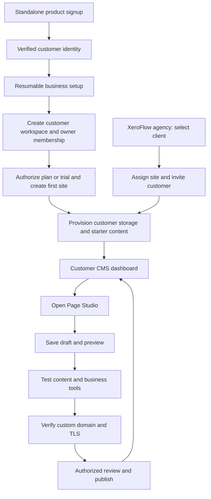

# Page Studio Customer CMS and AI Website Platform — PRD

Status: confirmed product direction; implementation in progress, broader CMS not complete.
Owner: XeroFlow Product and Engineering.
Last updated: 1 October 2026.

## 1. Authority and purpose

This is the canonical product requirements document for the customer website CMS, guided website generation and managed components. It incorporates the customer discussion and research into Squarespace, Wix, Framer, Gravity Forms and Base44. Scope, priorities, acceptance and task status are maintained here. Supporting research records evidence and alternatives; ADR-010 remains a proposed technical design and is not automatically accepted by this PRD.

Give a business owner one place to create, publish and operate a website: pages, content, media, enquiries, people, business tools, SEO and analytics. Customers must be able to sign in independently of the agency operations dashboard and perform everyday management without opening the visual builder. Page Studio remains the visual editing tool within this product.

An AI-created functional component is complete when its visible UI, persistent data, settings, permissions, management screen, follow-up and relevant metrics work together. A generated form that only looks correct does not meet the requirement.

## 2. Users and access boundaries

| Actor or relationship | Required experience and boundary |
| --- | --- |
| Website owner | Manage assigned sites, team, website configuration and authorized billing; retain owner continuity. |
| Invited team member | Role-appropriate enquiry, content, publishing or integration work; no automatic access to all capabilities. |
| Builder collaborator | Edit design and approved artifacts; builder access and operational CMS access remain separately controlled. |
| Public visitor | Browse published content and submit permitted forms without an account; cannot list private entries. |
| Website member | Authenticate to visitor-facing features and access permitted own records or gated content; no implicit CMS rights. |
| Contact | A business relationship that may exist without login, marketing consent or a paid plan. |
| Newsletter subscriber | Purpose-specific consent and delivery/suppression state; signup need not require a member account. |
| Paying customer/member | Provider-verified paid entitlement, cancellation and expiry; separate from marketing consent. |
| Agency/operator | Authorized provisioning, support, recovery and release management with audit. |

One person can occupy several relationships. The website owner's platform subscription/AI credits are distinct from subscriptions their visitors purchase. Reuse existing owner/portal authentication; do not duplicate credentials into a content database. A shared identity provider may be referenced by customer-owned profiles and entitlements.

Server-side capabilities must distinguish read/manage enquiries, export, edit content/schema/design, publish, configure integrations, invite/change roles and manage billing. Hiding controls is not authorization. Expired/revoked membership must affect active access and relevant queued actions. Map these capabilities to existing roles during the access audit rather than adopting an unreviewed replacement role enum.

### 2.1 One website platform, two product entry points

Confirmed scope: support both a standalone website product and websites managed through XeroFlow Agency. Share the website/CMS services, component contracts and Page Studio; vary navigation, branding, onboarding and authorized commercial arrangements. A customer must not need an agency staff account to own or operate a standalone site.

| Concern | Standalone customer | Agency-managed customer |
| --- | --- | --- |
| Entry | Product-branded signup/login domain | XeroFlow website portfolio or invited customer CMS link |
| Onboarding | Verify identity, create customer workspace, become its owner, create first site | Agency selects an authorized client, creates/assigns a site and invites the client |
| Daily work | Customer CMS; open Page Studio for visual editing | Same customer CMS and editor services, with agency portfolio/support tools where authorized |
| Publishing | Owner or delegated publisher can review and release when checks pass | Existing agency review policy applies until explicitly changed by an authorized party |
| Commercial relationship | Customer pays for its platform plan and AI usage | Agency-managed or client-paid according to an explicit billing agreement |
| Data | Customer-owned website database | Customer-owned website database; agency access is a separate authorized relationship |

Model these concerns separately: **identity → customer workspace → membership/capabilities → site → environment/storage binding**. An agency support/management grant and a billing account/payer are separate relationships. Entry hostname, signup source, email domain and a browser-selected mode must never grant access or determine data ownership.

A workspace can have multiple sites and an identity can join multiple workspaces. Resolve an explicit active workspace on every request. Existing agency client IDs need a reviewed mapping to this model; do not silently put all standalone customers under a shared default agency/client. Shared platform identity and workspace authorization metadata belong to the control plane; website content, enquiries and operational records remain in the customer's database.

A standalone owner can later invite an agency, and an agency-managed customer can become self-managed through an authorized handover. Retain site IDs, data bindings, domains, history and asset ownership; audit the grant/revocation or ownership transfer. Billing changes require their own explicit transition, including outstanding obligations and credit ownership. Removing agency assistance must not accidentally delete the customer's site or expose other agency clients. Revoked grants invalidate future launches and management actions.

## 3. Customer journey and information architecture

**Standalone create:** sign up → verify email → complete business setup → create customer workspace and first site → CMS dashboard → Page Studio → preview/test → connect domain → publish.

**Agency create:** select authorized client → assign site/entitlement → invite customer → customer CMS dashboard → Page Studio → agency review → publish.

**Guided website creation:** describe the business → choose visitor goals → review suggested pages/capabilities → supply missing facts → preview → complete setup → test → publish.

**Operate:** sign in at the independent Studio entry → choose an authorized website → see its CMS overview → manage content, enquiries and settings → open the visual builder when design work is needed.

| CMS area | Contents |
| --- | --- |
| Overview | Verified setup tasks, recent activity, enquiries and publication/delivery health. |
| Website | Pages/navigation, blog posts, gallery posts, other collections, media, SEO and publication history. |
| Business | Forms/enquiries, plus installed bookings, products/orders and paid subscription capabilities. |
| Audience | Contacts, website members, newsletter lists and consent. |
| Insights | Website/component analytics and delivery outcomes. |
| Settings | Team/roles, domains, email/integrations, privacy/retention, platform plan and AI credits. |

Use familiar names such as Enquiries, Posts and Appointments. Components remain a library/advanced view. Show installed capabilities progressively; do not present placeholder pages or unconnected services as working features. A decorative component does not need an inbox or database table.

All management screens need usable mobile and keyboard paths plus honest empty, loading, error, denied, expired-session, stale-edit conflict and unavailable states. Use the project's Nuxt UI v4 design conventions. Data records and metadata may be managed in the CMS; visual canvas, layout editing and component rendering remain in the separate Studio application.

### 3.1 Registration, step form and customer creation

The route names below are proposed additions to the existing `/studio` namespace, not claims of implemented screens. A branded product origin may expose clean public aliases while preserving a single route/service contract. Keep the existing agency registration separate.

Invited users accepting an already prepared website go directly to its dashboard after authentication. They do not re-provision its storage or repeat owner signup.

| Screen / proposed route | Customer action | Persistent outcome and recovery |
| --- | --- | --- |
| Signup `/studio/signup` | Enter name/email, accept applicable product terms; existing users sign in | Pending identity verification with expiry/resend/rate limits; no agency staff membership or paid entitlement |
| Verification `/studio/verify` | Redeem the short-lived sign-in/verification link | Verified identity and scoped session; expired/used links get a recoverable state; original invitation/return target remains allowlisted |
| Setup `/studio/onboarding`: About your business | Business/site name, industry, locale/timezone; conditional location/service-area fields | Revisioned onboarding draft bound to the verified identity; back/refresh/resume preserve answers |
| Setup: Website goals | Choose enquiries, bookings, sales, blog, gallery or other supported capabilities | Proposed pages/capabilities with prerequisites and missing facts; unsupported options are visibly unavailable |
| Setup: Starting point | Choose starter or describe the website; optionally add existing brand assets | Validated brief and starter reference; skip optional assets and domain connection |
| Setup: Review and create | Review facts, selected capabilities and applicable trial/plan terms | Idempotently create workspace + owner membership, then authorize entitlement and site; retry resumes the same operation |
| Website setup `/studio/sites/:siteId/setup` | Follow preparation; retry recoverable failures | Durable provisioning job and resource receipts; no false Ready state while database/content/runtime checks remain incomplete |
| CMS `/studio/sites/:siteId` | View setup checklist, manage content/enquiries/media/team | Scoped customer dashboard independent of the builder; only installed, available capabilities are active |
| Page Studio launch | Open visual editor, save draft, return to dashboard | Short-lived scoped launch to approved editor origin; customer/site/environment binding and draft history survive return |
| Domains `/studio/sites/:siteId/settings/domains` | Add hostname, follow DNS instructions, check verification | Persisted ownership/DNS/TLS state; connecting a domain does not itself publish |
| Review and publish | Preview and test, review changes, publish with the required capability | Release tied to exact source/artifacts, deployment and domain; failures retain prior verified live release |

Request only the facts needed at each step. Do not force a new user to choose “standalone versus agency” when the trusted entry or invitation already establishes the journey. In the CMS, make the active business/site and any agency management relationship visible. A “Back to XeroFlow” action appears only for users authorized to enter it.

“Create customer” means a workspace with a verified owner and explicit control-plane bindings. It is distinct from a visitor/member account, newsletter subscription, agency staff record and payment-provider customer. Identity creation must not automatically grant any of those other relationships. An existing email match never claims a workspace without verified authentication and an authorized membership/invitation.

Workspace/owner creation must be atomic; entitlement, payment-provider and infrastructure steps use retained operation IDs with reconciliation. Repeated clicks, network loss, multiple tabs and resumed sessions cannot create duplicate owners, sites, subscriptions or databases. Do not charge for a retried provisioning request. Define pending-account expiry and abandoned-draft retention before release; surface recoverable progress and support references without exposing credentials.

### 3.2 Product domain, editor domain and customer website domains

Use a branded product origin for signup/login/CMS. Keep XeroFlow's agency entry available. Give every site a scoped preview address, then allow the owner to connect their published website's custom domain. Webflow documents the same user-facing distinction between its staging subdomain and a customer-owned production domain ([official domain guide](https://help.webflow.com/hc/en-us/articles/33961334343827-How-do-I-connect-my-domain-to-Webflow)); our access and storage design remains our own requirement.

| Host purpose | Requirement |
| --- | --- |
| Product application | Trusted, configured origin for signup, CMS, help and branded authentication callbacks; exact brand/hostname remains to be chosen |
| XeroFlow agency application | Existing staff portfolio and client operations; shared service contracts do not confer staff rights on product customers |
| Visual editor | Approved editor origin with short-lived scoped handoff; no transferable agency session in URLs |
| Preview/published user content | Isolated origin boundary from privileged applications; customer/generated scripts cannot read application cookies or credentials |
| Customer custom website domain | Verified ownership, unique site/environment binding, DNS and TLS checks, primary-domain/canonical redirect behaviour, safe removal/reassignment |
| Customer-branded CMS hostname | Later optional capability; not required to launch the standalone product |

Do not share a parent-domain authentication cookie with untrusted previews. Explicitly allowlist authentication return URLs, editor launches and server-side trusted hosts; do not derive email-link origins from arbitrary request headers. Cross-origin authentication must use an audited one-time exchange or identity-provider redirect with state/replay protection. Preserve tenant/site scope after every handoff. A custom published domain never becomes an authentication or management origin merely because it is attached to a site.

Domain readiness and release readiness are separate. Support pending DNS/certificate issuance, conflicting ownership, provider outage and lost acknowledgements without claiming Live. Default preview indexing must be controlled; private previews need authorization, not just noindex. Exact Cloudflare domain routing/certificate configuration is an implementation decision validated against current provider documentation before changes.

## 4. Functional requirements

### 4.1 Guided creation and industry templates

Compose business type + visitor goal + reusable capabilities. Cover enquiries/quotes, appointments, sales, newsletters/memberships, locations and self-service, with industry variations for trades, professional services, retail, hospitality, finance and other businesses.

Templates declare required facts, typed data/configuration, management views, dependencies, suggested copy, example data and acceptance scenarios. Ask only relevant questions about services, audience, location/service areas, language, currency, timezone, recipients, availability and provider connections. Support country-appropriate addresses and distinguish billing, venue and service-area information.

The owner supplies or reviews prices, tax/payment terms, availability, legal disclosures and business claims. AI must not invent those facts or generate financial decision-making authority from a finance-themed template. Clearly label examples. Initial business journeys are enquiries/quotes, then bookings and online sales; editorial CMS work follows the sequence in section 8.

### 4.2 Forms, enquiries and component management

Provide a site-wide enquiry inbox and per-form views over the same records. Include bounded search/filter/pagination, live/test separation, detail, operational status, assignment/notes, permitted export, placement links and delivery history. Preserve original answers; corrections and annotations are versioned/audited.

Form management covers **Overview, Entries, Fields, After submission, Emails, Integrations and Insights**, with privacy/retention/archive settings. Fields have stable IDs, types, labels/help, validation, required/conditional visibility and appropriate consent controls. Submissions capture immutable schema/configuration/publication and placement identity so field renames do not reinterpret history.

After submission, offer a default message or approved destination with optional ordered conditions and deterministic fallback. Provide a preview using test inputs. Reject unsafe or visitor-controlled redirect destinations; do not place sensitive answers in query strings by default. Website URL redirects and post-form outcomes remain different settings.

### 4.3 Email, webhooks and workflows

Separate team notifications, customer acknowledgements and inbound mailbox forwarding. Customer responses need subject/body, approved variables, sender/reply-to, escaping, preview and controlled tests. Existing saved email preferences are defaults, not proof that sending or forwarding is enabled.

Webhooks need named destinations, event selection, allowed field mapping, conditions, synthetic tests, enable/disable, redacted attempt history and controlled retry/replay. The first proposed event is a versioned `enquiry.created` envelope. Credentials stay private; callers cannot select another customer's connection.

Show follow-up as trigger → conditions → actions, with delays where supported. Keep workflow/configuration versions tied to accepted events; define which authorized operational changes take effect immediately and which require publication. Distinguish simulation, isolated test delivery and real delivery/replay explicitly. A “test” label cannot hide external effects.

Verified sender ownership, suppression/bounce handling and provider readiness precede email activation. Delivery requires durable events/outbox, deduplication, bounded retries/timeouts, safe public egress, signature/replay protections and disable/revocation handling. Email or webhook failure cannot lose an enquiry. An acknowledgement means durable acceptance, not successful external delivery.

### 4.4 Pages, blog, gallery and structured content

Pages need title/slug, navigation/homepage settings, preview, SEO, publication history and safe URL changes. Content supports typed rich text, asset references and relationships, with public index/detail templates bound by stable IDs.

Blog posts need title, unique slug, sanitized rich text, excerpt, cover, author, categories/tags, draft/review/publish/archive, revisions and scheduled publication in the site timezone. Gallery posts need ordered assets, cover, captions/alt text, title/slug, optional description/taxonomy and publication state. Content editors can draft without permission to publish or alter design.

Validate scheduled retries and timezone transitions, stale edits, reference integrity and public/private boundaries. Drafts and private content must not leak into public rendering or feeds. Archive/removal and permanent deletion are separate operations.

### 4.5 Media, AI images and credits

Provide one reusable media library/picker for upload, existing assets and AI generation, including hero and section backgrounds. Retain approved model selection through Cloudflare AI Gateway and the existing image/credit work; expose availability, usage/credit state and generation outcomes honestly. Customer top-ups belong to the platform's per-customer billing/credit flow, not an assumed Cloudflare payment wallet for every end customer.

Generated and uploaded images use the same attach/reuse path. Preserve ownership, metadata, alt text, dimensions/type, provenance and usage references; protect cross-customer assets and explain referenced deletion. Billing-disabled demos/tests must be clearly identified and must not imply live payment collection. Existing image and credit staging evidence does not establish production activation of every capability.

### 4.6 Contacts, newsletters, members and subscriptions

Contacts support deduplication, lists/tags and links to business records without conflating distinct enquiries. Newsletter records preserve purpose, consent wording/version/source/time, pending/confirmed/unsubscribed/suppressed state and export. Repeat signup is idempotent; unsubscribe and suppression prevent queued marketing sends. Decide double opt-in and retention policies explicitly. Sending transactional email does not subscribe a person to marketing.

Website members need signup/sign-in/recovery, verification where required, profile/account status, roles and permitted own-record access. Team invitations require expiry/revoke and safe owner continuity. Account removal, role reduction and blocked access must be effective server-side.

Paid memberships/subscriptions need provider-linked plans, verified lifecycle events, entitlement, cancellation/expiry and self-service. Client-supplied payment status or form submission cannot grant paid access. Reconcile duplicate/out-of-order events. Booking capacity, fulfilment and payment authority require purpose-built adapters and acceptance beyond a generic form.

### 4.7 SEO, analytics and operations

Provide site/content-type SEO defaults with page/item overrides: title/description, canonical, robots, social preview/image, structured data, sitemap and redirects. Verify rendered published output; noindex is not authentication. AI suggestions require factual accuracy and owner review.

Define component views/starts/attempts/durable acceptances/conversions, attribution, denominator, window/timezone, deduplication and bot/test exclusions. Never conflate provider acceptance, delivery and business completion. Missing instrumentation is unavailable, not zero. Keep form answer content out of analytics and routine logs.

Show actionable setup/health states derived from evidence: Draft, Needs setup, Ready to test, Ready to publish, Live and Attention needed. Metrics and operations require scoped customer data just as records do.

## 5. Customer database ownership and component contract

Customer website content and operational records must use the customer's own database as their source of truth: content, form definitions/entries, operational settings, audience records and visitor entitlements. Media and immutable publication artifacts may reside in scoped object storage with customer-owned metadata/references. Shared platform authentication, infrastructure authorization and platform billing remain separately documented control-plane responsibilities; they do not justify a duplicate shared enquiry store.

Resolve storage through trusted, server-authorized tenant/customer/business/site/environment bindings. A browser or generated component cannot choose a database/Worker or grant itself access. Database ownership must include a practical export/backup/recovery and deletion policy. Do not use sandbox filesystem state as persistent authority.

The proposed managed-component contract includes definition/version, installed instance, placements, render/configuration/data schemas, authorized storage reference, management metadata, actions/events, integrations, metrics and lifecycle. AI proposes; trusted platform code validates, provisions and renders approved management controls. Unsupported capabilities produce a clear limitation or reviewed extension path. Arbitrary AI-generated admin code, SQL or credentials are not automatically trusted.

Independent installations do not accidentally share records or recipients. Intentional shared placements use one explicit instance. Duplication explains inherited data/integrations; removal of a placement does not delete retained records. Preserve owner edits during regeneration and show a proposed change summary. Breaking schema changes need migration/rollback evidence.

Submission and event/outbox persistence must be atomic where co-located, or use a durable idempotent handoff with reconciliation across services. Provisioning must recover without duplicate resources or false readiness. External delivery is at least once; receivers need stable identity for deduplication. Retention/export/deletion must account for attachments, events, provider-held data and audit requirements.

## 6. Current state and implementation constraints

Source baseline: Dashboard `a98b83a53c65fbb80da48e8a2348610d2c9d24bb`; Studio `50d372e1cb0bc92a661379866062dbe75a4539d0`. These are audit checkpoints, not future release bases.

Existing foundations include independent Studio login/site listing, scoped business content and generated collections, managed runtime boundaries, image/media/credit work, and publication/history. Customer email preferences explicitly do not establish activated delivery. A complete customer enquiry/component CMS is still open.

The audit found legacy agency assets, audit-derived submissions and analytics in shared native tables. Do not expose those as the new customer-database CMS by relabelling routes. Complete a writer/reader map, historical inventory and explicit cutover/reconciliation/rollback plan. Existing scoped D1 stores are candidates, but active public and management routing must be traced and tested.

Generated collection fields currently support primitive types. Rich text, media references, relationships and galleries need protocol, validation, migration and renderer work. Existing agency Leads delivery is a reuse candidate requiring scope, egress, signing and retry review. Preserve unrelated agency workflows and the separate Studio visual builder.

The customer workspace foundation is now implemented on a separate review branch ([PR #602](https://github.com/adme-dev/dashboard/pull/602), initial source `e5f4ad3faa58d11e159b2e21c542058b2ef4efe5`). The [ownership mapping and cutover record](https://github.com/adme-dev/dashboard/blob/feature/customer-workspace-foundation/docs/architecture/page-studio-customer-workspaces.md) documents verified identity references, explicit workspace memberships and legacy client/agency grants. It is an internal service with no public signup or route cutover. Local validation passed 79 targeted tests, including 23 new PostgreSQL cases; migration 442 was applied twice only to a disposable local database. Server typecheck diagnostics match the unchanged baseline. No hosted or production activation is claimed.

The next gated slice is implemented in [PR #603](https://github.com/adme-dev/dashboard/pull/603), stacked on #602, source `60d946a303c887d3413eb601c46daad961bed2d4`. It adds dedicated standalone email verification/session authority, saved revisioned business setup, and atomic creation of one customer-owned workspace. The [signup architecture and activation record](https://github.com/adme-dev/dashboard/blob/feature/studio-customer-signup/docs/architecture/page-studio-customer-signup.md) describes exact scope and configuration. All 72 focused tests pass, including 36 real PostgreSQL cases; Chrome verified captured-mail sign-in, save/reload, keyboard and 390px use, completion/reload and logout. Both final-review findings were fixed with failing-then-passing regression tests. Migration 443 was applied only to disposable local PostgreSQL. Full local frontend typechecking remained resource-limited; the remote CI/build has since passed on this source. Public signup is disabled by default, no production migration or deployment occurred, and no website/customer content database or billing relationship is created by this slice.

The ownership/site prerequisite is now implemented in [PR #604](https://github.com/adme-dev/dashboard/pull/604), stacked on #603, source `2206543d6fac7afbe38cd517c094bafb223becce`. Its explicit business-owner registry preserves legacy agency IDs and allows a verified standalone workspace owner to retain one operator-approved preview site, with atomic entitlement/receipt creation and fresh authorization on retries. The [site ownership record](https://github.com/adme-dev/dashboard/blob/feature/studio-customer-site-ownership/docs/architecture/page-studio-customer-site-ownership.md) documents migration, rollback limits and remaining adapters. All 30 real PostgreSQL cases pass, including both competing ownership orders under read-committed and repeatable-read isolation. Final repository verification passed 15,136 tests plus 54 separately scheduled route-scan tests; 1,612 environment-dependent cases were skipped. The review concurrency finding was fixed RED→GREEN. One additional populated legacy upgrade fixture remains a minor follow-up before production migration. Migration 444 was applied/replayed only locally; server typecheck matches the existing 289-diagnostic baseline. The service has no public route, provider dispatch, customer database allocation, editor grant or billing charge. **RND-20 and RND-21 remain open**. Remote CI/build passed for this source. The follow-on provisioning adapter and dashboard are described below. Hosted resource receipts and the editor journey remain outstanding. Public trial policy and activation remain separate decisions.

The internal native-session provisioning adapter is implemented in [Dashboard PR #605](https://github.com/adme-dev/dashboard/pull/605), stacked on #604, source `238a63c46980c1fa3f5129a7cbb97d78e34cfd50`, and [Studio PR #110](https://github.com/adme-dev/xeroflow-page-studio/pull/110), source `42086e444b9b95939d174796e32b47375d0795e0`. It retains one immutable approved staging intent, carries the distinct customer actor/original login, rechecks native authority before provider effects and fences first-checkpoint acceptance under the same transaction. Migration 445 was applied/replayed only locally. The [native provisioning record](https://github.com/adme-dev/dashboard/blob/feature/studio-customer-provisioning/docs/architecture/page-studio-customer-provisioning.md) and [Studio contract](https://github.com/adme-dev/xeroflow-page-studio/blob/feat/customer-provisioning-session/docs/architecture/customer-provisioning.md) document rollout and recovery. Both review findings (lock order and accepted name boundaries) passed RED→GREEN regressions. All 22 PostgreSQL cases pass; the final Dashboard suite passed 15,158 + 54 cases with 1,612 environment-dependent skips. One initial unrelated timing failure passed in isolation and in the complete rerun. Server TypeScript remains the exact 289-diagnostic baseline. Studio build/typecheck/security checks and 5,606 Vitest + 48 action-runtime cases pass; final full Studio lint passed 1,477 files. Dashboard #605 remote CI/build passed. Studio #110 CI passed on both Ubuntu and Windows, including compiler/container acceptance where applicable. Two independent local SQLite databases verify ownership/content/route isolation with provider fixtures; **hosted Cloudflare acceptance is not yet complete**. No public producer, Ready claim, editor grant, billing or production deployment is enabled. Customer create/progress/dashboard routes are now in review below. Scoped editor handoff and the hosted two-customer receipt proof remain next.

The standalone customer website overview is implemented in [PR #606](https://github.com/adme-dev/dashboard/pull/606), stacked on #605, source `66210b21084c2b2784acf742ef0a107754cd3544`. Completed setup returns to `/studio/dashboard`, where an explicitly approved staging owner can create one preview, refresh progress and safely resume retained setup. The body-free mutation derives all scope and policy server-side. The UI reports **Awaiting verification** rather than Ready and exposes no editor or publishing controls. The [dashboard architecture and configuration record](https://github.com/adme-dev/dashboard/blob/feature/studio-customer-dashboard/docs/architecture/page-studio-customer-dashboard.md) documents state handling and activation limits. Final review fixes for revoked pre-intent authority and insufficient page capacity passed four RED→GREEN regressions. All 70 focused tests and 15,184 full-suite cases plus 54 separately scheduled route-scan cases pass; 1,612 environment-dependent cases remain skipped. Focused lint passes and server TypeScript matches the exact 289-diagnostic baseline. Local Chrome verified native signup/setup, preview creation, status, failure/recovery, keyboard refresh and sign-out at desktop/390px/320px, using real PostgreSQL persistence and a coordinator fixture. No hosted provisioning proof is claimed. Remote CI/build has passed on this source. **RND-21 remains open** for hosted resource verification, recovery and complete dashboard/editor integration; RND-22 still requires a complete customer-aware editor session and launch/return journey; its internal transport prerequisite is recorded below. No production deployment or public activation occurred.

The internal native customer handoff foundation is implemented in [PR #607](https://github.com/adme-dev/dashboard/pull/607), stacked on #606, source `64ec2137a10acff482f666bfe811010e3f16d842`. It retains a hash-only ticket for at most two minutes, binds the current native login and approved website to exact configured dashboard/Studio origins, atomically consumes it once, rechecks current authority and returns a fixed dashboard destination. It does **not** issue an editor JWT, expose a route/button, grant editing or prove runtime readiness. The [handoff architecture record](https://github.com/adme-dev/dashboard/blob/feature/studio-customer-editor-handoff/docs/architecture/page-studio-customer-editor-handoff.md) explains the boundary and remaining consumer work. Migration 446 was applied twice only locally. All 27 handoff and 33 existing provisioning PostgreSQL cases pass, including concurrent redemption, replay, cross-customer setup, revocation and deterministic lock/expiry races. The review issuance-expiry finding was reproduced and fixed in one pass. Final full suite: 15,211 passed plus 54 separate route-scan cases; 1,612 environment-dependent skips. Focused lint passes; server TypeScript matches the exact 289-diagnostic baseline. Remote CI/build passed on this source. **RND-22 remains open**: the private session/checkpoint metadata increment is recorded below; typed-editor integration, hosted customer storage/runtime receipts and browser launch/save/reload/return still remain. No production activation or deployment occurred.

The private native customer editor-session and checkpoint metadata boundary is implemented in [Dashboard PR #608](https://github.com/adme-dev/dashboard/pull/608), stacked on #607, source `2bdaed7d93e8bdf7a0991bbfd73ce91243b93c53`. The paired change is [Studio PR #111](https://github.com/adme-dev/xeroflow-page-studio/pull/111), stacked on #110, source `e4fc120ffa8b1c68db42c928f609ae1b0a418c41`. A distinct customer JWT is exchanged atomically from the one-use handoff. Original native login/ownership/entitlement authority is rechecked for admission, reads and saves; stale heads conflict and managed-CMS bypass is denied. The private Studio client verifies signed exchange/admission receipts and exact checkpoint scope/storage keys. A public fixture generated by the Dashboard signer verifies protocol compatibility. The [session architecture record](https://github.com/adme-dev/dashboard/blob/feature/studio-customer-editor-sessions/docs/architecture/page-studio-customer-editor-sessions.md) documents the staging-only disabled transport and rollout gates. Migration 447 was applied twice only locally.

Validation for this increment — Dashboard: 15,269 + 54 passing tests, 1,612 environment-dependent skips; 20 real PostgreSQL cases including concurrent saves and logout/expiry lock races; focused lint clean; exact 289-diagnostic server TypeScript baseline unchanged. Studio: build/typecheck/security and 5,634 Vitest + 48 runtime tests pass, with four local compiler skips retained for CI. The repository-wide pre-commit Biome check passed 1,482 files with no fixes; all changed files also passed focused lint. One independent paired review of the session implementation found no Critical, Important or Minor defects.

CI follow-up — The initial Dashboard build exceeded the fixed raw Worker budget by 1,432 bytes; the revised source consolidates four wrapper routes into one dispatcher and shares the canonical-origin validator, with full regression tests green and the size budget unchanged. Consolidation saved 875 bytes but remained 557 over budget. The existing lossless SQL compactor now covers medium static statements; 16 compaction tests include actual Worker execution, byte-exact SQL/parameter checks and unchanged dynamic-query/HTML behavior. Full regression tests pass; the artifact-size guard is unchanged. The complete [Dashboard CI run](https://github.com/adme-dev/dashboard/actions/runs/36708993034) passed on the recorded source, including the production build and unchanged size guard: raw Worker 25,415,318 / 25,468,928 bytes (53,610 remaining), gzip 6,935,514 / 9,750,000 bytes. Studio secret scan passes after an exact commit/file/rule/line exception for the synthetic public test JWT; application code is unchanged. Full Studio CI was manually dispatched on the exact source with compiler publication disabled, because stacked feature-base PRs do not automatically trigger that workflow. [Studio CI](https://github.com/adme-dev/xeroflow-page-studio/actions/runs/36707242336) passed on both Ubuntu and Windows, including Ubuntu compiler/container/browser acceptance; compiler publication was skipped intentionally. **RND-22 remains open and customer launch is disabled.**

The review retained four explicit boundaries, which must be resolved before customer rollout:

1. Implement the native Sandbox lifecycle and browser launch/return/reconnect. Otherwise a signed session still cannot complete a customer editor journey; do not widen the legacy staff/client role branches.
2. Connect typed document validation, immutable scoped storage and digest verification to checkpoint metadata. Otherwise metadata alone cannot establish valid saved content. Reuse the existing checkpoint parser/storage primitives through a native-customer authority adapter.
3. Implement native managed-CMS graph adoption/save authorization. Generic checkpoint commits currently deny managed-site bypass; those customers cannot save until the graph path preserves their authority.
4. Verify hosted customer database/runtime/bucket isolation and receipts, then browser save/reload/return plus unchanged agency/QR navigation, followed by controlled migration/deployment. Local fixtures do not establish safe public activation or Ready status.

The next RND-22 increment adds the private native-customer typed draft repository in [Studio PR #112](https://github.com/adme-dev/xeroflow-page-studio/pull/112), based on #111, source `a73db0aa18d97bad687feb62da2ba955a8bd0b53`. It snapshots and validates the document, checks the canonical digest and signed customer scope/actor, writes immutable R2 content, verifies stored content and ETag before the native compare-and-swap metadata commit, and rechecks authority after storage reads/writes. The existing workspace coordinator can save and rehydrate through this adapter in local integration tests. Unguarded metadata commits remain denied. Failed or revoked operations may leave an unreferenced immutable blob, but do not advance the accepted draft. This repository is not yet registered on a customer browser route.

Storage validation: 26 new repository tests, including immutable retry, caller mutation, oversized stored retry data, forged metadata, stale conflicts and revocation during read/write/commit verification. The complete Studio suite passes 5,660 Vitest plus 48 runtime tests; four existing compiler cases remain skipped locally. Build (28 tasks) and typecheck (44 tasks plus security) pass. Independent review found no Critical or Important defects; its retry-read size-limit finding was reproduced RED and fixed GREEN. Repository-wide lint passed across 1,484 files with no fixes. The mandatory full-repository commit hook also passed with no fixes. [Studio CI](https://github.com/adme-dev/xeroflow-page-studio/actions/runs/36713100051) passed on the exact source on both platforms with compiler publication disabled. Local coordinator and fake-storage evidence does not enable customer launch or establish hosted Ready status. The managed-save increment below adds native graph authority without converting customer claims into agency/client sessions. **RND-22 remains open** for customer CMS setup/adoption, Sandbox/browser launch/save/reload/return, hosted storage/runtime isolation and release acceptance.

The next RND-22 increment, [Dashboard PR #609](https://github.com/adme-dev/dashboard/pull/609), implements customer-authorized ordinary page saves for **already managed** CMS sites. It is stacked on #608 at source `1d5c93d6919569577098c78a990382d867260a4d`; freshly fetched main `a98b83a53c65fbb80da48e8a2348610d2c9d24bb` remains an ancestor. The customer session remains a distinct principal and uses a checkpoint-only CMS mutation. Native login, owner membership, preview approval and entitlement are rechecked before snapshots, replay and final commit. The existing graph verifier preserves component/action/schema selections and advances the application and page checkpoint atomically. Audit attribution is `customer`; there is no legacy staging/publication grant. Only server-owned CMS bindings reach the coordinator. Customer schema/record/action/billing/AI/history operations remain denied. CMS adoption was denied in this save-only increment and is addressed separately below.

Managed-save verification: 17 new real PostgreSQL cases and 90 focused regressions pass, including concurrent saves, rollback of both pointers/audit, replay after logout, expiry before commit, graph tampering and revocation during storage. Independent review found no Critical, Important or Minor defects and separately passed all 17 native cases. The full suite passed 15,907 tests plus 54 separately scheduled CRM route-scan cases, with 993 environment-dependent skips. Focused lint is clean; server TypeScript matches the exact 289-diagnostic baseline. Production build passed the unchanged artifact guard: raw Worker 25,418,365 / 25,468,928 bytes (50,563 remaining), gzip 6,936,486 / 9,750,000. A separately committed and reviewed test-only correction aligns the older Astro quota fixture with production UTC accounting and tests UTC/Melbourne sessions. Tests ran after the build completed to avoid generated `.nuxt` file races; the shared CMS disposable database uses the stricter `studio_cms_activation_*` name. [Dashboard CI](https://github.com/adme-dev/dashboard/actions/runs/36748572693) passed on attempt 2 on the exact source. Attempt 1 passed the database gates and production build but hit a 30-second timeout in the unrelated desktop AI-governance scroll-owner test; rerunning the failed job passed without a source change. No new migration, public UI, activation or deployment. **RND-22 remains open** for missing native customer CMS prerequisite upgrades and provisioning recovery, browser/Sandbox lifecycle and hosted isolation/release acceptance.

The next RND-22 increment, [Dashboard PR #610](https://github.com/adme-dev/dashboard/pull/610), adds resumable native customer CMS adoption against an already verified managed storage target. It is stacked on #609 at source `c487e2a1f4c6f419429dbcdd16a9786683508eca`; freshly fetched main `a98b83a53c65fbb80da48e8a2348610d2c9d24bb` remains an ancestor. The private customer operation uses a dedicated `customer-adoption` mutation requiring `workspace:create`, preserves native customer identity and originating login, rechecks authority around bounded SQL and requires explicit recovery after a new login. Activation advances application, pointers and audit atomically. The paired [Studio PR #113](https://github.com/adme-dev/xeroflow-page-studio/pull/113), stacked on #112 at source `71674f5d210460f232ef13b4929066a31296ae52`, extends only private setup provenance and the existing customer control client; fetched main `50d372e1cb0bc92a661379866062dbe75a4539d0` remains an ancestor. General preparation/attachment grants, schema/record mutations, AI, billing and publication remain denied. No migration, allocation, public route, activation or deployment accompanies this increment.

Adoption verification: 18 real PostgreSQL cases cover managed save after adoption, component retention, concurrent/repeated starts, explicit login recovery, revocation during remote work, scope/environment denial, target/checkpoint drift, rollback and forbidden mutations. Dashboard's full suite passed 15,927 tests plus 54 separately scheduled CRM route checks, with 993 environment-dependent skips. Focused lint passes and the exact 289-diagnostic server TypeScript baseline is unchanged. Production build passes the unchanged guard: raw Worker 25,420,299 / 25,468,928 bytes (48,629 remaining), gzip 6,937,549 / 9,750,000. The final compiled Worker was verified to include the reviewed source-specific progress projection. Independent paired review caught an initial progress-shape regression; the corrected implementation preserves native agency/portal counts and returns the numeric total required by private Studio/customer clients, with regressions passing and no remaining review findings. Studio passes 5,663 Vitest plus 48 runtime tests (four existing local compiler skips), 28 build tasks, 44 typecheck tasks plus security, and repository-wide lint across 1,484 files. The mandatory full-repository commit hook also passed across 1,484 files with no fixes. Actual local D1 tests verify customer freeze persistence, retry/readback and rejected generic preparations. [Dashboard CI](https://github.com/adme-dev/dashboard/actions/runs/36752515386) passed on the exact recorded source. [Studio CI](https://github.com/adme-dev/xeroflow-page-studio/actions/runs/36753214633) passed on its exact source on Ubuntu and Windows, with compiler publication disabled; its secret scan also passed.

The adoption adapter requires retained database, collection, workflow, runtime/CMS-storage and staging receipts. It does not authorize missing native customer prerequisite upgrades or repair provisioning after the original provisioning login is revoked. The recovery increment below addresses the provisioning-login boundary; prerequisite-upgrade adapters, Sandbox/browser launch/save/reload/return, hosted two-customer isolation and release/QR navigation acceptance remain open. PostgreSQL and local D1 evidence plus scoped routing/R2 fixtures do not establish hosted Ready status. **RND-22 remains open and customer launch is disabled.**

The next RND-21/22 increment, [Dashboard PR #611](https://github.com/adme-dev/dashboard/pull/611), implements explicit native customer provisioning recovery. It is stacked on #610 at source `16d5dd1c88d0af6f15047630d9b2c8a8e6329826` (test-only follow-up to application source `7c50adcf60397f2b91ba33cfc148ea9d5cd049fe`); freshly fetched main `a98b83a53c65fbb80da48e8a2348610d2c9d24bb` remains an ancestor. The dashboard can offer **Resume setup** after the original owner signs in again. An append-only recovery receipt retains the original intent, actor/login provenance, plan, request key and resource/checkpoint identity. Each recovery action pins the failed provider attempt it may restart, so replay cannot restart a later failure. Current login, ownership, approval and entitlement are rechecked after lock waits and provider calls. A version RPC through both Studio workers hides recovery when the matching executor is unavailable. Studio conditionally resets only the exact failed payload with no live lease and resumes the existing guarded scheduler. Reads never recover or allocate; there is no new migration, deployment or activation.

Recovery verification: Dashboard passes 15,949 tests plus 54 separately scheduled CRM route checks, with 993 environment-dependent skips; 53 native provisioning PostgreSQL cases include 20 new recovery tests. Focused lint passes and server TypeScript matches the exact 289-diagnostic baseline. Production build passes the unchanged guard: raw Worker 25,427,185 / 25,468,928 bytes (41,743 remaining), gzip 6,938,868 / 9,750,000. The built artifact contains the new recovery route and receipt logic. The initial build was stopped during critical disk/memory pressure; 155.2 MiB of disposable output from only this interrupted build was removed. The final full test run followed the completed build; an earlier concurrent run was interrupted and is not counted as passing. Initial [Dashboard CI](https://github.com/adme-dev/dashboard/actions/runs/36758590187) failed the new lock observer because its transaction cached the activity snapshot before the recovery connection existed. Priming that stale snapshot reproduced the same failure locally. The reviewed test-only fix refreshes the observer snapshot and leaves expiry polling headroom; the exact eight-file CI database group now passes all 201 cases. Application/build source is unchanged. [Replacement Dashboard CI](https://github.com/adme-dev/dashboard/actions/runs/36759384140) passed on the exact current source. Studio passes 5,666 Vitest plus 48 action-runtime tests, 28 build tasks, 44 typecheck tasks plus security and full lint across 1,484 files; four existing compiler cases remain skipped locally. The paired [Studio PR #114](https://github.com/adme-dev/xeroflow-page-studio/pull/114) is stacked on #113 at source `7798f5cd392280a7335f276d854f4ddca5a6e113`; freshly fetched main `50d372e1cb0bc92a661379866062dbe75a4539d0` remains an ancestor. The mandatory full-repository commit hook passed 1,484 files with no fixes. Its [secret scan](https://github.com/adme-dev/xeroflow-page-studio/actions/runs/36758837328) passed; [full Studio CI](https://github.com/adme-dev/xeroflow-page-studio/actions/runs/36758875801) passed on Ubuntu and Windows on the exact source with compiler publication disabled. Independent paired review found and resolved retry replay, old-worker compatibility and authority-after-handshake races; no blocking findings remain. PostgreSQL cases include revocation, concurrent recovery, rollback, lock-crossed expiry and original checkpoint provenance. Real workerd/D1 cases verify retained resources, exact replay, lease denial and old-worker rejection. Chrome acceptance uses the real Nuxt page with API fixtures at desktop/390px/320px, keyboard activation and reload; it does not establish native browser-to-provider or hosted acceptance. **RND-21/22 remain open** for native collection/workflow/CMS-runtime prerequisite upgrades, full Sandbox/browser lifecycle and hosted two-customer storage/runtime receipt proof.

The next RND-22 increment, [Dashboard PR #612](https://github.com/adme-dev/dashboard/pull/612), implements native customer authorization for all three existing CMS prerequisites: collections, workflows and CMS staging storage. A private `cms-prerequisites` customer-session operation derives scope, parent-login provenance and trusted resource discovery from current native `workspace:create` authority. The original operation, actor, child claims, database and request identity remain immutable. Explicit same-owner CAS recovery selects new effective child claims without replacing resources; superseded recovery, different-owner takeover and disabled operations remain denied. Worker callbacks recheck native authority after lock waits and trailing audit reads. Installed receipts must match exactly. Upgrade-local actor contracts accept `customer-user`; generic attachment and agency/portal preparation rights remain unchanged. No browser route, allocation, migration, billing, publication or deployment is added.

Prerequisite validation: 21 new PostgreSQL cases include concurrent starts/recovery, native logout recovery, different-owner denial, remote discovery/execution revocation, target/receipt mismatch, immutable retry, tombstones, audit rollback and trailing-read expiry. The expiry gap found in paired review was reproduced with a failing membership-clock regression and fixed by a final native authority check. Transport/gateway/legacy tests pass; server TypeScript remains the exact 289-diagnostic baseline. Studio passes 28 build tasks, 44 typecheck tasks plus security, 5,674 Vitest cases and 48 runtime cases, with four existing local compiler skips. Real local D1 tests cover customer installation, retry and revocation for all three upgrade types. Dashboard source `176c7e636f2d9013a7f2a77f94781c4ab6cb3f9b` contains freshly fetched main `a98b83a53c65fbb80da48e8a2348610d2c9d24bb`. Its full regression passes 15,972 tests plus 54 separately scheduled CRM cases, with 993 existing environment-dependent skips. Production build passes the unchanged guard: raw Worker 25,435,574 / 25,468,928 bytes (33,354 remaining), gzip 6,941,372 / 9,750,000. The compiled Worker contains the new adapter; the full regression followed the completed build. [Dashboard CI](https://github.com/adme-dev/dashboard/actions/runs/36777112251) passed on the exact source. Studio repository lint passes 1,486 files with no fixes. The paired [Studio PR #115](https://github.com/adme-dev/xeroflow-page-studio/pull/115) is stacked on #114 at source `a85b714ec44cfa3d93d77def7fac9a28415d1d76`, containing freshly fetched main `50d372e1cb0bc92a661379866062dbe75a4539d0`. Its mandatory full-repository commit hook also passed all 1,486 files without fixes. [Studio secret scan](https://github.com/adme-dev/xeroflow-page-studio/actions/runs/36777379895) passed; [full Studio CI](https://github.com/adme-dev/xeroflow-page-studio/actions/runs/36777398964) passed on Ubuntu and Windows on the exact source with compiler publication disabled. Dashboard #612 is stacked on #611. Both full CI results passed; no deployment or activation occurred. Independent paired review has no outstanding findings. **RND-22 remains open** for the customer Sandbox/browser launch/save/reload/return journey, honest Ready status, hosted two-customer database/runtime/bucket receipt proof and release acceptance. Local fixtures do not establish hosted isolation.

The next RND-22 increment, [Studio PR #116](https://github.com/adme-dev/xeroflow-page-studio/pull/116), adds the private native customer workspace lifecycle. A staging-only, default-off named Worker entrypoint restores an existing managed draft, reads durable typed content, applies bounded typed edits against the exact immutable base, prepares a checkpoint-specific preview snapshot and evicts disposable runtime. Customer scope, actor and fixed dashboard return derive from fresh native authority. It does not expose ports, start the browser editor, issue cookies, allocate an empty website, or grant source/SQL/model/publication access. Same-child retries retain checkpoint ID, timestamp and base; an acknowledged old save never moves a newer head. Eviction is not logout and concurrent admitted hydration may recreate the runtime. Native CAS and immutable snapshots remain authoritative.

Workspace verification: 68 focused cases and 813 Sandbox package cases pass. The real workerd test bundles the actual Worker index, invokes its named entrypoint over private RPC and reads two customers' separate documents from local R2; foreign pointers, revoked sessions and public HTTP are denied. Full Studio build passes 28 tasks, typecheck passes 44 tasks plus security, and 5,716 Vitest plus 48 action-runtime cases pass, with four existing compiler cases skipped locally. A final-reply token-expiry regression and two delayed-storage-read regressions failed before their fixes. Deadline checks now surround internal repository I/O and runtime operations; a delayed read cannot dispatch a later native commit after timeout. Independent review has no outstanding findings. Full repository lint passed across 1,491 files with no fixes. Studio #116 is stacked on #115 at source `4d9c13f0b6127ca9de70d01a26aea771aa330624`; freshly fetched main `50d372e1cb0bc92a661379866062dbe75a4539d0` remains an ancestor. The mandatory commit hook also passed all 1,491 files without changes. The built Worker exports the new private entrypoint. [Secret scan](https://github.com/adme-dev/xeroflow-page-studio/actions/runs/36783476522) passed; [full CI](https://github.com/adme-dev/xeroflow-page-studio/actions/runs/36783498085) passed on the exact source with compiler publication disabled. No deployment, binding enablement or migration occurred. **RND-22 remains open** for browser launch/cookie/socket/return integration, hosted two-customer receipt proof and release acceptance. Local control/storage/Sandbox fixtures do not close the browser or hosted gates.

The customer browser checkpoint increment is in review in [Studio PR #117](https://github.com/adme-dev/xeroflow-page-studio/pull/117), stacked on #116. It adds `save-document` against an exact immutable base and retains the coordinator’s `durable` receipt. Requests using `__Host-xf_customer_editor` enter a separate boundary before legacy routes: exact claims-derived HTTPS editor origin, same-origin POST, strict JSON and streamed 1 MiB payload limits, native authority, managed CMS validation, and no fallback to agency/client authentication. Malformed, duplicate and mixed cookies fail closed; customer requests to source, AI, socket and other legacy routes remain denied. RPC and HTTP share staging/feature-gated lifecycle construction. No cookie issuer, launch, customer proxy/socket transport or Ready label is enabled.

Local validation passes 74 focused cases, including the actual generated persistence bridge connected to native verification/lifecycle fixtures (lost-response retry, queued edits and logout), plus real-workerd default-index routing. A valid V1-over-V2 regression fails with the schema guard removed and passes with it restored. All 17 existing editor-shell tests pass in real Chrome. Final build passes 28 tasks, types pass 44 tasks plus security, and the full regression passes 5,748 Vitest plus 48 action-runtime tests (845 Sandbox cases, four existing local compiler skips). Independent review has no remaining findings. Full repository lint and the mandatory commit hook each passed all 1,494 files without changes. Source `fad9a7b42ef58421d1239efef5219133d41a3d72` contains freshly fetched main `50d372e1cb0bc92a661379866062dbe75a4539d0`. [Secret scan](https://github.com/adme-dev/xeroflow-page-studio/actions/runs/36788289646) passed; [exact-source CI](https://github.com/adme-dev/xeroflow-page-studio/actions/runs/36788305906) passed on Ubuntu and Windows with compiler publication disabled. No deployment, configuration enablement or migration occurred. Hosted native browser and two-customer resource acceptance remain open.

The next RND-22 increment, [Studio PR #118](https://github.com/adme-dev/xeroflow-page-studio/pull/118), implements the Studio consumer for native customer browser launch, stacked on #117. A strict URL-encoded POST carries the one-use handoff to the configured central editor origin. Studio restores the managed durable draft under fresh native reconnect/preview authority, checks the exact scoped runtime host, then POSTs the verified native token to a scoped session endpoint. It sets a Secure/HttpOnly/SameSite=Lax host-only cookie bounded by signed expiry. Bearer-to-cookie admission is repeatable while that same session remains authorized; it does not extend expiry or mint another session. Dedicated customer routing covers allowlisted immutable preview pages/assets, read-only socket actions, existing typed saves and the signed dashboard return. Source/model/AI operations remain closed. The overlay now has a native customer presentation role, Pages/Components/Site controls, a Dashboard link, and surface switching through the active governed page. No agency/client authority coercion is used.

Consumer verification passes 28 build tasks, 44 typecheck tasks plus security, 5,785 Vitest cases and 48 action-runtime cases (880 Sandbox cases; four existing local compiler skips). All 18 editor tests pass in real Chrome, including customer design edit/save/reload/undo and the dashboard return control. The actual workerd index issues the scoped cookie, rejects wrong origin/scope, returns to the signed dashboard and denies native revocation, using real local R2 and a fixture control binding. The customer surface toggle and revocation during delayed preview-error inspection both have failing-before/passing-after regressions. Independent final source review has no remaining blocking findings. Full lint and the mandatory commit hook each passed 1,497 files without fixes. Source `1a50516610adb66d9c714be8a6a8ee4a25bb65a6` exactly matches the reviewed/tested tree and contains freshly fetched main `50d372e1cb0bc92a661379866062dbe75a4539d0`. [Secret scan](https://github.com/adme-dev/xeroflow-page-studio/actions/runs/36791723820) passed; [exact-source CI](https://github.com/adme-dev/xeroflow-page-studio/actions/runs/36791752648) is running with compiler publication disabled. These complementary local fixtures do not establish hosted end-to-end browser or resource isolation.

The customer dashboard producer and “Open Studio” button are now in review in [Dashboard PR #613](https://github.com/adme-dev/dashboard/pull/613), stacked on #612. Native owner login and approved preview entitlement select the workspace/site; the browser cannot supply scope, target, role or return URL. GET projects only editor availability without minting a child session or ticket. Readiness validates the original immutable adoption receipt/application independently from the latest application/checkpoint, allowing ordinary later saves and an expired original child session. Bounded target/R2 reads occur outside SQL locks; native authority and the complete snapshot are checked again before the explicit empty-body, exact-origin, rate-limited POST issues a one-use ticket inside the final transaction. Native revocation during a failed storage read also invalidates the earlier dashboard response. The visible action uses Nuxt UI; the same-tab hidden transport form submits only the ticket to the configured central editor without URL or persistent-storage credentials. Provisioning status, publication and broader Ready remain separate.

Producer verification: 16,064 post-build regression cases pass, with 993 environment-dependent skips. The broad run passed 15,925; four PostgreSQL suites initially rejected the local `postgres:` URL before running and then passed all 139 cases with their required `postgresql:` scheme. An earlier parallel build/test run hit Nuxt configuration regeneration; the post-build results supersede it. The production build passes the unchanged Worker guard: raw 25,444,571 / 25,468,928 bytes (24,357 remaining), gzip 6,945,352 / 9,750,000. The compiled Worker contains the new endpoint. Changed-file lint passes; server TypeScript remains the exact 289-diagnostic baseline, and app checking adds no diagnostics to its HEAD-source overlay baseline. Independent review re-read all 20 modified/new files end-to-end with no outstanding blockers. Real Chrome exercised the actual Nuxt page/CSP at 1280/390/320px, keyboard launch, safe failure, unavailable/stale access and the credential POST with the exact Origin. It exposed a `no-referrer` policy causing Chrome to send `Origin: null`; configured native launch documents now use origin-only policy and an exact form-action destination, while APIs/unconfigured documents retain no-referrer. Studio's second handoff already uses origin-only policy. These browser tests intercept API/editor fixtures and do not establish hosted end-to-end acceptance.

Dashboard source `ab1dab31536d49e8b8ec97475edb3530ebaf5c09` includes freshly fetched main `a98b83a53c65fbb80da48e8a2348610d2c9d24bb` and is pushed with a clean worktree. [Exact-source Dashboard CI](https://github.com/adme-dev/dashboard/actions/runs/36794511635) is running. The launch configuration, implementation contract and reproducible browser command are recorded in [the producer runbook](https://github.com/adme-dev/dashboard/blob/ab1dab31536d49e8b8ec97475edb3530ebaf5c09/docs/plans/2026-10-01-customer-studio-launch.md) on PR613. No deployment, migration, billing or deployed flag change occurred.

Next verify actual browser POST/cookie behavior, both editor surfaces, save/reload/reconnect/return and logout on authorized staging hosts, prove all scoped runtime access passes through the authenticating Worker, and collect two-customer database/bucket/runtime receipts. Browser rollout remains staging-only and disabled; no Ready claim is included. **RND-22 remains open.**

### 6.1 Onboarding audit checkpoint

- [`app/pages/auth/register.vue`](../../app/pages/auth/register.vue) and [`server/api/auth/register.post.ts`](../../server/api/auth/register.post.ts) create agency `team_members`; they are not the standalone customer signup flow.
- [`app/pages/studio/index.vue`](../../app/pages/studio/index.vue) and the [magic-link request endpoint](../../server/api/portal/auth/magic-link/request.post.ts) support existing invited customers. The site list currently has assigned-site navigation, not self-service account/site onboarding.
- The [portal site creation endpoint](../../server/api/portal/page-studio/sites/index.post.ts) and [site service](../../server/utils/pageStudio/sites.ts) already enforce customer scope and active entitlements. Extend/adapt these contracts after workspace mapping; do not bypass their limits to make signup work.
- [`PortalSetup.client.vue`](../../app/components/page-studio/PortalSetup.client.vue) supports proposals and provisioning but assumes agency review and portal return routes. Standalone owners need explicit approval/publishing capabilities and appropriate copy/navigation.
- [`DomainsWorkspace.client.vue`](../../app/components/page-studio/DomainsWorkspace.client.vue) and the [domain management contract](../../shared/pageStudio/domainManagement.ts) already expose domain verification state. Reuse these services after verifying standalone authorization and route/branding support.

The local entry-page check and reproducible startup instructions are recorded in [local onboarding review](../page-studio/local-onboarding-review-2026-09-30.md). Local rendering does not establish completed signup, database provisioning or hosted domain activation.

## 7. Acceptance and completion evidence

The first onboarding acceptance journey is **new verified owner → resumable business setup → one customer workspace/site → customer dashboard → scoped Page Studio launch → saved preview**. Repeat the shared dashboard/editor path for an agency-invited customer. The first complete operational journey is **owner login → configure a form → visitor submits → owner sees the durable enquiry → follow-up delivers with visible status**. Email activation additionally requires verified provider readiness.

Each relevant slice must demonstrate:

- Two isolated customers and environments; anonymous, visitor/member, operator/editor/publisher and revoked access cases.
- Durable reload/restart behaviour, idempotent retries, schema/configuration history, stale edits and partial provisioning recovery.
- Storage/queue/provider failures without false success, lost records or duplicate external effects from uncontrolled replay.
- Mobile/keyboard use, accessible forms and real empty/loading/error/denied states.
- Domain-specific publishing, consent, payment or booking invariants where that capability is delivered.
- Preservation of existing CMS, media, publication and established navigation including QR Codes.

Track task completion through linked source/tests and hosted evidence, not generated screenshots or documentation alone. Record current main, exact source commit, target, deployment ID and live verification separately. Update marketing pages only when shipped evidence supports the claim. No conversion uplift, latency target or launch date has yet been agreed; do not invent those commitments.

## 8. Delivery order and canonical backlog

All 24 tasks remain open. RND-01 has preliminary research but incomplete routing/migration validation. RND-17 now has a persistence/access foundation in review in [PR #602](https://github.com/adme-dev/dashboard/pull/602): atomic workspace ownership, explicit legacy client binding, scoped agency grants and 23 PostgreSQL cases. The standalone verified-identity adapter, baseline resumable step form and workspace-only portion of RND-18/19/20 are now in review in [PR #603](https://github.com/adme-dev/dashboard/pull/603). Legacy identity cutover, production migration validation, conditional onboarding questions, approved trial/plan/site provisioning, and hosted acceptance remain open. The internal owner registry and approved preview-site creation portion of RND-20 are in review in [PR #604](https://github.com/adme-dev/dashboard/pull/604). The internal customer-session provisioning/first-checkpoint portion of RND-21 is in review in [Dashboard PR #605](https://github.com/adme-dev/dashboard/pull/605) and [Studio PR #110](https://github.com/adme-dev/xeroflow-page-studio/pull/110). The customer create/progress/overview portion is now in review in [PR #606](https://github.com/adme-dev/dashboard/pull/606). The internal one-use customer handoff prerequisite is in review in [PR #607](https://github.com/adme-dev/dashboard/pull/607). The private native customer session and checkpoint metadata boundary is in review in [Dashboard PR #608](https://github.com/adme-dev/dashboard/pull/608) and [Studio PR #111](https://github.com/adme-dev/xeroflow-page-studio/pull/111). Typed document/storage validation is now in review in [Studio PR #112](https://github.com/adme-dev/xeroflow-page-studio/pull/112), ordinary managed-CMS saves in [Dashboard PR #609](https://github.com/adme-dev/dashboard/pull/609), and customer CMS adoption in [Dashboard PR #610](https://github.com/adme-dev/dashboard/pull/610) and [Studio PR #113](https://github.com/adme-dev/xeroflow-page-studio/pull/113). Explicit provisioning recovery is in review in [Dashboard PR #611](https://github.com/adme-dev/dashboard/pull/611) and [Studio PR #114](https://github.com/adme-dev/xeroflow-page-studio/pull/114). Native customer authorization for prerequisite collection/workflow/CMS staging upgrades is in review in [Dashboard PR #612](https://github.com/adme-dev/dashboard/pull/612) and [Studio PR #115](https://github.com/adme-dev/xeroflow-page-studio/pull/115). The private customer workspace lifecycle is in review in [Studio PR #116](https://github.com/adme-dev/xeroflow-page-studio/pull/116), and the gated browser checkpoint save integration is in review in [Studio PR #117](https://github.com/adme-dev/xeroflow-page-studio/pull/117). [Studio PR #118](https://github.com/adme-dev/xeroflow-page-studio/pull/118) adds the gated Studio launch/cookie/preview/socket/return consumer and native customer editor presentation. [Dashboard PR #613](https://github.com/adme-dev/dashboard/pull/613) adds the native dashboard launch producer/button, managed readiness checks and real Chrome form/CSP verification. Next complete hosted two-customer database/runtime/bucket receipt acceptance. Local isolation tests do not close hosted acceptance. IDs remain stable across the supporting documents. This is the only maintained task-status ledger for this PRD.

1. **Identity and ownership foundation:** RND-01 and RND-17 — map current stores/identities and define customer workspace, agency grants and payer relationships. Validate on two isolated fixtures before adding signup.
2. **Standalone onboarding:** RND-18–RND-21 — verified owner signup, resumable step form, idempotent customer/site creation and provisioning into the CMS. Existing invited customers converge on the same dashboard.
3. **First website release:** RND-22–RND-23 — brand-aware navigation/authentication, scoped editor handoff, save/preview and custom-domain publication. RND-24 validates delegated agency access and later handover.
4. **Customer CMS and forms:** RND-02–RND-05 — managed-component contract, private inbox, durable submission and safe settings; basic team permissions are required here.
5. **Follow-up and guided creation:** RND-06–RND-09 — webhook/email delivery, insights and a complete enquiries/quotes template.
6. **Editorial CMS:** RND-12 and RND-13 — pages/media integration, blog/gallery publishing and SEO.
7. **People:** RND-14 and RND-15 — full invitation/role lifecycle, contacts/consent and visitor/member features.
8. **Business transactions:** RND-10 and RND-16 — bookings/sales, paid memberships and further industry templates.

The first release can publish supported starter content. Selecting an operational feature does not claim its later CMS/delivery work is complete. Initial delegated access must be secure from the first agency path; RND-24 adds full handover rather than deferring authorization.

RND-11 applies to every release slice. Delivery order does not defer security, permissions or retention required by an earlier capability.

| ID | Deliverable / dependencies | Required acceptance |
| --- | --- | --- |
| RND-01 | Audit existing login, submissions, collections, actions and Leads delivery; produce a storage/identity adapter map | Existing form variants identified; no accidental second inbox/store or account model; deployment boundaries recorded |
| RND-02 | Define and validate the managed-component contract; depends on RND-01 | A form and a non-form example register management controls; unsupported capabilities and foreign storage references are rejected |
| RND-03 | Extend customer shell and scoped enquiry read/detail APIs; reuse existing login | Invited customer signs in and sees only authorized websites/entries; expired/revoked access and cross-customer IDs fail; no builder required |
| RND-04 | Durable submission/admin binding and instance lifecycle; depends on RND-02 | Public test submission appears once, survives restart, remains readable after field rename, and cannot be listed anonymously |
| RND-05 | Form configuration and safe conditional success behaviour | Field/rule validation, deterministic fallback, stale-edit conflict, test preview and unsafe redirect rejection |
| RND-06 | Durable outbox and customer-managed outbound webhooks; depends on RND-04 | Synthetic delivery, signed payload verification, timeout/replay/dedup, SSRF/redirect tests, disable/revocation and failed-delivery visibility |
| RND-07 | Team/customer email templates and provider activation | Verified sender, approved recipients, escaping, preview/test send, bounce/suppression, retries and no duplicate response on replay |
| RND-08 | Component metrics/activity and operating controls | Defined counters match known test events; test/bot exclusions, permissions, redaction and timezone behaviour verified |
| RND-09 | Guided enquiries/quotes template and end-to-end AI generation | Business brief produces working visual component + settings + inbox + approved actions; missing setup is explicit |
| RND-10 | Bookings and online-sales journeys, then industry variations | Booking concurrency, payment/order authority and domain-specific readiness verified independently; no visual-only claim of completion |
| RND-11 | Hosted acceptance, docs/marketing and release | Two isolated customers; mobile/keyboard paths; real login/submission/webhook/email tests in authorized test environments; production enablement recorded separately |
| RND-12 | Customer-database pages/navigation/media integration and legacy reconciliation | Authoritative metadata, published artifact references and asset ownership agree; usage-aware deletion; existing pages and generated images remain accessible |
| RND-13 | Rich content, blog/gallery publishing and SEO; depends on RND-02/RND-12 | Typed rich text/references, editorial roles, history, scheduling, public index/detail templates, ordered media and rendered SEO verified |
| RND-14 | Team invitations and capability-based roles; basic read/write isolation required already by RND-03 | Invite expiry/revocation, role changes and owner continuity; content/design/publish/enquiry/integration/billing rights enforced server-side |
| RND-15 | Contacts, newsletter consent and visitor/member access | Contact deduplication, purpose-specific consent, unsubscribe/suppression, member recovery and own-record access; visitor access never grants CMS access |
| RND-16 | Customer paid memberships/subscriptions and self-service | Provider-verified events, entitlement changes, duplicate/out-of-order reconciliation, cancellation and expiry; distinct from marketing consent and platform AI credits |
| RND-17 | Customer workspace, agency grant and payer mapping; depends on RND-01 | Fixture tests prove standalone ownership and agency-assisted access without a shared default tenant; existing client mappings and rollback reviewed |
| RND-18 | Customer signup/verification; depends on RND-17 | New owner verifies and resumes; expired/replayed links and duplicate signup are safe; no agency staff account created; unit/API tests and browser check |
| RND-19 | Resumable business step form; depends on RND-18 | Mobile/keyboard completion, back/refresh/resume and concurrent draft conflict verified; conditional questions and unavailable capabilities clear |
| RND-20 | Idempotent workspace/owner/site creation; depends on RND-17/RND-19 | Atomic workspace/owner creation; approved trial/plan checks; duplicate/lost-response/reconciliation tests produce exactly one intended site and billing relationship |
| RND-21 | Provisioning-to-dashboard journey; depends on RND-20 | Storage/runtime receipts verified before Ready; interrupted job resumes; two customer databases isolated; existing invite skips repeat provisioning |
| RND-22 | Dual-entry navigation, authentication and editor return; depends on RND-21 | Standalone and agency users open the same authorized site, save/reload a draft and return correctly; wrong-origin, cross-site and revoked handoffs rejected |
| RND-23 | Standalone domain and first-publish journey; depends on RND-22 | Ownership/DNS/TLS and primary-host output checked in authorized staging; pending/failure/retry states honest; owner release and agency review policy both enforced |
| RND-24 | Agency assistance and managed-to-self-service handover; depends on RND-17/RND-22 | Authorized grant/revoke/transfer preserves IDs, customer database and history; billing remains explicit; revoked agency cannot reopen sessions or queued management actions |

### 8.1 Implementation checkpoints and likely change areas

RND IDs describe deliverables; split larger deliverables into focused implementation plans before coding. Each plan should change one working journey, carry tests for its failure cases and reference this ledger rather than introducing another status list.

| Checkpoint | Likely code areas | Required evidence before proceeding |
| --- | --- | --- |
| Ownership mapped (RND-01/17) | Customer/portal auth utilities, entitlement/site services, control-plane schema/migrations | Existing agency fixture still works; standalone fixture has separate ownership; writer/reader and identity migration maps reviewed |
| Signup and step form (RND-18/19) | New Studio signup/onboarding pages, existing portal auth adapters, onboarding API/storage | Browser walkthrough with isolated email capture and test database; no production invitations or mail sent; resume and expired-link checks |
| First dashboard (RND-20/21) | Site creation service, setup/provisioning orchestration, Studio site overview | Repeated create/request and interrupted provisioning retain one workspace/site; actual scoped customer storage reads/writes |
| Editor and first release (RND-22/23) | Studio layout/launcher, standalone auth return handling, domain workspace/publishing services and separate Studio repository | Both entry journeys; draft saved/reloaded; exact editor origin; staging domain verification and publication receipt; unchanged agency/QR navigation |
| Agency handover (RND-24) | Membership/grant lifecycle, audit and billing relationship services | Revoked access fails server-side; authorized ownership/payer changes preserve live website continuity |
| Each later CMS slice | Areas specified by RND-02–RND-16 and supporting component contracts | Feature-specific API/unit tests, real browser operational flow, customer storage isolation and RND-11 release evidence |

## 9. Open technical decisions and scope boundaries

Before the corresponding capability ships, resolve storage adapters/outbox transactions and legacy cutover; role mapping; instance duplication; operational versus publication activation; safe redirect/egress strategy; provider onboarding; retry/retention limits; visitor identity provider; country/language support; and exact metric definitions. Public owner self-signup and dual standalone/agency entry are now in scope. Resolve the exact product name/hostname, identity-provider integration, workspace-to-existing-client schema mapping, starter trial/plan policy, supported payer transitions and standalone publication authority before their respective implementation slices. Customer-branded admin domains remain a later option.

This phase does not promise complete feature parity with any competitor, arbitrary app/backend generation, a replacement agency CRM, a general financial decision engine or an immediately available commerce/payment provider. Existing image billing design is not reopened. Broad product scope is recorded above; each capability ships through its acceptance gate.

## 10. Supporting evidence and design records

- [Competitive research: Squarespace, Wix, Framer, Gravity Forms and Base44](../research/2026-09-30-website-cms-competitive-research.md): 35 official sources; documented features distinguished from design conclusions. Our reference patterns are approachable publishing, central operations, structured content, complete forms, and generation that connects UI/data/workflows.
- [Original R&D brief](../research/2026-09-30-component-management-and-guided-websites.md): discussion history, detailed submission/delivery rationale and template examples.
- [Customer CMS standards](../page-studio/customer-cms-standards.md): source audit and detailed acceptance examples supporting this PRD.
- [ADR-010](../decisions/ADR-010-managed-website-component-contracts.md): proposed contract architecture and alternatives; validation remains required.
- [Documentation index](../page-studio/README.md): authentication, content, email, images/credits and release references.

These documents support this PRD. Update requirements and task status here first; amend affected technical evidence when implementation changes. Competitor documentation review was not a hands-on product test and does not establish their database tenancy or our security guarantees.
