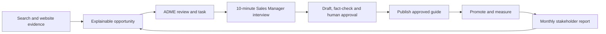

# Knox GWM Search Authority & AI Trust

## Stakeholder proposition and pilot workflow

**Prepared for:** Knox GWM Haval, Burwood Highway

**Client website:** <https://www.knoxgwmhaval.com.au>

**Prepared by:** XeroFlow

**Agency partner:** ADME Advertising

**Date:** 31 July 2026

## The proposition

XeroFlow will give Knox GWM a governed search-intelligence and content
publishing capability that sits alongside the existing dealership website.

It will turn real buyer-search evidence and dealership knowledge into
prioritised work, approved buying guides and measurable customer journeys—
without requiring Dealer Studio access or putting the existing website behind
a new proxy.

Knox becomes the design client for a repeatable XeroFlow product that ADME can
later roll out across other automotive clients.

## What we are about to do

1. Connect Knox's Google Search Console property to XeroFlow using read-only
   access.
2. Establish a 90-day baseline of the searches and pages already driving
   visibility.
3. Monitor priority dealership and vehicle pages for crawl, canonical,
   structured-data, image and mobile-performance issues.
4. Identify explainable opportunities and let the account team deliberately
   convert the best ones into XeroFlow tasks.
5. Capture one useful customer question each month through a short Sales
   Manager interview.
6. Draft, verify and approve the resulting content through a human-controlled
   workflow.
7. Publish approved guides at `learn.knoxgwmhaval.com.au`.
8. Add one safe `Buying Guides` link to the existing desktop and mobile menu
   through Google Tag Manager.
9. Measure discovery, engagement, calls to action and confirmed leads, then use
   the evidence to inform future content and reviewed paid-media briefs.

## The operating workflow

In plain language:

`Evidence -> Decision -> Original expertise -> Approval -> Publication -> Measurement -> Improvement`

## Proposed first-90-day sequence

This is the intended pilot sequence. Exact dates depend on Google access, DNS,
GTM and stakeholder readiness.

### Days 1–30 — Establish the evidence loop

- Confirm Knox, GA4, Ads, Search Console, GTM and DNS ownership.
- Connect Search Console with read-only access.
- Import and validate the 90-day search baseline.
- Record the current technical and measurement baseline.
- Surface the first evidence-backed opportunities.

**Stakeholder outcome:** one agreed view of current visibility, data health and
the first priorities.

### Days 31–60 — Build trust and original content

- Start bounded monitoring across priority pages and a rotating vehicle sample.
- Assign each technical finding to XeroFlow, the dealer website origin or an
  external provider.
- Select the first customer question using search and sales evidence.
- Run the first short Sales Manager interview.
- Draft, fact-check and approve the first content asset.

**Stakeholder outcome:** a prioritised remediation list and one approved,
publication-ready dealership guide.

### Days 61–90 — Publish, connect and measure

- Activate `learn.knoxgwmhaval.com.au` after DNS and certificate checks.
- Publish the approved guide with metadata, structured data, sitemap support
  and rollback.
- Add and verify the Buying Guides menu link.
- Confirm GA4, XeroFlow event and lead attribution.
- Enable supported Google Business Profile reporting or approved promotion if
  Google's access requirements are complete.
- Deliver the first stakeholder report and agree the next content question.

**Stakeholder outcome:** a live, measurable workflow from buyer demand to
approved content and customer action.

## Who does what

| Stakeholder | Responsibility |
| --- | --- |
| XeroFlow | Build and operate the evidence, workflow, monitoring, publishing, audit and reporting capability |
| ADME Advertising | Own the client cadence, interpret opportunities, coordinate interviews and approvals, and apply evidence to reviewed marketing work |
| Knox GWM | Authorize access, supply dealership expertise, approve claims and disclaimers, and arrange the bounded DNS and GTM changes |
| Dealer website provider | Resolve origin-controlled template, vehicle-data, canonical or main-site sitemap issues when required |

## The guardrails

- No Dealer Studio or dealer-CMS integration is required for the pilot.
- Google Tag Manager adds the menu link; it does not create indexable pages or
  inject vehicle schema.
- XeroFlow will identify origin-controlled issues but will not disguise them
  with browser-side overrides.
- AI may help analyse evidence and prepare drafts, but it cannot invent vehicle
  claims, approve content, publish, or change Google Ads campaigns.
- Every content and Google Business Profile publication requires human
  approval.
- The existing Knox website continues operating if the XeroFlow publisher or
  Menu Agent is unavailable.
- Search visibility, rich results, AI citations and lead improvement are
  measured outcomes—not guarantees.

## What stakeholders will receive

- A Search Authority workspace in XeroFlow.
- Search Console visibility and data-health reporting.
- Explainable opportunities with evidence and ownership.
- Technical findings with recommended remediation.
- One original, Sales Manager-sourced content asset per month.
- A XeroFlow-managed Knox Buying Guides hub.
- Human-approved Google Business Profile support when available.
- Monthly reporting connecting actions, visibility, engagement and leads.

## Decision requested

Approve:

1. Knox GWM as the design client.
2. The `learn.knoxgwmhaval.com.au` publishing model.
3. Read-only Search Console connection and the agreed GA4/Ads mappings.
4. The bounded GTM Buying Guides menu link.
5. The monthly interview and human-approval workflow.
6. The responsibility boundary for Dealer Studio/origin-controlled fixes.
7. The selected pilot commercial terms.
8. Detailed delivery planning for readiness and the Search Console evidence
   loop.

## Copy-ready CEO note

**Subject:** Knox GWM Search Authority & AI Trust pilot

We are proposing Knox GWM as the design client for a new Search Authority and
AI Trust capability inside XeroFlow.

The pilot will connect the search, advertising and measurement data ADME
already manages with two new capabilities: Search Console intelligence and
technical trust monitoring. It will also give us a controlled way to turn real
customer questions and dealership expertise into approved buying guides,
published through XeroFlow without relying on Dealer Studio.

The workflow remains people-led. AI can assist with analysis and drafting, but
dealership claims, publishing and campaign decisions remain subject to human
review and approval. We will measure what happens from search visibility
through to engagement and confirmed leads without promising rankings, AI
citations or media-performance outcomes.

We are asking stakeholders to approve Knox as the design client, the proposed
content-host and menu-link approach, the required read-only access, and detailed
planning for the initial evidence phase.

The intended outcome is a practical workflow proven at Knox and then packaged
for responsible rollout across other ADME automotive clients.
