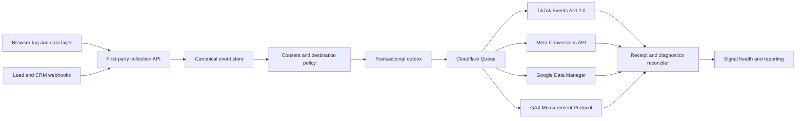

# XeroFlow enterprise server-side measurement R&D

**Client pilot:** Werribee Toyota

**Website:** `werribeetoyota.com.au`

**Research date:** 4 September 2026

**Decision:** Extend XeroFlow's existing Measurement Signal Hub with a native
TikTok Events API 2.0 adapter and a provider-neutral enterprise signal layer.

## Executive answer

XeroFlow should capture the broad, useful first-party event stream, but it should
not send every captured interaction to TikTok, Meta, Google, or GA4. The enterprise
model is:

1. capture once into a canonical XeroFlow event;
2. attach event identity, attribution, consent, provenance, and data quality;
3. apply a per-client, per-provider policy;
4. deliver an allowlisted payload through native provider adapters; and
5. reconcile provider receipts and diagnostics back into XeroFlow.

That approach gives the marketing team detailed signals and control without
turning the advertising platforms into uncontrolled copies of the customer data
estate. It also reuses XeroFlow's existing Neon control plane, transactional
outbox, Cloudflare Queue worker, retry/idempotency controls, test mode, activation
approval, audit trail, and client health reporting.

Werribee is collecting first-party events now, but it is **not ready for production
server-side advertising delivery**. Two prerequisites must be fixed first:

- every sampled event currently records marketing consent as denied; and
- form submissions are attempts, not confirmed leads, so there is no trustworthy
  optimisation conversion.

Adding a TikTok token before those two gaps are resolved would create a connected
destination, not an enterprise measurement system.

## What is working today

The XeroFlow browser tag is live on Werribee Toyota and was still receiving events
on 4 September 2026. In the preceding 30 days it captured **178,208 events**,
including:

| Signal | Events |
|---|---:|
| Page views | 39,130 |
| Vehicle views | 5,017 |
| Form submissions | 43 |
| Phone clicks | 51 |
| Clicks | 42,304 |
| Scrolls | 22,233 |
| Engagement events | 21,794 |
| Dead clicks | 32,932 |

Attribution collection is already useful for Google and Meta:

| Identifier | Events carrying it |
|---|---:|
| `gclid` | 77,494 |
| `gbraid` | 58,792 |
| `wbraid` | 1,086 |
| `fbp` | 160,718 |
| `fbc` | 703 |
| `ttclid` | 0 |

The tag knows how to capture `ttclid`, but no recent TikTok click identifier was
observed. TikTok's `_ttp` browser identifier is not yet part of the canonical
capture contract.

The backend foundation is strong. XeroFlow already has native Meta and Google Data
Manager adapters behind a shared delivery worker, plus test runs, destination
health, encrypted credential references, activation approvals, audit, retry, and
dead-letter handling. TikTok should be a third native adapter on that control
plane, not a standalone integration.

## The two Werribee launch blockers

### 1. Consent is captured as denied

The 30-day sample contained 177,952 `au_implicit_essential` events and 259
`eu_implicit_deny` events, all with marketing denied. Werribee's tracking site is
configured with consent mode off while its measurement profile is consent-gated.
The result is internally consistent—XeroFlow keeps essential first-party
telemetry—but no sampled event qualifies for advertising fan-out.

The fix is not to silently change denied to granted. XeroFlow needs a consent
bridge that reads an explicit choice from the site's consent management platform,
stores an auditable snapshot, updates browser tags, and applies the same decision
to server delivery. Google describes Consent Mode as the mechanism that receives
the user's choice from a banner; it is not itself a banner or a substitute for
obtaining consent. [Google Consent Mode](https://support.google.com/analytics/answer/10000067?hl=en)

OAIC guidance also cautions that notice alone does not establish consent, and that
URLs, IP addresses, identifiers, and hashed data can be personal information.
XeroFlow should complete a privacy impact assessment and client legal review
before activating identity enrichment or cross-border platform delivery.
[OAIC tracking-pixel guidance](https://www.oaic.gov.au/privacy/privacy-guidance-for-organisations-and-government-agencies/organisations/tracking-pixels-and-privacy-obligations)

### 2. There is no confirmed website lead conversion

All 43 recent `form_submit` events were marked `lead_eligible=false`. There were no
lead-intent correlations, Werribee website leads, or canonical `generate_lead`
events in the period. Optimising from the raw HTML submit event would count failed
validation, abandoned provider widgets, and other attempts as conversions.

The site integration must receive a confirmed success signal from each lead form:
a post-success callback, data-layer event, thank-you state, or an authoritative
dealer-form/provider webhook. XeroFlow can then correlate the browser event and
server outcome with one event id and promote a single canonical conversion.

## Cross-platform design rules

The official provider guidance converges on the same core design:

| Concern | TikTok | Meta | Google Ads | GA4 |
|---|---|---|---|---|
| Browser + server | Pixel plus Events API recommended | Pixel plus Conversions API | Google tag plus Data Manager/ECL | Google tag plus Measurement Protocol |
| Deduplication key | Same event and `event_id` | Same event and `event_id` | Stable `transactionId` | XeroFlow id plus browser/session correlation |
| Click/browser keys | `ttclid`, `_ttp` | `fbc`, `fbp` | `gclid`, `gbraid`, `wbraid` | `client_id`, `session_id` |
| Identity enrichment | Hashed email, phone, external id | Hashed email, phone, external id | Normalised SHA-256 user data | `user_id`/user data where permitted |
| Request context | IP and user agent where permitted | IP, user agent, source URL | Session and event source attributes | Client/session ids and engagement time |
| Consent | Explicit policy gate | Explicit policy gate | `adUserData` and `adPersonalization` | `ad_user_data` and `ad_personalization` |
| Validation | Test Events and diagnostics | Test Events/diagnostics | `validateOnly`, request id, diagnostics | Debug validation plus report reconciliation |

TikTok explicitly recommends Pixel and Events API together, sharing the same
events and parameters, and documents browser/server deduplication using event name
and event id. [TikTok connection methods](https://ads.tiktok.com/help/article/website-data-connection-setup-methods?lang=en),
[TikTok deduplication](https://ads.tiktok.com/resources/help/article/event-deduplication?lang=en)

TikTok match quality can use `ttclid`, `_ttp`, hashed first-party identifiers, and
request context, subject to consent and data-minimisation policy.
[TikTok matching guidance](https://ads.tiktok.com/resources/help/article/how-to-set-up-matching-events-with-events-api)

Meta's official Business SDK examples use the corresponding browser identifiers,
hashed customer data, source URL, IP, and user agent for Conversions API events.
[Meta Node Business SDK](https://github.com/facebook/facebook-nodejs-business-sdk/blob/main/README.md),
[Meta server-event example](https://github.com/facebook/facebook-python-business-sdk/blob/main/examples/AdsPixelEventsPostCustom.py)

Google Data Manager uses a stable transaction id, click identifiers, consent,
session attributes, and carefully normalised and hashed first-party data. Its HTTP
response can still carry record-level warnings, so XeroFlow must retain the
request id and reconcile asynchronous diagnostics.
[Google Data Manager events](https://developers.google.com/data-manager/api/devguides/events/send-events),
[Google diagnostics](https://developers.google.com/data-manager/api/devguides/diagnostics)

GA4 Measurement Protocol should reuse the browser's client and session identity.
Google notes that malformed payloads can still receive HTTP 2xx and that session
attribution depends on the matching session id and timely delivery.
[GA4 Measurement Protocol](https://developers.google.com/analytics/devguides/collection/protocol/ga4/reference?hl=en),
[GA4 session attribution](https://developers.google.com/analytics/devguides/collection/protocol/ga4/use-cases)

## Target architecture

Cloudflare Queues provides at-least-once delivery, so stable idempotency keys and
provider deduplication are required even when the normal delivery path runs only
once. [Cloudflare Queue delivery guarantees](https://developers.cloudflare.com/queues/reference/delivery-guarantees/)

### Canonical event envelope

Every event should carry:

- immutable `event_id`, canonical name, source, occurrence time, receipt time,
  client, site, environment, and schema version;
- browser/session identity, landing/referrer data, campaign parameters, and
  allowlisted click identifiers;
- an immutable consent snapshot with purpose-level decisions and provenance;
- lead/CRM correlation references and quality state—attempted, confirmed,
  qualified, won, invalid, or test;
- safe business properties such as vehicle stock id, make/model, page type,
  value, and currency; and
- quality flags, policy decisions, provider mapping version, and delivery lineage.

Raw identity must not be placed in canonical events, queue messages, logs,
diagnostics, or audit records. If a conversion has an authorised CRM/lead source,
the delivery adapter may resolve and normalise email or phone, hash it in memory,
construct the provider request, and immediately discard it. The existing HMAC
lead-intent fingerprint remains a correlation key; it is not sent to providers.

Raw IP address is not required for the initial launch. Adding it to delayed
server-side matching would require a separately approved, encrypted, short-lived
matching envelope and privacy assessment. User agent, click ids, browser ids, and
confirmed first-party identity provide a safer first release.

## Signal policy: capture broadly, share deliberately

XeroFlow should retain useful first-party behavioural signals for analytics and
site-quality work. Ad platforms should receive outcome-oriented, documented
events—not every scroll, dead click, rage click, or raw form interaction.

| XeroFlow canonical signal | TikTok | Meta | Google Ads | GA4 | Client-facing meaning |
|---|---|---|---|---|---|
| `page_view` | Pixel/base coverage; server optional | Pixel/base coverage; server optional | Tag/session context | `page_view` | Website visit |
| `vehicle_view` | `ViewContent` | `ViewContent` | Audience/remarketing policy | `view_item` | Vehicle viewed |
| `site_search` | `Search` | `Search` | Audience policy | `search`/`view_search_results` | Inventory search |
| `phone_click` | `Contact` if qualified | `Contact` | Configured click conversion | `generate_lead` with channel | Phone enquiry intent |
| `form_start` | Usually no | Usually no | Usually no | Funnel event | Form started |
| confirmed lead | `SubmitForm` | `Lead` | Configured lead conversion | `generate_lead` | Enquiry received |
| test-drive booking | `Schedule` | `Schedule` | Configured booking conversion | Custom/recommended event | Test drive booked |
| qualified lead | CRM/offline event when approved | CRM Conversion Leads | Enhanced conversions for leads | Funnel event | Sales-qualified enquiry |
| vehicle sale | `Purchase` when contractually appropriate | `Purchase`/offline outcome | Enhanced conversion/offline outcome | `purchase` | Vehicle sold |
| scroll/dead click/rage click | No | No | No | Optional UX analytics | Internal experience signal |

TikTok's current standard-event catalogue includes ViewContent, Search, Contact,
Schedule, SubmitForm, and Purchase, which lets XeroFlow avoid custom names for the
main automotive funnel. [TikTok standard events](https://ads.tiktok.com/resources/help/article/standard-events-parameters?lang=en)

Each mapping is versioned and independently configurable by client and
destination. A client can capture an event in XeroFlow without authorising it for
any advertising platform.

## Enterprise controls and observability

### Agency Signal Centre

The marketing team needs an operational view, not just an on/off toggle:

- live capture volume and freshness by site and canonical event;
- browser/server pairing and deduplication rates;
- attribution coverage for `ttclid`, `_ttp`, `fbc`, `fbp`, `gclid`, `gbraid`, and
  `wbraid`;
- consent-granted, denied, unknown, policy-skipped, invalid, test, and delivered
  counts;
- confirmed-conversion funnel with attempted submissions kept separate;
- provider delivery latency, retries, permanent failures, dead-letter volume,
  last receipt, and diagnostic state;
- match-quality inputs present per provider, without exposing the actual identity;
- mapping/version history, activation approvals, and an immutable change log;
- test-event mode, payload preview with redaction, replay for safe failures, and
  per-event lineage from capture to provider receipt.

Suggested operating objectives:

| Objective | Initial target |
|---|---:|
| Capture availability | 99.9% monthly |
| Valid event visible in XeroFlow | p95 under 60 seconds |
| Eligible event accepted by provider | p95 under 5 minutes |
| Delivery success excluding policy skips | at least 99.5% |
| Unexplained duplicate conversions | 0 |
| Dead-letter acknowledgement | within one business day |
| Destination health/diagnostic refresh | at least hourly |

### Client portal

Clients should see a simpler view:

- website tracking status and last signal received;
- funnel counts for visits, vehicle views, enquiries, qualified leads, and sales;
- platform connection health and last successful delivery;
- plain-language warnings such as “consent signal missing” or “form success event
  not connected”; and
- change history and outcomes, without credentials, hashes, raw identifiers,
  internal error payloads, or replay controls.

## TikTok adapter requirements

The native adapter should use Events API 2.0 and the Business API gateway, with:

- destination fields for Pixel/Data Source id, purpose-scoped access-token
  reference, environment, event mappings, and safe property allowlists;
- standard event mappings and deterministic `event_id` reuse across Pixel and
  server;
- `ttclid` and `_ttp` propagation, user-agent context, approved hashed identity,
  page URL, value/currency, and non-sensitive content identifiers;
- test-event support, schema validation, redacted payload preview, provider
  receipt capture, retry classification, and Events Manager diagnostics;
- idempotency at the outbox/delivery layer and provider deduplication at TikTok;
  and
- the same two-person live-activation and audit controls used by the existing
  measurement hub.

TikTok Events Manager provides Test Events, diagnostics, change history, and
match-quality reporting that should feed the XeroFlow destination health view.
[TikTok Events Manager](https://ads.tiktok.com/help/article/about-tiktok-events-manager/),
[TikTok web diagnostics](https://ads.tiktok.com/help/article/web-diagnostics?redirected=1)

## Recommended rollout for Werribee Toyota

### Gate 0 — trustworthy collection

1. Inventory every lead path on the website, including embedded dealer/provider
   forms and phone interactions.
2. Add confirmed-success callbacks or provider webhooks and verify one canonical
   conversion per successful lead.
3. Integrate an approved consent mechanism with XeroFlow and all browser tags.
4. Capture `_ttp`, verify TikTok campaign URLs retain `ttclid`, and report both as
   coverage metrics.

**Exit gate:** explicit consent is observable; test leads become confirmed
canonical conversions; failed/abandoned forms do not.

### Gate 1 — TikTok test destination

1. Add TikTok to the shared contracts, database constraints, encrypted credential
   bindings, API endpoints, worker registry, and Nuxt UI destination editor.
2. Implement Events API 2.0 payload mapping and test-mode delivery.
3. Pair browser Pixel and server events using the same event name and event id.
4. Validate ViewContent, Search, Contact, SubmitForm, and Schedule in TikTok Test
   Events; inspect match coverage and deduplication.

**Exit gate:** test events are accepted, paired without duplicates, contain no
unapproved fields, and appear healthy in XeroFlow and TikTok.

### Gate 2 — enterprise signal operations

1. Add the agency Signal Centre, event explorer, coverage metrics, provider
   diagnostics, alerting, redacted payload preview, and replay controls.
2. Add the client portal funnel and plain-language health view.
3. Bring Meta, Google Data Manager, and GA4 onto the same event policy and
   diagnostic vocabulary so platform comparisons are meaningful.

**Exit gate:** every eligible conversion has end-to-end lineage; every skip or
failure has an explicit reason; client and agency totals reconcile.

### Gate 3 — controlled live activation

1. Complete privacy/legal review and client data-sharing approval.
2. Run the existing two-person activation workflow.
3. Enable a narrow event allowlist first: vehicle view, confirmed lead, and test
   drive booking.
4. Observe delivery, deduplication, match inputs, and conversion counts through a
   seven-day soak period before adding qualified-lead or sale outcomes.

**Exit gate:** no unexplained duplicates, no PII leakage, provider diagnostics
are healthy, and XeroFlow/provider counts are within an agreed reconciliation
tolerance.

## Recommendation

Proceed with the native TikTok adapter and enterprise Signal Centre, using
Werribee Toyota as the pilot. Treat consent and confirmed lead capture as Gate 0,
not later polish. Once those foundations are sound, TikTok becomes a bounded
extension of the existing XeroFlow measurement control plane, and the same model
can govern Meta, Google Ads, GA4, and future destinations without duplicating
business logic or surrendering control of the first-party event stream.
