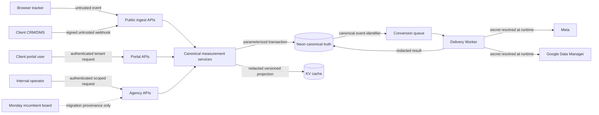

# Measurement Signal Hub Threat Model

## Status and scope

Accepted design baseline, 2026-07-17. This register covers the canonical
configuration service, internal and portal APIs, public tracking/outcome endpoints,
Neon, derived KV configuration, queues, the delivery Worker, provider adapters,
the native rollout board, and the final Monday reconciliation.

Production activation remains separately gated. A threat marked mitigated here
means the design has an explicit control; its implementation still requires the
tests and evidence listed below.

## Assets

- tenant identity and client access boundaries;
- measurement configuration and lifecycle authority;
- CRM/lead lifecycle truth and immutable transition history;
- conversion event identity, attribution IDs, and consent decisions;
- Meta, Google, webhook, Queue, and KV credentials;
- provider delivery state and replay authority;
- configuration and operational audit evidence;
- client trust: one client's data or action must never affect another client.

## Trust boundaries

Data from browsers, client systems, provider responses, queues, KV, Monday, and
even authenticated users is untrusted at its boundary. Neon state is trusted only
after tenant-scoped typed parsing; legacy rows are not exempt from output redaction.

## STRIDE register

| Boundary | Threat | Abuse case | Required controls | Verification |
|---|---|---|---|---|
| Browser → public ingest | Spoofing/tampering | Fabricate another site's conversion or alter tenant key | Opaque write key/hostname mapping, origin policy, tenant derived server-side, schema/size caps, consent snapshot | Unknown key/origin and cross-tenant fixtures reject identically |
| Browser tracking → canonical outbox | Consent bypass/PII disclosure/duplication | Promote an analytics-only event, copy form data, or replay a browser lead into provider delivery | Exact `generate_lead` allowlist; marketing-consent gate; attribution allowlist; shared browser event ID; insert-result dedup; transactional savepoint | Granted/denied, duplicate, PII exclusion, and promotion-failure tests |
| Client CRM → outcome webhook | Spoofing/replay | Forge `Qualified`, reuse a valid request, enumerate endpoints | Opaque endpoint key; HMAC-SHA256 over timestamp + raw body; constant-time compare; short timestamp window; event ID idempotency; secret version/rotation; generic responses | Signature vectors, expired/future timestamp, replay, rotation and enumeration tests |
| Agency/portal → APIs | Elevation/tenant confusion | Change an unassigned client or use a portal ID from another tenant | Authentication plus role/permission and client scope; resource lookup includes client; cross-tenant behaves as not found; expected version | Role matrix, IDOR, cross-tenant and stale-write endpoint tests |
| Agency → Google discovery | Tenant confusion/credential disclosure/wrong destination | List another client's conversion actions, leak OAuth material, or mistake an ad account/resource name for a Data Manager destination | Configure permission; client + connection predicate; encrypted profile credential boundary; strict provider response schema; eligible action allowlist; numeric destination ID DTO; redacted errors | Cross-tenant 404, malformed provider response, token redaction, and exact-ID UI tests |
| Config service → Neon | Tampering/repudiation | Bypass version checks, overwrite newer config, deny a live enablement | Parameterized transaction; expected-version predicate; atomic increment; before/after audit; actor/reason; two-person live gate | Concurrent update test, rollback test, audit equality/read-back |
| Service → KV | Tampering/stale cache | Cache contains secrets or overwrites newer truth | Explicit projection allowlist; no credential refs/identifiers; config version; publish after commit; monotonic compare; TTL; Neon fallback | Projection snapshot, secret scan, out-of-order publish and outage tests |
| Neon → Queue | Duplication/loss | DB commit succeeds but queue publish fails, or message repeats | Transactional outbox, unique idempotency key, publisher claim/lease, sweeper, queue message contains canonical IDs only | Queue-failure recovery and duplicate message tests |
| Queue → Worker | Tampering/DoS | Crafted/oversized message, poison retry loop, tenant/destination swap | Parse message; reload event/destination by tenant; size limit; bounded attempts/backoff; DLQ; per-destination rate limits | Fuzz/size tests, mismatched tenant fixture, poison-message drill |
| Worker → provider | Information disclosure/privilege | Token logged, wrong dataset used, external capability overwritten | Resolve opaque credential reference at runtime; destination/client recheck; capability `canZeroMutate`; redacted structured logs; timeout; provider allowlist | Log scan, wrong-destination test, external-management denial |
| Provider → Worker | Tampering/instruction injection | Malformed response changes state or leaks body | Provider-specific response schema; bounded body; stable error mapping; request ID/error class only; no response-body persistence | Malformed/oversized response fixtures and redaction tests |
| Replay API → Queue/provider | Elevation/repudiation | Unauthorized or repeated replay double-sends | Owner/admin permission; reason; eligibility predicate; delivery idempotency; immutable replay audit; rate limit | Role, duplicate replay, reason and audit tests |
| Monday import/reconcile | Tampering/info disclosure | Board field becomes runtime config or receives PII/secrets | Import is provenance/task data only; typed Measurement links; allowlisted final fields; no runtime reads; mutation audit/read-back | Static dependency search, dry-run diff, redaction and read-back audit |
| Support/observability | Information disclosure | Staff or client sees raw PII, credentials, payloads or another tenant | Separate internal/client DTOs; field allowlists; pseudonymous identifiers; scoped log search; no raw body; support access audit | DTO contract tests, snapshot secret/PII scans, tenant visibility tests |
| Public endpoints | Denial of service | Payload bombs, high-rate signatures, expensive identity matching | Body/header limits before parse; endpoint/IP/client rate limits; bounded identity strategy; timeouts; no cross-tenant scanning | Boundary size/rate/load tests and query-plan inspection |

## Deterministic abuse outcomes

| Scenario | Outcome |
|---|---|
| Wrong-tenant resource identifier | `MEASUREMENT_NOT_FOUND`; no ownership hint |
| Valid signature with duplicate event ID | Return prior accepted/duplicate result; no new transition/outbox row |
| Expired, future, malformed, or invalid signature | Generic authentication failure; rejection metadata only |
| Portal authoritative request under external authority | `MEASUREMENT_FORBIDDEN`; optional proposal only if configured |
| Stale expected version | `MEASUREMENT_VERSION_CONFLICT`; no partial audit/cache write |
| Older event after terminal outcome | Reject to exception workflow; immutable attempted transition retained |
| Provider `429`, timeout, supported `5xx` | Retryable delivery with bounded delayed retry |
| Provider auth/config/payload failure | Permanent-blocked until configuration version changes |
| Consent prohibits destination | Policy skip, not failure; no provider request |
| Profile or destination disabled/paused | No queued provider delivery |
| KV publication failure | Neon commit succeeds; cache marked stale; safe fallback used |
| Queue publish failure | Outbox remains pending and sweeper retries |

## Secret and PII rules

- Tokens and HMAC secrets live only in the approved secret store or the existing
  encrypted connection boundary. Measurement tables contain opaque references and
  secret version metadata, never values.
- Contact email/phone is not part of canonical event JSON, diagnostics, logs, board
  items, or queue payloads. Provider-required normalization/hashing occurs at the
  narrow adapter boundary from an approved, short-lived source.
- Click and provider lead identifiers are client-scoped identifiers. Internal views
  may show a redacted suffix; client views show counts/status only.
- Raw public request bodies are discarded after validation. Rejection records retain
  timestamp, endpoint/client after safe resolution, event-ID hash where available,
  reason class, and request correlation ID.
- Credential references are also hidden from portal/client DTOs and general health
  exports because their names may reveal infrastructure details.

## Rotation and incident response

1. Webhook endpoints track current and previous secret versions with a short,
   explicit grace expiry. Verification never reports which version matched.
2. Provider credential rotation changes the opaque reference/config version, blocks
   live dispatch until validation passes, and leaves historical attempts redacted.
3. A suspected tenant-confusion or secret-leak incident triggers the profile kill
   switch, credential revocation, queue pause, audit preservation, scoped replay
   review, and client/privacy escalation.
4. DLQ content is not archival. Alerts fire before platform expiry and replay uses
   Neon canonical events, not untrusted retained messages.

## Retention enforcement

Retention follows ADR-004. Purge jobs operate on client/time indexes, process bounded
batches, preserve aggregate counts, and emit an audit/metric without deleted content.
Legal holds are explicit rows or policy state, not ad hoc job disablement. Raw body
or provider payload storage is prohibited, so there is nothing to purge from logs.

## Required security evidence before live rollout

- [ ] Migration proves tenant foreign keys, uniqueness, safe dormant defaults, and
      absence of secret-value columns.
- [ ] API role matrix and IDOR/cross-tenant tests pass.
- [ ] Optimistic concurrency and audit transaction tests pass.
- [ ] Webhook signature, timestamp, replay, rotation, size, and rate tests pass.
- [ ] Browser/server event deduplication test passes with one shared event ID.
- [ ] Queue failure, duplicate, poison, retry, and DLQ recovery drills pass.
- [ ] Provider response parsing and log/DTO redaction tests pass.
- [ ] KV projection contains only allowlisted fields and survives outage/stale order.
- [ ] Two-person live enablement and emergency pause are demonstrated.
- [ ] Ferntree or the approved fallback has fresh identifier-bearing test evidence
      and signed privacy/operational ownership.

## Residual risks

- Provider consoles and beta diagnostic APIs may be delayed or unavailable. Zero
  records this as evidence freshness, never fabricated readiness.
- Hashed identifiers remain personal information in many contexts. Hashing is not
  anonymisation; consent, tenant scope, retention, and access rules still apply.
- Existing `social_connections` stores provider tokens in legacy columns. This
  design does not copy them; hardening that legacy credential store is related but
  separate work. Measurement uses opaque references and the narrow adapter boundary.
- A client can send semantically false but correctly signed outcomes. Reconciliation,
  anomaly detection, source authority, and immutable history reduce impact but do
  not prove real-world truth.

## Related

- [ADR-004](../decisions/ADR-004-measurement-signal-hub-canonical-control-plane.md)
- [Master PRD](../superpowers/plans/2026-07-17-measurement-signal-hub-capi-outcomes.md)
- [Readiness audit](../superpowers/research/2026-07-17-meta-google-account-readiness-audit.md)
