# Video Workflow Handoff

This file captures the full set of video-related work that was merged and pushed through to production.

## What Was Added

- Video Studio V1 planning and AV editor work
- Publish, export, and distribution follow-up
- AI producer harness in the media library
- Asset intelligence APIs for models, extraction, masks, derivatives, captions, thumbnails, and streaming
- Standalone `asset-intelligence` worker for queue-driven processing
- Timeline helpers for video library and derivative reuse
- App integration on the audio project page and video media library
- Tests and documentation for the new video pipeline

## Delivery Path

1. Video work was developed across the video-studio branches and worktrees.
2. The AI producer harness and asset intelligence layer were integrated into the app and server code.
3. The video work was merged into `main` as commit `d3aa681f`.
4. `main` was pushed to `origin/main`.
5. Cloudflare Pages production for `agency-dashboard` was deployed from `main`.
6. Production was verified against the latest Pages deployment.

## Main Branches Involved

- `feat/video-studio-v1`
- `feat/video-studio-v1-3`
- `feat/video-ai-producer-harness`
- `publish-video-ai-producer-harness`

## Core Files Touched

- `app/components/media/MediaAssetHarness.vue`
- `app/components/media/MediaVideoLibrary.vue`
- `app/pages/agency/audio/projects/[id].vue`
- `app/utils/video/videoLibraryTimeline.ts`
- `server/utils/video-asset-intelligence/*`
- `workers/asset-intelligence/*`
- `server/api/agency/video/*`
- `test/video/*`
- `test/workers/asset-intelligence/*`
- `docs/superpowers/plans/2026-06-10-video-asset-intelligence-execution.md`

## Graph View

```dot
digraph video_workflow {
  rankdir=LR;
  graph [fontsize=12, fontname="Helvetica", labelloc="t", label="Video Work Delivered to Main and Production"];
  node [shape=box, style="rounded,filled", fillcolor="#f7f7f7", color="#c9c9c9", fontname="Helvetica"];
  edge [color="#6b7280", fontname="Helvetica"];

  start [label="Start\nVideo work already in progress on local branches and worktrees"];

  subgraph cluster_foundation {
    label="Video foundation";
    color="#d1d5db";
    style="rounded";

    v1 [label="Video Studio V1 planning\nUI and AV workflow design"];
    v2 [label="AV editor / timeline work\nvideo-studio-v1-3 branch"];
    v3 [label="Publish / export / distribution\nvideo-studio-v1-3 follow-up"];
  }

  subgraph cluster_harness {
    label="AI producer and asset intelligence";
    color="#d1d5db";
    style="rounded";

    h1 [label="Media asset harness\nAdded AI producer controls"];
    h2 [label="Asset intelligence APIs\nmodels, extract, masks, derivatives, stream"];
    h3 [label="Asset intelligence worker\nQueue consumer, provider adapters, storage, DB"];
    h4 [label="Timeline and registry helpers\nvideoLibraryTimeline, assetDerivativeTimeline,\nvideoSourceRegistry, generatedClipInspector"];
  }

  subgraph cluster_integration {
    label="App integration";
    color="#d1d5db";
    style="rounded";

    i1 [label="Media library integration\nVideo library rows can add assets to timeline"];
    i2 [label="Audio project integration\nMediaAssetHarness mounted in project page"];
    i3 [label="Server utilities and routes\nvideo-asset-intelligence DB/enqueue/access/buckets"];
    i4 [label="Tests and docs\nVitest coverage plus runbooks, plans, handoffs"];
  }

  subgraph cluster_merge {
    label="Merge and deploy";
    color="#d1d5db";
    style="rounded";

    m1 [label="Merged into main\nMerge commit d3aa681f"];
    m2 [label="Pushed to origin/main\nRemote branch updated"];
    m3 [label="Cloudflare Pages deploy\nagency-dashboard production"];
    m4 [label="Production verified\nlatest Pages deployment points to d3aa681f"];
  }

  start -> v1;
  v1 -> v2;
  v2 -> v3;
  v3 -> h1;
  h1 -> h2;
  h2 -> h3;
  h3 -> h4;
  h4 -> i1;
  i1 -> i2;
  i2 -> i3;
  i3 -> i4;
  i4 -> m1;
  m1 -> m2;
  m2 -> m3;
  m3 -> m4;

  branch_v1 [shape=note, label="Branches involved:\nfeat/video-studio-v1\nfeat/video-studio-v1-3\nfeat/video-ai-producer-harness\npublish-video-ai-producer-harness"];
  deploy_note [shape=note, label="Result:\nmain and origin/main aligned\nCloudflare Pages production updated"];

  v2 -> branch_v1 [style=dashed, color="#9ca3af"];
  m4 -> deploy_note [style=dashed, color="#9ca3af"];
}
```

