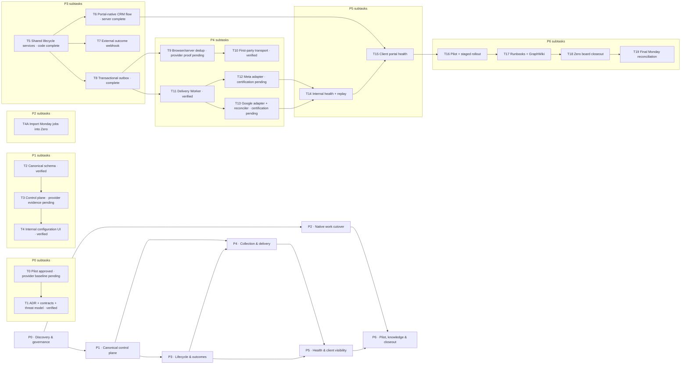

# Zero Measurement Signal Hub — Parent Task and Subtask Backlog

**Master PRD:** [Zero Measurement Signal Hub plan](./2026-07-17-measurement-signal-hub-capi-outcomes.md)
**Execution state:** foundation branches are merged to `main`; pilot evidence updates use short-lived review branches
**Operating rule:** Zero owns configuration, delivery health, and rollout work. Monday remains migration input/history and receives only the governed final reconciliation.

## Delivery status — 18 July 2026

- **Production foundation verified:** T1–T5, T8, T10, and T11 have production evidence. Zero now exposes the versioned client configuration UI, canonical readiness and audit views, native/client lifecycle services, first-party hostname transport, transactional outbox, dedicated Queue consumer, Hyperdrive, DLQ, and dormant provider adapters.
- **Controlled pilot approved and configured:** Big Garage Subaru (`436e159b-d053-4de2-ad0e-e589b938ced7`) is the owned-site pilot. Its profile is disabled in `test`, `consent_gated`, and uses active first-party collection at `signals.biggaragesubaru.com.au`. The exact dormant destinations are Meta dataset `202987455920103` and Google conversion action `customers/6257728347/conversionActions/7687832282`, both mapped to `lead_qualified`.
- **Canonical Zero board established:** the native `Meta CAPI Rollout` board contains seven parents and 21 subtasks. Eight production-evidenced subtasks and parent P1 are `Verified`; 13 subtasks remain open. Monday board `18422459929` is still read-only migration input and has not been mutated.
- **Provider certification blocked, not failed:** the linked Google account is active for Ads but its token expired on 17 July and lacks `https://www.googleapis.com/auth/datamanager`; re-consent is open in the controlled-pilot browser session. Zero contains zero Big Garage leads and the pilot tracking site contains zero events, so no real Meta lead ID or Google click ID exists yet. No provider event has been sent.
- **Remaining acceptance evidence:** complete Google re-consent, create an approved identifier-bearing pilot lead/click, obtain a Meta Test Events code, run Meta/Google test delivery and diagnostic reconciliation, prove browser/server dedup in Meta, execute failure/rollback drills and the soak window, then complete T4A/T17–T19.
- **Security state:** production board-status routes require authentication, board membership, and authenticated actor attribution following PR #209. Configuration and destination secrets remain opaque; production evidence records only secret presence and redacted health.

## Graphic mapping

## P0 — Discovery and governance

**Parent outcome:** Freeze the pilot, ownership, contracts, privacy rules, and evidence baseline before persistent or external behavior is enabled.

### T0 — Pilot and incumbent-board baseline

- **Details:** Keep Monday board `18422459929` read-only; map its fields to Zero; operate Big Garage Subaru as the approved owned-site pilot; capture current Meta and Google diagnostics before Zero sends events.
- **Deliverable:** Board schema/mapping note, Big Garage pilot decision record, named owners, provider baseline, fresh identifier-bearing test-lead evidence.
- **Done when:** Big Garage is recorded as the pilot, the exact destinations and pre-existing provider faults are baselined, and fresh real test identifiers are approved without fabricating provider data.
- **Depends on:** None.

### T1 — Architecture, lifecycle contract, and threat model

- **Details:** Approve Neon as canonical storage, KV as cache only, dedicated async delivery, Zero-native work management, lifecycle authority/conflict rules, retention, consent, redaction, idempotency, and rollback semantics.
- **Deliverable:** ADR, versioned TypeScript/Zod contracts, STRIDE threat model, privacy/retention decision, error taxonomy.
- **Done when:** Cross-module contracts are reviewable and stale writes, tenant confusion, replay, secret exposure, and terminal-state regressions have explicit outcomes.
- **Depends on:** T0.

## P1 — Canonical control plane

**Parent outcome:** Store and operate every client’s measurement configuration in Zero without relying on Monday or provider-console inference.

### T2 — Canonical measurement database schema

- **Details:** Add profiles, capability-aware destinations, mappings, durable lead/CRM links, lifecycle history, outcome endpoints, conversion outbox, and delivery attempts with additive constraints and indexes.
- **Deliverable:** Idempotent migration plus migration contract tests and rollback/forward-fix notes.
- **Done when:** Tenant scope, uniqueness, safe defaults, audit timestamps, idempotency keys, and redacted diagnostic storage are enforced by Postgres.
- **Depends on:** T1.

### T3 — Typed repositories and configuration APIs

- **Details:** Create the only supported service boundary for reading/mutating profiles, capability states, destinations, mappings, and health; enforce RBAC, optimistic concurrency, auditing, and cache publication.
- **Deliverable:** Repositories, Zod inputs/outputs, internal endpoints, consistent errors, unit/API tests.
- **Done when:** Secrets and cross-client rows cannot be returned, stale config writes return `409`, and a KV failure cannot replace Neon truth.
- **Depends on:** T2.

### T4 — Internal Measurement configuration experience

- **Details:** Add a client Measurement panel with collection tier, consent, lifecycle authority, capability matrix, destination mapping, owners, evidence, blockers, mappings, readiness, and audit history.
- **Deliverable:** Production-quality Nuxt UI slice and browser/component tests.
- **Done when:** Ops can configure a disabled profile without SQL and cannot confuse externally managed web/GTM measurement with Zero-managed CRM delivery.
- **Depends on:** T3.

## P2 — Native rollout work cutover

**Parent outcome:** Make Zero’s native board and task hierarchy the working rollout system while preserving complete Monday provenance.

### T4A — Import Monday parent jobs and subitems into Zero

- **Details:** Dry-run the existing Monday importer, create the native Meta CAPI Rollout board, preserve item/subitem relationships, owners, dates, dependencies, comments/files, source IDs, and client links, then establish a cutover timestamp.
- **Deliverable:** Native board, mapping tables, import/reconciliation report, exceptions, visible cutover notice subject to approval.
- **Done when:** Every source item is imported or excepted, reruns are idempotent, and Monday is no longer the working configuration/task source.
- **Depends on:** T0 for import; T3–T4 for typed Measurement-profile links.

## P3 — Lifecycle and outcome authority

**Parent outcome:** Turn lead and CRM status movements into one immutable, tenant-safe lifecycle stream and transactional outbox.

### T5 — Shared lead and CRM transition services

- **Details:** Replace route-level duplicated mutations with one lead state machine and one opportunity-stage service; add explicit lead-to-opportunity links and preserve actor, source, previous/next stage, occurrence time, and mapping evidence.
- **Deliverable:** Shared services and state/concurrency/tenant/provenance tests.
- **Done when:** Agency and portal transitions use the same rules and duplicate or stale transitions cannot emit duplicate outcomes.
- **Depends on:** T2–T3.

### T6 — Native client-portal outcome workflow

- **Details:** Make the existing portal CRM pipeline the default client outcome surface for linked opportunities while retaining a governed leads-only path before linkage.
- **Deliverable:** Scoped portal mutations, permission checks, audit timeline, and end-to-end native lifecycle test.
- **Done when:** A client can progress an authorised lead/opportunity to Qualified/Won/Lost without an external webhook and Zero remains authoritative.
- **Depends on:** T3, T5.

### T7 — External CRM/DMS outcome ingestion

- **Details:** For external-authority cohorts only, accept versioned signed webhooks with timestamp tolerance, replay protection, rate/size limits, endpoint rotation, deterministic identity resolution, and exception routing.
- **Deliverable:** Public webhook boundary, configuration UI, signature vectors, abuse-case tests, sandbox evidence.
- **Done when:** Wrong signatures, replays, oversized bodies, ambiguous matches, and cross-tenant identifiers fail closed without leaking internals.
- **Depends on:** T3, T5; not required for the native-CRM pilot.

### T8 — Transactional lifecycle event and conversion outbox

- **Details:** Write accepted lifecycle history and canonical conversion events in the same database transaction, snapshot the config/mapping version, enqueue after commit, and repair stranded rows safely.
- **Deliverable:** Outbox service, queue producer, sweeper, and rollback/idempotency tests.
- **Done when:** Queue failure cannot lose an accepted lifecycle change and retry cannot duplicate the canonical event.
- **Depends on:** T3, T5.

## P4 — Collection and provider delivery

**Parent outcome:** Collect, deduplicate, transport, and deliver website and CRM signals with provider-specific behavior behind canonical contracts.

### T9 — Browser/server deduplication contract

- **Details:** Make the browser event ID canonical, carry it through `/api/public/track`, canonical events, and Meta server delivery, and distinguish duplicate suppression from legitimate repeated actions.
- **Deliverable:** Shared event-ID contract, endpoint tests, GTM/Pixel evidence.
- **Done when:** Meta Test Events shows browser/server copies deduplicated and Zero rejects malformed or reused IDs according to policy.
- **Depends on:** T1, T3, T8.

### T10 — First-party transport and hostname readiness

- **Details:** Configure Tier A/B/C/backend collection, CNAME/custom hostname ownership, DNS/certificate reconciliation, safe tenant resolution, consent gating, and failure states.
- **Deliverable:** Hostname service, bindings, configuration UI, DNS/tenant browser tests.
- **Done when:** A hostname cannot route to the wrong client and certificate/DNS failure pauses collection visibly.
- **Depends on:** T3–T4, T9.

### T11 — Dedicated conversion-delivery Worker

- **Details:** Consume outbox jobs, claim deliveries idempotently through Postgres/Hyperdrive, batch conservatively, retry with jitter, route permanent failures to a DLQ, and expose replay-safe diagnostics.
- **Deliverable:** Worker package, queue/DLQ bindings, adapter interface, unit/integration tests.
- **Done when:** Redelivery and partial failure are safe, secrets remain in bindings, and queue/DLQ state is diagnosable.
- **Depends on:** T2–T3, T8–T10.

### T12 — Meta web/CRM CAPI adapter and validation

- **Details:** Keep Pixel, web CAPI, CRM CAPI, and Conversion Leads states separate; send normalized consent-aware web events and the distinct CRM payload with valid Meta lead ID, raw stage, every later stage, and accurate timestamps.
- **Deliverable:** Adapter, payload/error contracts, Test Events action, eligibility/coverage view, Ferntree baseline comparison.
- **Done when:** Test events reach the intended dataset, dedup works, auth/quota faults classify correctly, and Conversion Leads is not labelled ready before Meta’s validation gates pass.
- **Depends on:** T9–T11.

### T13 — Google Data Manager adapter and diagnostics

- **Details:** Approve advertiser versus data-partner auth, add/re-consent `datamanager`, map the exact conversion action, ingest canonical events, store request IDs, and poll diagnostics to terminal per-destination status.
- **Deliverable:** Auth spike, adapter, request-status reconciler, error matrix, test-account evidence.
- **Done when:** One Qualified test conversion reaches terminal diagnostics without using legacy offline-upload eligibility or breaking spend access.
- **Depends on:** T3–T4, T11; may overlap late T12 work after T1.

## P5 — Delivery health and client visibility

**Parent outcome:** Let staff and clients understand configuration and delivery state without raw payloads, secrets, or cross-client data.

### T14 — Internal delivery health, alerting, and replay

- **Details:** Aggregate collection, destination, credential, queue, delivery, freshness, and provider diagnostics; add filters, safe trace IDs, alerts, and permissioned idempotent replay.
- **Deliverable:** Internal health view/API, alert policies, replay audit, seeded state matrix tests.
- **Done when:** Ops can explain delivered/skipped/pending/failed states without querying raw tables and replay cannot duplicate success.
- **Depends on:** T3, T8, T11–T13.

### T15 — Redacted client-portal measurement health

- **Details:** Show source authority, browser/server/CRM capability summary, Zero versus external ownership, last sync/outcome, rejected count, and plain-language onboarding/paused/degraded/healthy states.
- **Deliverable:** Tenant-scoped portal API and responsive portal view.
- **Done when:** The portal matches canonical internal state while exposing no provider payload, token, internal trace, or other-client information.
- **Depends on:** T6–T7, T14.

## P6 — Pilot, knowledge, and closeout

**Parent outcome:** Prove the system with Ferntree or its fallback, capture operational knowledge, complete Zero’s board, then reconcile Monday once.

### T16 — Pilot and staged cohort rollout

- **Details:** Complete the disabled/test profile, preserve provider baselines, validate browser and native-CRM Qualified paths, reconcile counts, run failure/rollback drills, soak, and expand only through signed cohort gates.
- **Deliverable:** Pilot evidence pack, metric baseline, go/no-go record, rollback proof.
- **Done when:** Collection, consent, dedup, outcome freshness, delivery, health, tenant isolation, and rollback meet agreed thresholds.
- **Depends on:** Native Meta pilot T4–T6, T8–T12, T14–T15; external CRM adds T7; Google adds T13.

### T17 — Runbooks, public documentation, and GraphWiki refresh

- **Details:** Publish onboarding, validation, consent, hostname, webhook, secret rotation, replay/DLQ, pause/rollback, and incident runbooks; update feature documentation and regenerate Graphify/GraphWiki.
- **Deliverable:** ADR/runbooks/API docs/marketing feature entry and refreshed architecture graph.
- **Done when:** A second operator can onboard and diagnose a client from documentation and the graph represents the Worker/contracts/routes/services.
- **Depends on:** T1–T16.

### T18 — Zero-native board completion audit

- **Details:** Reconcile every rollout parent/subtask against canonical readiness evidence, preserve blocked/deferred truth, attach safe evidence, and produce the final source-to-destination completion export.
- **Deliverable:** Signed native-board audit and reconciliation export.
- **Done when:** No Done state relies solely on Monday and each completion points to Zero configuration/health evidence.
- **Depends on:** T4A, T16–T17.

### T19 — Final Monday reconciliation and retirement

- **Details:** Dry-run the final diff, obtain explicit write approval, update only mapped fields, preserve blockers, read back every mutation, and mark the incumbent board migrated/read-only under the agreed convention.
- **Deliverable:** Intended-versus-actual reconciliation report and retirement evidence.
- **Done when:** Monday matches the accepted final Zero state, contains no secrets/PII, and staff use Zero for all future rollout work.
- **Depends on:** T18 and execution-time approval.

## Implementation ledger

1. **T1 complete:** capability/profile/destination/event contracts, ADR, threat model, provider-readiness R&D, and deterministic contract tests.
2. **T2 complete:** migrations `256`–`261`, schema contract tests, rollback/forward-fix runbook, disabled/test seed, idempotent apply, and Neon readback. Migration `260` adds lifecycle-stage outcome mappings; migration `261` adds leased diagnostic cadence and append-only redacted check evidence. Both are applied with zero active runtime rows.
3. **T3 control-plane slices complete:** versioned tenant-safe profiles, destinations, capabilities, mappings, privacy/live approvals, audit history, readiness, governed activation, and dormant external outcome-endpoint policy. Provider validation/test actions plus endpoint rotation/promotion remain.
4. **T5–T6 server path complete:** commit `c54b9ff1` makes agency and portal CRM opportunity moves optimistic and transactional, writes immutable lifecycle evidence, applies client-scoped mapping, and inserts one canonical outbox event in the same transaction. Portal browser/UI acceptance remains with T6/T15.
5. **T8 complete:** commits `a8d8e3fe` and `94091f7e` add deterministic event idempotency, transactional outbox creation, minimal queue messages, post-commit publication, a protected five-minute repair endpoint, and recovery for pending, retryable, and lease-expired work.
6. **T11 production foundation verified:** commit `4e60490c` adds the standalone Queue/Hyperdrive Worker, tenant-scoped `SKIP LOCKED` claims, immutable attempts, redacted logs, independent provider fan-out, retry/backoff, stale-claim recovery, DLQ binding, configuration tests, and a deployment runbook. Production has queue `measurement-delivery`, consumer `measurement-delivery-worker`, DLQ `measurement-delivery-dlq`, Hyperdrive binding, and Google secret names provisioned; secret values were not read.
7. **T12 adapter code complete; certification open:** Meta CRM CAPI sends the mapped event, valid event time/action source, stable event ID, and retained Meta lead ID to the configured dataset. Test Events, dedup, eligibility, and live provider evidence remain release gates.
8. **T13 code complete; certification open:** Google Data Manager ingestion uses the configured Google Ads account/conversion action, click identifier, event timestamp, and stable transaction ID. Its scheduled reconciler polls status per destination after 30 minutes, backs off by 1.3 with jitter up to 60 minutes, stops at 24 hours, preserves warnings/error counts without raw bodies, and atomically promotes only terminal `SUCCESS` to delivered. Existing OAuth grants still require explicit `datamanager` re-consent.
9. **Quality evidence:** Worker typecheck passes independently; new production files pass scoped ESLint; provider, processor, ingestion/diagnostic repositories, diagnostic parser/reconciler, queue publisher, repair route, migration, binding, and Worker configuration tests pass as separately spaced test-file runs. The legacy `googleAdsClient.ts` still has pre-existing repository lint debt; this slice changes only its scope constant.
10. **T4/T14/T15 surfaces deployed:** the Big Garage client page renders its profile, capability matrix, exact destinations, readiness blockers, redacted health, and provider-test controls. T14–T15 remain open until real provider diagnostics and client-facing acceptance are captured.
11. **Zero board evidence:** board `86054ef6-6454-46fb-9002-1ba4d8d060b8` contains seven parents and 21 detailed subtasks. T1, T2, T3, T4, T5, T8, T10, and T11 plus parent P1 are `Verified`; the remaining work is intentionally open.
12. **Next production slice:** complete Google `datamanager` re-consent, create/approve real Big Garage test identifiers and a Meta Test Events code, then run the provider evidence sequence. T18 must close in Zero before T19 performs the single final Monday reconciliation.
