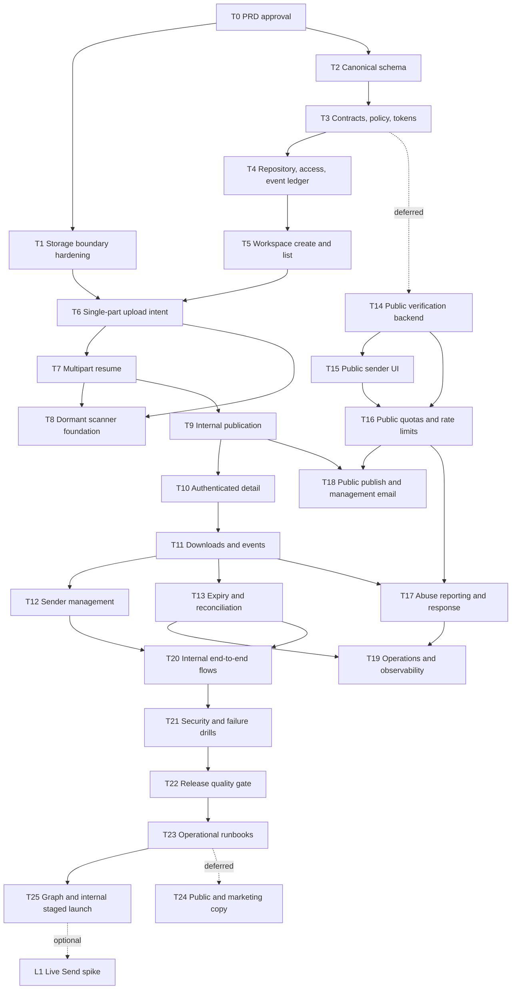

# Implementation Plan: XeroFlow Send

**Date:** 2026-07-20
**Status:** Approved — private internal v1 implementation in progress
**Source of truth:** `docs/superpowers/specs/2026-07-20-send-product-prd.md`
**Goal-loop objective:** Incrementally deliver private, authenticated, workspace-scoped transfers for internal Dashboard users while keeping the PRD and this task plan current.

**2026-07-21 scope amendment:** [ADR-006](../../decisions/ADR-006-private-internal-dashboard-send-v1.md) removes guest links, external recipients, recipient email, public senders, and scanner deployment from the v1 launch path. T14–T19, T24, and L1 are preserved as deferred backlog, not required goal work. The locally implemented T8 scanner adapter remains dormant and does not block T9.

## 1. Overview

Deliver one private transfer platform in vertical slices:

1. harden the existing storage boundary;
2. establish transfer state, policy, and tenant-safe persistence;
3. deliver authenticated internal Workspace Send end to end;
4. deliver authenticated transfer detail and download;
5. prove operations, retention, security, and launch readiness;
6. preserve external/public and croc-like Live Send only as deferred product options.

No implementation task starts until T0 records PRD approval. Every later task should leave the application in a working state, remain behind feature flags until its checkpoint, and update the implementation ledger with evidence.

## 2. Architecture decisions

- Neon is canonical for identity, policy, state, and audit; R2 stores private object bytes.
- Database records store R2 keys, never permanent or presigned access URLs.
- The server creates upload intents and keys; the browser receives only narrow expiring capabilities.
- Small uploads use presigned `PUT`; large uploads use R2 multipart upload.
- V1 has no unauthenticated route; dormant public-compatible fields do not create authority.
- Private-v1 publication requires stable canonical object metadata and records `scan_status = 'not_required'`; this is not represented as a malware-free verdict.
- Authenticated workspace access is rechecked before each short-lived signed download.
- Application expiry is immediate; scheduled deletion is authoritative and R2 lifecycle is a backstop.
- Internal creation and publication remain behind disabled feature flags until the release gate.
- Live Send is optional and cannot weaken or delay stored-transfer delivery.

## 3. Dependency graph



## 4. Task execution protocol

For each task in the goal loop:

1. Read the PRD sections and task acceptance criteria relevant to the slice.
2. Check current git status and preserve unrelated user changes.
3. Mark exactly one task `IN PROGRESS` in the implementation ledger.
4. Write or update the failing test first for behavior changes.
5. Implement the smallest slice that passes the task acceptance criteria.
6. Run focused tests and changed-file lint; run broader checks at checkpoints.
7. Re-read every changed file and perform security and cross-tenant review.
8. Update this ledger with commit/evidence, blockers, and any follow-up.
9. Update the PRD before implementing any changed product or security decision.
10. Stop for human authority at every PRD “Ask first” boundary.

The goal is complete when required tasks T0–T13, T20–T23, and T25 are done, private-launch evidence exists, and no private-v1 PRD success criterion remains unmet. T8 non-production integration, T14–T19, T24, and L1 are not required unless the PRD is amended.

## 5. Task list

### Phase 0 — Product gate and storage safety

#### T0 — Review and approve the product contract

**Description:** Resolve or accept the PRD assumptions, proposed defaults, scope, and open decisions before behavior or persistent state changes begin.

**Acceptance criteria:**

- [x] Human records `Approved as written` or names changes.
- [x] Named changes are applied to the PRD before implementation.
- [x] Internal limits, retention, authenticated recipient identity, scanner deferral, and launch path have explicit decisions or intentionally documented defaults.

**Verification:**

- [x] PRD status changes from `Proposed` to `Approved` with date/decision note.
- [x] This plan is reconciled with every approved scope change through 2026-07-21.

**Dependencies:** None
**Files likely touched:** PRD and this plan only
**Estimated scope:** S

#### T1 — Make the generic storage boundary deny by default

**Description:** Add regression tests and remove unsafe generic behavior before Send reuses any existing storage capability.

**Acceptance criteria:**

- [x] Unknown storage prefixes can never be deleted by default.
- [x] Upload confirmation cannot attach an arbitrary R2 key or unowned entity to the caller.
- [x] Existing authorised attachment/avatar/expense flows continue to work or receive an explicit migration path.

**Verification:**

- [x] Focused tests cover unknown-prefix deletion, key substitution, entity ownership, and authorised legacy behavior.
- [x] `pnpm exec vitest run test/server/utils/storageAccess.test.ts test/server/api/storageBoundary.test.ts test/server/storageNativeBinding.test.ts`
- [x] Changed-file ESLint passes.

**Dependencies:** T0
**Files likely touched:** the three routes under `server/api/storage/`, one deny-default storage access helper, `server/api/agency/tasks/[id]/attachments.post.ts` if its metadata path remains supported, and up to two focused test files
**Estimated scope:** M

#### T2 — Add the canonical Send schema

**Description:** Add an idempotent migration for transfers, files, recipients, public senders, upload intents, and append-only events with tenant-safe constraints and indexes.

**Acceptance criteria:**

- [x] Tables and enums/checks represent the PRD state models and policy snapshot.
- [x] Tokens are represented only by hashes and no access URL column becomes canonical identity.
- [x] Constraints cover byte/file totals, expiry ordering, unique object keys, idempotency, and tenant/client relationships.

**Verification:**

- [x] Migration contract test asserts required tables, columns, constraints, and indexes.
- [x] Migration applies idempotently to an explicitly approved isolated PostgreSQL target and readback matches expectations.
- [x] Forward-fix/rollback notes are recorded.

**Dependencies:** T0
**Files likely touched:** next available SQL migration, one schema contract test, optional rollback note
**Estimated scope:** M

#### T3 — Define transfer contracts, policy, and secret handling

**Description:** Create runtime contracts and pure services for state, limits, retention, token hashing, password policy, and public response mapping.

**Acceptance criteria:**

- [x] Zod contracts are strict and shared only where multiple runtimes need them.
- [x] Transfer/file transitions reject invalid or terminal regressions.
- [x] Share and management tokens are high entropy, stored hashed, and excluded from logs/public mappers.

**Verification:**

- [x] Unit tests cover transitions, policy resolution, token lookup, redaction, and invalid input.
- [x] `pnpm exec vitest run test/send/contracts.test.ts test/send/policy.test.ts test/send/tokens.test.ts`
- [x] Changed-file ESLint passes.

**Dependencies:** T2
**Files likely touched:** `shared/types/send.ts`, two files under `server/utils/send/`, up to two test files
**Estimated scope:** M

#### T4 — Add tenant-safe repository, access, and event services

**Description:** Establish the only supported persistence and authorisation boundary for Send.

**Acceptance criteria:**

- [x] Every read/mutation scopes by transfer plus authorised actor/tenant policy.
- [x] State transitions use optimistic or transactional protection against stale/replayed writes.
- [x] Append-only events redact secrets and are committed with security-significant transitions.

**Verification:**

- [x] Tests cover owner, authorised collaborator, public sender session, cross-tenant denial, stale transition, and event redaction.
- [x] `pnpm exec vitest run test/send/repository.test.ts test/send/access.test.ts`
- [x] Changed-file ESLint passes.

**Dependencies:** T2, T3
**Files likely touched:** up to three `server/utils/send/` files and two test files
**Estimated scope:** M

### Checkpoint A — Safe foundation

- [x] T0–T4 acceptance criteria pass.
- [x] Migration is applied and verified only with explicit approval.
- [x] Focused tests pass and changed files lint cleanly.
- [x] Storage delete/confirm behavior is deny-by-default.
- [x] No secret/token/access URL appears in schema responses or logs.
- [x] Human reviews foundation evidence before user-facing upload work continues.

### Phase 1 — Workspace Send vertical slices

#### T5 — Deliver workspace transfer creation and listing

**Description:** Let an authorised staff user create a draft and see their permitted transfer list behind a disabled-by-default feature flag.

**Acceptance criteria:**

- [ ] Draft creation validates client/project scope, policy, recipients, expiry, and optional access rules.
- [ ] Listing cannot return another tenant's transfers and supports useful status filtering.
- [ ] Nuxt UI pages provide an accessible draft shell and empty/list states.

**Verification:**

- [ ] API tests cover authorised creation, cross-client denial, invalid expiry, and strict input.
- [ ] Component/page tests cover creation errors and list states.
- [ ] Manual local check with the flag on and off.

**Dependencies:** T4
**Files likely touched:** one create/list API route pair, one agency page, one Send form/list component, one focused test file
**Estimated scope:** M

#### T6 — Deliver server-bound single-part upload intents

**Description:** Complete the first real upload path: create a file intent, upload directly to private R2, and confirm actual object metadata without trusting a caller-selected key.

**Acceptance criteria:**

- [x] The server generates a transfer-scoped key and expiring capability.
- [x] Completion proves intent ownership, key equality, expected size/type policy, object existence, and single-use/idempotent behavior.
- [x] UI shows per-file progress, retry, cancellation, and actionable failure.

**Verification:**

- [x] Tests cover key substitution, expired intent, wrong size/type, replay, cross-tenant actor, and success.
- [x] Browser/local R2 test uploads one file and confirms canonical `uploaded`/`quarantined` state.
- [x] R2 CORS is read and verified before any proposed change is applied.

**Dependencies:** T1, T5
**Files likely touched:** upload-intent service, init/complete routes, one upload composable or component, one focused test file
**Estimated scope:** M

#### T7 — Add multipart upload and resume

**Description:** Add the large-file path with create, part upload, completion, abort, resume, and stale-upload handling.

**Acceptance criteria:**

- [x] Configured large files use multipart while smaller files keep the single-part path.
- [x] Client state can resume using server-validated multipart identity and completed parts.
- [x] Create/part/complete/abort retries are idempotent and cannot cross transfer/file boundaries.

**Verification:**

- [x] Unit/API tests cover resume, duplicate part, invalid part number, wrong upload ID, abort, and completion mismatch.
- [x] Manual interruption test resumes a multipart file without reuploading successful parts.
- [x] Incomplete upload expiry/backstop behavior is documented.

**Dependencies:** T6
**Files likely touched:** multipart service, up to three multipart API route files, one focused test file
**Estimated scope:** M

#### T8 — Add quarantine and malware scan orchestration

**Description:** Preserve the completed provider-neutral scan and Container adapter as a dormant future trust-boundary capability. Private v1 does not provision, deploy, or wait on this runtime.

**Acceptance criteria:**

- [x] Every completed upload enters quarantine and produces idempotent scan work.
- [x] Single-part scan work cannot mark a file clean before its reusable presigned write capability expires; the scanner re-reads canonical size, type, ETag/checksum evidence after that boundary.
- [x] Only verified clean results transition a file to `clean`; detected/error/timeout states remain inaccessible.
- [x] Scanner evidence is redacted, versioned, and attributable without storing unsafe response bodies.

**Verification:**

- [x] Tests cover clean, detected, scanner error, timeout, duplicate result, mismatched object, and queue redelivery.
- [x] Safe synthetic fixtures prove magic-byte/type checks and active-content disposition.
- [ ] Selected scanner's non-production integration is verified without real sensitive content.

The unchecked integration item is deferred and is not a private-v1 acceptance gate.

**Dependencies:** T6, T7 where multipart is enabled
**Files likely touched:** scan contracts/service, queue or worker entry, internal result boundary, scanner adapter, focused tests
**Estimated scope:** M (provider selection is an Ask-first gate)

#### T9 — Publish an internally validated transfer

**Description:** Atomically freeze a complete, stable file set, record the private-v1 validation decision, and transition the transfer to ready without creating public tokens, recipients, or notification work.

**Acceptance criteria:**

- [x] Transfers with incomplete, rejected, mutable, or policy-ineligible files cannot publish.
- [x] A private publication records `scan_status = 'not_required'`; it never claims a malware-clean scanner verdict.
- [x] Exactly one publication transition creates one immutable ready file set.
- [x] Publication creates no share/management token, recipient row, or email job.

**Verification:**

- [ ] Tests cover premature single-PUT publication, incomplete multipart, replay, changed file set, `not_required` evidence, and absent public/email side effects.
- [x] Migration/contract tests prove the private policy fits the canonical ready-state constraints.

**Dependencies:** T7; T8 local code is retained but its integration is not required
**Files likely touched:** publish policy/service/route, private validation transition, one focused test file
**Estimated scope:** M

#### T10 — Deliver authenticated internal transfer detail

**Description:** Build the authenticated transfer detail boundary for workspace users who pass canonical transfer access checks.

**Acceptance criteria:**

- [x] Unauthenticated and cross-workspace requests reveal no transfer metadata and use the established not-found policy.
- [x] Expired, revoked, unavailable, and ready states are safe and distinct.
- [x] Responses allowlist fields and expose no object key, dormant token/hash, policy internals, or signed URL.

**Verification:**

- [ ] API tests cover missing auth, owner/manager/assigned-member access, cross-workspace denial, expiry, revocation, and safe errors.
- [ ] Component tests cover accessible metadata and terminal-state UI.
- [ ] Browser check confirms no public route or bearer-only access path exists.

**Dependencies:** T9
**Files likely touched:** authenticated detail API route, agency detail page/component, one API/component test file
**Estimated scope:** M

#### T11 — Authorise downloads and record delivery events

**Description:** Add download-one behavior for authenticated workspace users, minting short capabilities only after current access policy checks. Archive download remains a separate product choice.

**Acceptance criteria:**

- [x] Every download checks current session, workspace/transfer access, file state, expiry, revocation, and maximum-download policy.
- [x] R2 capability lifetime is deliberately short and responses prevent caching/referrer leakage.
- [x] View/download counts and events are idempotent enough to avoid retry inflation under the approved policy.

**Verification:**

- [ ] Tests cover direct key guessing, revocation, expiry, max-download exhaustion, signed capability redaction, and retry behavior.
- [ ] Manual check downloads a policy-eligible file and rejects the same path after revocation or from an unauthorised account.
- [ ] V1 omits archive download until the open archive decision is approved.

**Dependencies:** T10
**Files likely touched:** download policy/service, authenticated download route, event integration, one focused test file
**Estimated scope:** M

#### T12 — Deliver sender management, revocation, and expiry controls

**Description:** Complete the workspace sender lifecycle with transfer detail, event summary, revoke, and policy-bounded extension.

**Acceptance criteria:**

- [x] Authorised senders see file, validation, view/download, expiry, and revocation state.
- [x] Revocation takes effect immediately and is idempotent.
- [x] Expiry extension cannot exceed entitlement/policy or reactivate deleted content silently.

**Verification:**

- [x] API tests cover ownership, extension bounds, revoke replay, and post-revoke denial.
- [x] Page tests cover management states and Nuxt UI confirmation modal.
- [x] Manual end-to-end workspace transfer succeeds behind the feature flag.

**Dependencies:** T11
**Files likely touched:** management API route pair, agency detail page/component, one focused test file
**Estimated scope:** M

#### T13 — Automate expiry, deletion, and storage reconciliation

**Description:** Add scheduled, idempotent cleanup plus drift/orphan detection and propose R2 lifecycle backstops.

**Acceptance criteria:**

- [x] Access rejects at logical expiry before object deletion completes.
- [x] Cleanup claims work safely, deletes expected objects, records evidence, and tolerates already-missing objects.
- [x] Reconciliation reports orphan objects, missing objects, stale intents/multipart uploads, and retryable deletion failures.

**Verification:**

- [x] Tests cover concurrent cleanup, retry, missing object, partial transfer deletion, and reconciliation classification.
- [x] Proposed R2 lifecycle configuration is reviewed before applying.
- [x] A non-production expiry drill reaches `deleted` and leaves no object.

**Dependencies:** T11
**Files likely touched:** cleanup service, protected cron/internal route, reconciliation script or service, focused tests, lifecycle config/runbook
**Estimated scope:** M

### Checkpoint B — Private internal delivery

- [x] T5–T13 acceptance criteria pass.
- [ ] Workspace sender can create, upload/resume, internally validate, publish, monitor, revoke, and expire a transfer.
- [ ] Authenticated authorised user can view and download; unauthenticated and cross-workspace users cannot.
- [ ] Cross-tenant, key-substitution, active-content, signed-capability-leak, and replay tests pass.
- [ ] Cleanup and R2/database outage drills pass.
- [ ] `pnpm typecheck`, repository or appropriately scoped lint, and `pnpm build` results are recorded with pre-existing issues distinguished.
- [ ] Human approves the selected internal cohort and feature-flag enablement. External/public work remains deferred.

### Deferred Phase 2 — External delivery and Verified Public Send

Tasks T14–T19 preserve the original backlog only. They are not approved, not required
for private-v1 completion, and must not be started without a PRD, threat-model, cost,
and product approval.

#### T14 — Add public draft and sender verification backend

**Description:** Reuse Turnstile and double-opt-in patterns to verify a public sender before storage capabilities are issued.

**Acceptance criteria:**

- [ ] Public draft creation validates Turnstile server-side and returns enumeration-safe status.
- [ ] Verification token/session is short lived, single purpose, transfer scoped, replay resistant, and stored safely.
- [ ] No upload intent can be created before sender verification succeeds.

**Verification:**

- [ ] Tests cover missing/invalid/replayed/expired Turnstile and email verification tokens.
- [ ] Tests prove verification cannot authorise another transfer or email identity.
- [ ] Email is captured by a non-delivering adapter unless real sending is approved.

**Dependencies:** T3, T4, Checkpoint B approval
**Files likely touched:** public sender service, draft/verify route pair, verification email helper, one focused test file
**Estimated scope:** M

#### T15 — Build the public sender creation and upload experience

**Description:** Create the public `/send` flow for metadata, verification wait/resume, file selection, upload progress, and completion.

**Acceptance criteria:**

- [ ] Public UI clearly states limits, retention, prohibited content, privacy, and verification requirement.
- [ ] Refresh/resume preserves only safe draft identity and recovers server state.
- [ ] Form, Turnstile, upload progress, failures, and mobile/dark-mode behavior meet project UI rules.

**Verification:**

- [ ] Component/page tests cover validation, verification pending, resume, quota failure, and accessible progress.
- [ ] Browser check covers keyboard, mobile, dark/light modes, refresh, and interrupted upload.
- [ ] Public creation remains disabled by feature flag in production.

**Dependencies:** T14, T6–T8
**Files likely touched:** public sender page, up to two Send components, one composable adaptation, one focused test file
**Estimated scope:** M

#### T16 — Enforce public quotas and layered rate limits

**Description:** Add byte, file, retention, draft, concurrency, verification, and request limits using canonical policy and the existing Durable Object rate-limiting foundation.

**Acceptance criteria:**

- [ ] Limits apply before expensive storage/scan/email work and again at completion where necessary.
- [ ] Rate keys use privacy-preserving actor evidence and cannot be bypassed by changing only one identifier.
- [ ] Public errors expose retry guidance without revealing abuse scores or registered emails.

**Verification:**

- [ ] Tests cover per-IP/email/transfer bursts, byte exhaustion, concurrent drafts, incomplete multipart abuse, and fail-closed/fail-open decisions specified by policy.
- [ ] Rate-limiter Worker tests pass if its contract changes.
- [ ] A load/abuse simulation demonstrates bounded creation and upload authorisation.

**Dependencies:** T14, T15
**Files likely touched:** public policy/rate service, public route integration, optional rate-limiter contract/Worker file, focused tests
**Estimated scope:** M

#### T17 — Add abuse reporting and operator response

**Description:** Let recipients report a transfer and let authorised operators quarantine, revoke, annotate, and block according to explicit policy.

**Acceptance criteria:**

- [ ] Report submission is rate limited, enumeration safe, and never opens uploaded content inline.
- [ ] Operator actions require explicit role/permission and append audit evidence.
- [ ] Emergency action blocks access immediately and can disable new public drafts independently.

**Verification:**

- [ ] Tests cover unauthorised operator, report spam, duplicate reports, immediate quarantine, and audit redaction.
- [ ] Operator UI uses safe metadata and confirmation modals.
- [ ] Kill-switch drill blocks public creation while valid unaffected downloads follow policy.

**Dependencies:** T11, T16
**Files likely touched:** report/operator service and API, operator page/component, one focused test file
**Estimated scope:** M

#### T18 — Deliver public publication and sender management email

**Description:** Complete the public happy path with verified publish, sender confirmation, share link, and separate secure management link.

**Acceptance criteria:**

- [ ] Public publication obeys clean-scan, limit, expiry, and verification policy.
- [ ] Sender email includes safe share metadata and a separate high-entropy management link.
- [ ] Public sender can view safe status and revoke only the associated transfer.

**Verification:**

- [ ] Tests cover management-token hashing, link separation, replay, revoke, expiry, and email redaction.
- [ ] Non-delivering email preview is reviewed.
- [ ] Controlled test identity completes create-to-revoke flow in non-production.

**Dependencies:** T9, T14–T16
**Files likely touched:** public publish/management API, management page/component, sender email template/helper, one focused test file
**Estimated scope:** M

#### T19 — Add Send operations, cost, and health visibility

**Description:** Give operators a redacted view of transfer volume, bytes, scan backlog/failures, incomplete uploads, delivery failures, expiry/deletion lag, reports, and policy state.

**Acceptance criteria:**

- [ ] Operators can explain a transfer's state without raw SQL or secret data.
- [ ] Metrics separate workspace/public traffic and surface storage/operation growth.
- [ ] Alerts cover scanner outage, queue backlog, deletion lag, unusual draft/upload rate, and quota pressure.

**Verification:**

- [ ] API/UI tests cover role checks, redaction, empty/error/degraded states, and metric aggregation.
- [ ] Seeded state matrix renders every operational status.
- [ ] Logs/metrics contain safe correlation but no raw tokens, passwords, emails beyond approved need, or signed URLs.

**Dependencies:** T13, T17, T18
**Files likely touched:** health aggregation service/API, operations page/component, one focused test file
**Estimated scope:** M

### Phase 3 — Battle test and private internal launch

#### T20 — Prove the end-to-end product flows

**Description:** Prove the complete authenticated internal sender and downloader journeys in a real browser before adversarial release drills.

**Acceptance criteria:**

- [ ] Authenticated internal create-to-download happy path passes in a real browser.
- [ ] Interrupted multipart resume, individual download, cross-workspace denial, revocation, and expiry paths pass.
- [ ] Browser evidence identifies the tested environment, transfer IDs, state transitions, and safe outcomes without exposing secrets.

**Verification:**

- [ ] Browser automation tests and focused API/component tests pass.
- [ ] Mobile and keyboard completion of the core journeys is recorded.
- [ ] Evidence is linked from the implementation ledger.

**Dependencies:** T12, T13, Checkpoint B
**Files likely touched:** up to three browser-flow tests, fixtures, one evidence document
**Estimated scope:** M

#### T21 — Run security and dependency-failure drills

**Description:** Exercise the PRD threat model and prove fail-closed or explicitly approved degraded behavior across untrusted boundaries and external dependencies.

**Acceptance criteria:**

- [ ] Missing-auth, cross-tenant/key substitution, signed-capability leakage, replay, quota, and active-content cases produce safe outcomes.
- [ ] R2 and database failures follow documented retry/fail-closed policy.
- [ ] Revocation, expiry, cleanup concurrency, orphan reconciliation, and internal kill switches work during degraded conditions.

**Verification:**

- [ ] Security/abuse test suite and operational failure drills pass.
- [ ] Logs and traces are inspected for token, password, email, R2 credential, signed-URL, and cross-tenant leakage.
- [x] Security review records no unresolved critical/high Send issue.

**Dependencies:** T20
**Files likely touched:** security/abuse tests, failure fixtures, one drill script or harness, one evidence document
**Estimated scope:** M

#### T22 — Run the release quality gate

**Description:** Complete accessibility, responsive design, performance, build, configuration, and deployment-readiness verification separately from functional and adversarial testing.

**Acceptance criteria:**

- [ ] Internal Send pages pass keyboard, focus, label/error, mobile, and dark/light-mode review.
- [ ] Metadata performance targets, upload responsiveness, CORS, security headers, cache/referrer policy, lifecycle rules, and feature flags are verified.
- [ ] Repository checks distinguish Send regressions from known legacy debt and the deployment target guard passes.

**Verification:**

- [ ] Focused and broad Vitest results are recorded.
- [ ] `pnpm typecheck`, `pnpm lint`, `pnpm test:run`, `pnpm build`, and `pnpm deploy:check` results are recorded with legacy debt separated.
- [ ] Accessibility/performance/configuration evidence is linked from the ledger.

**Dependencies:** T21
**Files likely touched:** accessibility/performance tests, configuration assertions, one release evidence document
**Estimated scope:** M

#### T23 — Publish operational and incident runbooks

**Description:** Make the feature supportable by a second operator before staged internal enablement.

**Acceptance criteria:**

- [ ] Runbooks cover configuration, private validation policy, retention, lifecycle, reconciliation, incident response, kill switches, rollback, and support.
- [ ] Runbooks identify owners, safe commands, decision points, evidence, and escalation paths.
- [ ] A clean-room operator review finds no undocumented production-only knowledge.

**Verification:**

- [ ] A second operator can follow the runbooks in non-production.
- [ ] Cross-workspace denial, cleanup, and rollback procedures are dry-run or exercised safely.
- [ ] Runbook commands avoid secrets in output and target the guarded deployment path.

**Dependencies:** T22
**Files likely touched:** up to four focused documents under `docs/runbooks/` and this ledger
**Estimated scope:** M

#### T24 — Synchronise public and marketing copy (deferred)

**Description:** Preserved future-public backlog. No public or marketing promotion is required or approved for private v1.

**Acceptance criteria:**

- [ ] Relevant feature/marketing pages describe actual approved behavior without false E2EE, unlimited, permanent-storage, or anonymous-upload claims.
- [ ] Public Send pages expose limits, retention, verification, privacy, prohibited content, and abuse-reporting information.
- [ ] Navigation and SEO metadata are updated only where Send belongs in the approved information architecture.

**Verification:**

- [ ] Copy review checks every security, encryption, retention, and limit claim against the PRD.
- [ ] Page/component tests and responsive dark/light browser review pass for changed surfaces.
- [ ] Marketing changes remain behind launch timing approved by the product owner.

**Dependencies:** Future public PRD approval and T23
**Files likely touched:** `app/pages/features/index.vue`, `app/pages/features/[slug].vue`, `app/components/MarketingNav.vue`, public Send page copy/tests
**Estimated scope:** M

#### T25 — Refresh architecture knowledge and record private staged-launch evidence

**Description:** Refresh Graphify/GraphWiki, close the implementation ledger, and prepare—but do not silently execute—the approved staged rollout.

**Acceptance criteria:**

- [ ] Graphify/GraphWiki represents the final internal Send contracts, routes, services, dormant workers, storage, and authenticated trust boundaries.
- [ ] The implementation ledger points to verification and production-readiness evidence for every required task.
- [ ] Internal staged rollout has an owner, cohort, feature-flag state, metrics, rollback trigger, review date, and explicit approval record.

**Verification:**

- [ ] Graph health check passes or documented warnings are surfaced.
- [ ] PRD success criteria and task ledger have no unexplained open required item.
- [ ] Production migration/deployment/enablement occurs only with explicit approval and guarded commands.

**Dependencies:** T23; T24 is not required for private v1
**Files likely touched:** graph outputs according to repository convention, PRD, this plan, one launch evidence document
**Estimated scope:** M

### Deferred optional Phase 4 — Croc-like Live Send

#### L1 — Run a browser Live Send feasibility spike

**Description:** Test WebRTC DataChannel transfer, signaling/state coordination, TURN fallback, code-phrase pairing, reconnect behavior, and client-side encryption without committing the main product to the transport.

**Acceptance criteria:**

- [ ] Spike compares direct, TURN-relayed, and failed-connectivity behavior with measured throughput/cost.
- [ ] Security review distinguishes transport encryption from PAKE/code-phrase authentication and true server-blind payload encryption.
- [ ] Product decision records receiver-presence UX, abuse exposure, browser limits, and whether Live Send should proceed.

**Verification:**

- [ ] Non-production prototype transfers representative files across restrictive networks.
- [ ] No production route, TURN credential, or marketing claim is enabled by the spike.
- [ ] ADR recommends proceed, revise, or stop.

**Dependencies:** T25 and a PRD Ask-first approval
**Files likely touched:** isolated prototype/test files and one ADR
**Estimated scope:** M

## 6. Parallelization opportunities

After shared contracts are approved, the following work streams are logically independent, but they must coordinate through committed contracts and should not edit the same files concurrently:

- authenticated detail UI tests can proceed while download services are implemented;
- runbook drafts can proceed alongside late operational UI work;
- observability aggregation can proceed after event taxonomy is fixed.

Must remain sequential:

- PRD approval before implementation;
- schema before repositories;
- repositories before user-facing mutations;
- upload intent before multipart;
- stable canonical upload plus recorded internal validation before publication;
- publication before authenticated download;
- complete private internal checkpoint before cohort enablement;
- end-to-end, adversarial, and release-quality gates before production enablement.

## 7. Risks and mitigations

| Risk | Impact | Mitigation |
|---|---|---|
| Compromised internal account causes storage abuse | Medium | Auth, workspace byte/file/concurrency limits, short retention, kill switch, monitoring |
| Internal user distributes unsafe or active content | Medium | Trusted-user boundary, endpoint protection, attachment-only disposition, no inline preview, audit/revocation; require scanner review before external sharing |
| Cross-tenant/key substitution | High | Server-generated keys, intent binding, explicit tenant predicates, deny-default tests |
| Signed URL leakage/reuse | High | Mint after policy check, short expiry, no logs/emails, no-store/referrer controls, immediate logical revocation |
| Multipart orphan cost | Medium | Intent expiry, abort path, R2 incomplete-upload lifecycle, reconciliation |
| Dormant scanner cost or capacity surprises later | Low for v1 | Do not deploy for private v1; re-benchmark and cost-review before external sharing |
| ZIP generation exceeds runtime limits | Medium | Decide at T0; omit, queue/prebuild, or use streaming Worker/container path |
| Long-lived feature branch conflicts | Medium | Small vertical commits, feature flags, short-lived branch/PR slices |
| Existing dirty worktree overlap | Medium | Preserve unrelated changes, inspect before each task, isolate touched files |
| False end-to-end encryption claims | High | Explicit PRD language and copy review; separate future encrypted mode |
| Lifecycle deletion delay | Medium | Application access expiry is immediate; scheduled cleanup plus lifecycle backstop |
| Cost grows through repeated internal downloads | Medium | Download limits, monitoring, capability expiry, revocation, and cohort rollout |

## 8. Checkpoint command matrix

Run focused checks after every task and the broader matrix at Checkpoints A, B, and T20–T22 as appropriate:

```bash
pnpm exec vitest run <focused-test-files>
pnpm exec eslint <changed-ts-vue-files>
pnpm typecheck
pnpm lint
pnpm test:run
pnpm build
pnpm deploy:check
```

The repository has known pre-existing type/lint debt. Every checkpoint must state whether a failure is pre-existing or introduced by Send, with a reproducible scoped command proving Send files clean.

## 9. Approval-safe implementation-readiness audit

This read-only audit was completed on 2026-07-20 while T0 remained pending. It does not approve or start T1/T2.

### T1 evidence and implementation seams

- `server/api/storage/[key].delete.ts` currently returns `true` for every unrecognised key prefix. T1 must replace that fallback with denial and test that neither object deletion nor database cleanup runs after denial.
- `server/api/storage/confirm-upload.post.ts` trusts caller-provided `key`, `entityType`, and `entityId`. Its task insert and expense/avatar updates do not prove that the authenticated actor may mutate the referenced entity.
- `server/api/storage/presigned-upload.post.ts` generates keys from a caller-provided entity ID, but the key contains no actor-bound proof and no durable intent exists. Prefix matching alone is therefore insufficient to prevent key substitution. T1 must treat presign and confirm as one capability boundary, even though T6 later replaces this with canonical Send upload intents.
- `server/api/agency/tasks/[id]/attachments.post.ts` accepts presigned-upload metadata and a caller-provided `uploadedBy`; it has no explicit route-level `requireAuth`. It is a compatibility surface to secure or intentionally retire, not an authorisation template for Send.
- The attachment delete route and avatar upload route demonstrate useful object-before-delete and actor-derived-key behavior, but only the client access helpers in `server/utils/measurement/access.ts` and `server/utils/social/clientAccess.ts` provide the deny-first assignment pattern Send should follow.
- No focused generic-storage API test exists today. The repository's route-test convention is to install H3 globals, mock auth/database/storage modules, and import the handler after mocks. T1 should add `test/server/api/storageBoundary.test.ts`; pure category/entity policy belongs in `test/server/utils/storageAccess.test.ts`.
- Existing `test/server/storageNativeBinding.test.ts` protects the native R2 write path and must remain green, but it does not cover authorisation.

### T1 completion evidence

- Completed on 2026-07-21 with 22/22 focused tests passing across the new boundary/policy suites and the existing native R2 binding suite.
- Focused ESLint passed for every T1 TypeScript file. The full repository typecheck remains red on pre-existing debt; T1-specific diagnostics were fixed and separately rechecked.
- Presign requests now accept only owned legacy categories, authorise the actor against the target entity, generate actor-scoped keys, and issue short-lived domain-separated HMAC confirmation capabilities.
- Confirmation verifies actor, key, category/entity, expiry, actual object type/size, and entity access again. Deletion denies unknown prefixes before existence probes. Direct task uploads are authenticated, board-authorised multipart uploads; caller-supplied attachment metadata mode is retired with `415`.
- T1 deliberately remains stateless. Durable single-use/idempotent replay handling is assigned to T6, while abandoned PUTs and object/database drift are assigned to T13.

### T2 evidence and migration seams

- `266_notification_preferences_opt_in.sql` is currently untracked and is the highest conventional numeric migration visible. The Send migration must resolve the next free identifier immediately before creation; it must not assume `266` or hard-code `267` in advance.
- The migration directory already contains two `258_*` files plus non-numeric/timestamped files, so filename order alone is not a safe dependency mechanism. T2 should be self-contained, idempotent, and explicit about referenced base tables.
- `agency_clients(id)` is the established client boundary and `client_team_assignments(client_id, team_member_id)` is the established scoped-user relationship. Workspace transfer constraints and repository tests should use those canonical relationships; public transfers need an explicit nullable-client/public-sender invariant rather than a synthetic tenant assumption.
- The established schema-test convention is a static Vitest contract under `test/config/` that reads the SQL and asserts tables, constraints, indexes, append-only protections, and rollback/runbook language. T2 should add `test/config/sendMigrationContract.test.ts` and model append-only event protections on the patterns in migration `256_measurement_signal_hub.sql`.
- Applying the migration to any shared or production database remains an explicit approval action. Before that approval, verification is limited to the contract test, SQL review, and any isolated disposable-database check already authorised by the user.

### T2 completion evidence

- Completed on 2026-07-21 as migration `268_send_foundation.sql`; `268` was rechecked as the sole free/current identifier immediately before final verification.
- Eight migration contract tests pass and focused ESLint/diff checks are clean. The combined T1–T2 suite passes 30/30 tests.
- An explicitly approved disposable PostgreSQL 14 cluster under `/tmp` applied the migration twice successfully. A valid workspace transfer/file/intent/event graph inserted cleanly; an event update was rejected by the append-only trigger and an intent with a substituted expected size was rejected by the composite object-contract foreign key.
- Adversarial review added project/client null-bypass protection, transfer-scoped object keys, exact intent/file contract binding, same-transfer event/file binding, nested secret-key rejection, bcrypt password-hash shape checking, and immutable transfer identity/published policy snapshots.
- No shared or production database was accessed. The disposable PostgreSQL process was stopped after validation.

### T3 completion evidence

- Completed on 2026-07-21 with 14/14 focused domain tests, focused ESLint, diff checks, and a scoped TypeScript compile passing.
- Shared strict Zod contracts normalize recipient email, reject duplicate normalized recipients and caller-selected object keys, and prevent project scope without client scope.
- Explicit transfer/file transition graphs reject skips, self-transitions, and terminal regression. Policy resolution accepts configuration rather than embedding public limits, derives totals from file sizes, and rejects excessive file, byte, recipient, retention, or download requests.
- Send bearer material is 256 random bits encoded as base64url; only lowercase SHA-256 hashes are intended for persistence. Constant-time digest comparison rejects malformed material.
- Guest mapping is allowlist-only and strips client/owner identity, token hashes, password hashes, policy internals, and signed URLs even when future database rows gain additional fields.

### T4 completion evidence

- Completed on 2026-07-21 with 10/10 focused access/repository tests. The complete T1–T4 foundation suite passes 55/55 tests across nine files; focused ESLint and diff checks are clean.
- Workspace owners and management roles are explicit, client collaborators require `client_team_assignments`, non-client member access is owner-only, and verified public senders are scoped to their own public-sender ID. Unauthorized reads and mutations return the same not-found result.
- Transition writes lock the canonical row, recheck actor access inside the transaction, compare expected version and prior status, apply optimistic SQL predicates, bind the audit event type to the destination state, and append the event in the same transaction.
- Event metadata recursively removes secret-bearing keys, detects circular/non-JSON or oversized structures, and redacts 256-bit bearer-shaped values and signed R2-style URLs even under innocuous keys.
- A final full repository typecheck still reports 803 pre-existing diagnostics, but none reference any T1–T4 Send/storage path. This is recorded baseline debt, not a passing global typecheck.

### T5 completion evidence

- Completed on 2026-07-21 behind independent private/server and public/UI flags that both default off. The feature adds strict `POST`/`GET /api/agency/send` boundaries, a policy-aware draft/list service, and the direct `/agency/send` page without changing the already-modified agency navigation.
- Creation derives actor identity from authenticated write access, validates strict Zod input, hashes optional passwords with bcrypt cost 12, hashes caller idempotency material with actor scope, verifies client assignment and project membership, stores recipients and the append-only `draft_created` event transactionally, and resolves concurrent idempotency races without duplicate recipient/event work.
- Listing is bounded to 100 rows, rejects repeated/coerced query arrays, filters by status, and returns only owner, management, or assigned-client rows. API responses use shared allowlisted summary types and never return password hashes, token hashes, or idempotency material.
- Foundation migration 268 was refined before shared use so share-token hashes are nullable in drafts, required for `ready`, installable only during `scanning` to `ready`, and immutable afterward. A fresh disposable PostgreSQL cluster applied the migration twice; premature token install and token replacement failed while the publication transition passed. No shared database was accessed and the cluster was removed.
- The final focused matrix passes 50/50 tests across ten files, focused ESLint is clean, and the path-filtered full typecheck reports no Send-related diagnostics. Headless Chrome verified the enabled page heading, eight labelled controls, empty state, creation-denial state, screenshot layout, and a clean Send-surface console; the browser check caught and drove a Nuxt component-resolution fix.
- `pnpm audit --audit-level high` reports three pre-existing high advisories through `@rocicorp/zero`, `promptfoo`, and `concurrently`; this slice added no dependency and none of those paths are introduced or invoked by Send T5.

### T6 completion evidence

- The feature-flagged control plane now creates server-keyed single-part intents, persists only SHA-256 capability hashes, scopes every read/write to the authenticated workspace actor and transfer, rotates pending retry capabilities, verifies canonical R2 `HEAD` metadata, completes once without double-counting, and records explicit completion/abort events. Callers cannot submit an object key.
- The browser uploader performs a direct R2 `PUT`; application Workers receive only small JSON control requests. It exposes per-file progress, retry, cancellation, local policy failures, and server failures without rendering or logging the presigned URL. Cancellation aborts the browser request and consumes the durable server intent.
- The focused T1–T6 matrix passes 83/83 tests across 14 files. All T6/shared-storage changed files pass focused ESLint, and a full Nuxt typecheck remains red on unrelated repository debt while its path-filtered output contains no Send/storage diagnostics.
- Current R2 binding behavior was checked against `@cloudflare/workers-types@5.20260719.1`; confirmation uses native `R2Bucket.head()` metadata in Cloudflare and the existing S3-compatible HEAD fallback elsewhere.
- After explicit approval on 2026-07-21, `agency-files` retained its two existing origin-restricted `GET, HEAD` rules and gained two separate `PUT` rules restricted to the same origins and the `Content-Type` request header. An immediate Wrangler read-back matched the approved four-rule policy; no wildcard origin, deployment, flag, or navigation change was introduced.
- A real system-Chrome test from the exact `http://localhost:3000` origin received a `204` preflight with exact origin, `PUT`, and `Content-Type`, uploaded a 70-byte `text/plain` object with status 200, verified canonical R2 HEAD metadata, and produced zero console warnings/errors. The non-sensitive smoke object was deleted and subsequent HEAD returned 404; the test was repeated with verified cleanup.
- A fresh migration-268 recheck was attempted without touching any shared database, but the host exhausted its System V IPC segment pool before disposable PostgreSQL could bootstrap. Static migration contracts remain green and T2's earlier approved disposable PostgreSQL apply-twice/live-constraint evidence still stands; the new workspace intent uniqueness constraint must be re-run when the host IPC pool is available.
- Cloudflare documents that presigned URLs are reusable until expiry. T8 now explicitly gates clean state until the single-part write capability has expired and canonical metadata is re-read, preventing post-scan overwrite through a still-valid upload URL.

### T7 completion evidence

- Files at or above the configuration-driven 100 MiB default threshold now use server-owned R2 multipart identities and persisted 16 MiB default geometry; smaller files retain the T6 single-part path. The upload ID and object key never enter request or response contracts.
- Authenticated resume lists canonical R2 parts and exposes only validated part numbers/sizes. Part signing is bounded to the persisted geometry; completion rejects missing, duplicate, out-of-range, or wrong-sized parts and constructs the R2 completion request from canonical ETags rather than caller input.
- The browser uploader retries the existing scoped intent, skips server-validated completed byte ranges, uploads remaining parts sequentially with progress/cancellation, and then uses the existing idempotent completion boundary. Abort handles R2/database retry gaps and refuses to mark a final object aborted.
- The complete T1–T7 focused matrix passes 120/120 tests across 18 files; focused ESLint and the cache-free production build pass. The repository-wide Nuxt typecheck remains red on unrelated existing debt, so no global typecheck pass is claimed. No dependency was added, both Send flags remain disabled, and migration `269_send_multipart_geometry.sql` has not been applied to a shared database.
- A real system-Chrome/R2 smoke uploaded a 5 MiB first part, closed that browser context to simulate interruption, recovered the single canonical completed part, uploaded only the 1 MiB remainder from a fresh context, completed and HEAD-verified the 6 MiB `application/octet-stream` object, and recorded zero console warnings/errors. The temporary object was deleted and cleanup was verified.
- The production multipart control plane now uses a workerd-compatible SigV4 adapter rather than the Node-oriented S3 client/presigner path. Canonical R2 part listing is paginated with a 10-page/10,000-part ceiling and rejects missing or repeated continuation markers; XML reads are capped at 2 MiB. Six adapter regression tests cover signing, pagination, completion XML, and normalized R2 errors.
- Deployment `43c5a646` passed a live authenticated 105,906,176-byte (101 MiB) multipart create/upload/publish/download/revoke smoke. Production data confirmed `multipart`, `completed`, `clean`/`not_required`, one download, and exactly one event at every lifecycle boundary; the transfer finished `revoked`.
- [send-multipart-uploads.md](../../runbooks/send-multipart-uploads.md) records intent expiry, R2's default seven-day incomplete-upload backstop, T13 reconciliation responsibilities, retry behavior, safe cleanup, and the migration/flag gates.

### T12 completion evidence

- The strict authenticated `PATCH /api/agency/send/:id/expiry` route permits owners and workspace management roles only, preserves out-of-scope non-disclosure, and resolves the maximum retention policy on the server.
- Extensions are forward-only by at least one minute, capped at the policy milestone anchored to original creation time, protected by optimistic versioning, idempotently replayable, and recorded as secret-free operator audit events. Revoked, expired, deleted, and other terminal transfers cannot be reactivated.
- The transfer manifest offers only exact later policy dates and hides the action when no extension remains or the transfer is terminal.
- Deployment `8a2a6ada` passed a live authenticated production smoke: a zero-file draft was extended from 7 to 14 days, the new expiry was confirmed in the UI and database audit event, and the transfer was then revoked. Both immutable and custom Send routes returned 200.
- The final focused Send release matrix passes 197/197 tests across 34 files; focused ESLint and the production build pass.

### T13 reconciliation evidence

- Cleanup remains the only destructive path: it uses bounded `FOR UPDATE SKIP LOCKED` claims, validates exact transfer ownership for every key, preserves partial failures for idempotent retry, and finalizes database state only after all R2 deletes succeed.
- The new reconciliation phase is report-only. It follows R2 cursors with page ceilings, caps database batches, issue samples, and HEAD concurrency, and distinguishes a failed metadata lookup from proven absence.
- Reports classify orphan/malformed objects, missing canonical objects, stale single/multipart intents, and cleanup claims eligible for retry. Results expose only UUIDs and short one-way fingerprints, never keys, upload IDs, capabilities, or signed URLs.
- Deployment `09703d23` serves both the immutable and custom Send routes with HTTP 200, while the protected cleanup route returns 401 without its scheduler secret. A separate read-only production scan examined three Send objects and two expected file rows: zero orphan, malformed, missing, metadata-failure, multipart-stale, retryable-deletion, truncation, or batch-limit findings. One expired single-part intent belongs to an already-revoked transfer and is inaccessible pending normal cleanup.
- Live Wrangler read-back confirmed `agency-files` has its enabled default rule aborting incomplete multipart uploads after seven days. The reviewed focused release matrix passes 210/210 tests across 37 files; focused ESLint and both root and isolated production builds pass.
- A disposable PostgreSQL 14 and filesystem-object drill ran two cleanup workers concurrently against an expired transfer. Exactly one worker claimed it; an injected failure on the second object left the transfer retryable, and a retry after 16 minutes idempotently finished both deletes. The transfer reached `deleted`, both file rows reached `deleted`, exactly one claim and one deletion event remained, no objects remained, and the final report-only reconciliation found zero issues.
- The final five-axis review corrected transient S3 HEAD errors being reported as missing objects, object-key normalization before signing, multipart-abort final-object verification during an R2 outage, and the missing automatic UI refresh after a single-upload sealing window. Each correction has a failing-then-passing regression test in the 210-test matrix.
- Reviewed source save points are `b00ef135` (dormant scanner adapter), `51332e4d` (private lifecycle and UI), and `fd348e5c` (cleanup, reconciliation, and operations). The isolated dormant scanner audit reports no known vulnerabilities. The unchanged root workspace still reports a pre-existing high advisory through `@rocicorp/zero`'s unconfigured transitive Prometheus exporter; Send neither configures nor imports that exporter, and dependency remediation remains outside this release.
- Production deployment `c9e0bb46` released reviewed source `a0a3d74b`. After edge propagation, `https://app.xeroflow.io/agency/send` returned HTTP 200 and an unauthenticated `POST /api/cron/send-cleanup` returned HTTP 401. The deployment-specific Pages hostname remains outside the enabled custom-host runtime boundary and returns 404 for Send; the custom production hostname is the supported entry point.

### T8 foundation evidence

- Upload completion now transitions every file to `quarantined` and transactionally creates one canonical `send_scan_jobs` row. Single PUT work remains unavailable until the reusable presigned capability expires; multipart work becomes available only after canonical completion metadata is verified.
- The provider-neutral orchestration re-reads canonical object metadata before and after scanning, binds normalized results to the claimed job and ETag, rejects MIME mismatches, fails closed on mutation/error/timeout, and fences delayed attempts by canonical attempt number.
- R2 and internal Queue messages are wake-ups only. The boundary validates account, bucket, generated Send object keys, and identifier-only replay messages, while logs exclude message bodies, object keys, ETags, raw scanner output, and signed capabilities.
- Migration `270_send_scan_jobs.sql` creates dormant schema only. It does not create a Queue, R2 event notification, Container, route, provider adapter, or secret, and it remains unapplied to shared databases. Both Send flags remain disabled.
- The user approved Cloudflare Containers plus ClamAV on 2026-07-21. The dormant adapter now streams private R2 objects through a per-job Container, denies general internet access, restricts FreshClam egress, discards raw detection output, and exposes only the normalized provider-neutral result contract. The Container never receives an R2 URL or credential.
- The standalone scanner package has a lockfile; production and full dependency audits report no known vulnerabilities. Worker TypeScript passes, and the standard-library Go adapter passes unit tests, vet, and a Linux/amd64 cross-build with the checksum-verified official Go 1.25.12 toolchain.
- The complete T1–T8 local matrix passes 151/151 tests across 22 files, including Queue redelivery, expired final leases, compatible and conflicting MIME evidence, Container state cleanup, R2 ETag binding, outbound deny rules, and the deployment preflight. Focused ESLint passes.
- Migration 270, Cloudflare Queue/DLQ and R2 notification creation, the real Container image build, non-production integration, deployment, and activation remain gated. Docker was unavailable locally, so no image-build or runtime claim is made.

## 10. Implementation ledger

| Task | Status | Evidence | Notes / blocker |
|---|---|---|---|
| T0 | COMPLETE | Original PRD approved 2026-07-20; private internal-v1 amendment and ADR-006 approved 2026-07-21 | The amendment supersedes guest, public, email, and scanner-launch requirements for v1 |
| T1 | COMPLETE | 22 focused tests passed; changed-file ESLint passed; full typecheck baseline inspected on 2026-07-21 | Presign/confirm is actor- and entity-bound; unknown deletion prefixes deny; multipart task uploads derive actor from auth and caller-supplied metadata mode is explicitly retired. Stateless confirmation replay moves to T6; orphan cleanup moves to T13. No external DB/R2 integration was performed. |
| T2 | COMPLETE | 8 contract tests; migration applied twice to approved disposable PostgreSQL 14; live constraint drills passed on 2026-07-21 | Migration `268_send_foundation.sql`; no shared database was accessed; forward-fix/rollback runbook recorded |
| T3 | COMPLETE | 14 domain tests; focused ESLint; scoped TypeScript compile passed on 2026-07-21 | Strict contracts, explicit transition graphs, configuration-driven policy, 256-bit token hashing, and allowlist public mapping delivered |
| T4 | COMPLETE | 10 focused tests; T1–T4 combined suite 55/55; focused ESLint and path-filtered typecheck clean on 2026-07-21 | Actor-scoped reads/writes, client assignments, optimistic transitions, state/event binding, and recursive redaction delivered |
| T5 | COMPLETE | 50/50 focused tests; ESLint clean; no path-filtered type errors; isolated PostgreSQL and headless Chrome checks passed on 2026-07-21 | Strict create/list API, policy-aware draft service, and accessible feature-flagged agency UI delivered; no navigation change while the layout has unrelated edits |
| T6 | COMPLETE | 83/83 focused tests; focused ESLint clean; no path-filtered type errors; approved live CORS read-back and real-Chrome/R2 preflight, PUT, HEAD, console, and cleanup evidence on 2026-07-21 | Single-part application and live browser-storage path complete; both Send flags remain disabled. Disposable PostgreSQL recheck remains pending host IPC capacity but T2's prior apply-twice evidence and current static contracts are green. |
| T7 | COMPLETE | 120/120 slice tests plus the final 185/185 release matrix; focused ESLint and production build pass; prior interruption/resume test plus live 101 MiB production lifecycle evidence on 2026-07-21 | Multipart identities stay server-owned; migrations 268–271 and private Send flags are live; the six-test workerd adapter suite covers signed control-plane requests and bounded pagination |
| T8 | DORMANT / DEFERRED FOR PRIVATE V1 | Provider-neutral contract, canonical repository, Queue boundary, Cloudflare Container/ClamAV adapter, migration 270, 151/151 local tests, Worker typecheck, Go test/vet/cross-build, clean dependency audits, and a failing-closed deployment preflight | No image build, resource provisioning, deployment, or activation is required for private v1; reconsider before any external sharing; both Send flags are false |
| T9 | COMPLETE | Stable-object publication service/API, migration 271, focused lifecycle and contract tests | Single PUT waits for its short sealing window; multipart may publish immediately; no public token, recipient, email, or scanner job |
| T10 | COMPLETE | Authenticated allowlist-only detail API and transfer-manifest UI | No object key, token/hash, policy internals, or signed URL is returned |
| T11 | COMPLETE | One-minute attachment-only download capability, no-store/no-referrer route, idempotent event/count handling | Archive download remains intentionally omitted |
| T12 | COMPLETE | Revocation plus policy-bounded expiry extension API/UI; ownership, bounds, replay, terminal-state and production smoke evidence; 197/197 release matrix | Extension is creation-anchored, forward-only, idempotent, audited, and cannot reactivate terminal content |
| T13 | COMPLETE | Protected cleanup cron plus bounded report-only reconciliation; live production scan found zero object drift; lifecycle read-back, 210/210 tests, and the disposable concurrent partial-delete/retry drill passed | Cleanup remains intentionally limited to private Send data and the protected scheduled path |
| T14 | DEFERRED — EXTERNAL/PUBLIC SCOPE | — | Requires PRD, threat-model, cost, and product approval |
| T15 | DEFERRED — EXTERNAL/PUBLIC SCOPE | — | Requires new approval |
| T16 | DEFERRED — EXTERNAL/PUBLIC SCOPE | — | Requires new approval |
| T17 | DEFERRED — EXTERNAL/PUBLIC SCOPE | — | Requires new approval |
| T18 | DEFERRED — EXTERNAL/PUBLIC SCOPE | — | Requires new approval; no real email |
| T19 | DEFERRED — EXTERNAL/PUBLIC SCOPE | — | Public-specific operations are not a v1 gate |
| T20 | COMPLETE FOR PRIVATE V1 | Authenticated single-part and 101 MiB multipart production create/upload/publish/download/revoke smokes completed on 2026-07-21 | Public and external-recipient flows remain deferred |
| T21 | PARTIAL | Authorisation, transition, signed-capability, active-content, revocation, expiry-extension, scanner-boundary, cleanup retry/concurrency, reconciliation, multipart control-plane tests, and the disposable expiry/partial-delete drill passed in the 210-test matrix | A broader production outage drill remains optional follow-up work |
| T22 | COMPLETE FOR PRIVATE V1 | Latest deployment `c9e0bb46` from reviewed source `a0a3d74b` succeeded; the supported custom Send route returned 200, the unauthenticated cleanup boundary returned 401, and 37 files/210 focused tests plus the production build passed | Repository-wide typecheck debt remains separately recorded; no global green claim |
| T23 | PARTIAL — RUNBOOK COMPLETE | Consolidated private operations runbook covers ownership, configuration, kill switch, retention, reconciliation, incident response, rollback, safe triage, and the now-passed disposable drill | Clean-room second-operator review remains open |
| T24 | DEFERRED — NO PUBLIC MARKETING | — | Private v1 requires no public promotion |
| T25 | COMPLETE FOR PRIVATE V1 | Explicit approvals consumed; migrations 268–271, Pages, pages-cron, and private flags released on 2026-07-21 | New public/scanner scope still requires approval |
| L1 | OPTIONAL / DEFERRED | — | Requires PRD amendment or explicit approval |

## 11. Current goal-loop handoff

The private internal v1 is deployed and enabled. Migrations 268–271, Pages, and the
`pages-cron` Worker are live; the authenticated create/upload/publish/download/revoke
production smokes passed for both the single-part and 101 MiB multipart paths, and the
focused release matrix is 210/210. The production database confirms the multipart
transfer completed, published, downloaded once, and finished revoked. Policy-bounded
expiry extension is also live and was verified through the UI and database audit trail.
Bounded report-only storage reconciliation is live and found no production object drift.

The remaining work is optional operational polish rather than a launch blocker:

1. have a second operator perform the clean-room runbook review for T23;
2. optionally repeat the interruption/resume variant in production; the uninterrupted
   101 MiB multipart lifecycle is already production-verified and interruption/resume
   remains covered by the prior real-browser/R2 test;
3. do not deploy T8 infrastructure or start T14–T19/T24/L1 without a new approved PRD
   amendment.
