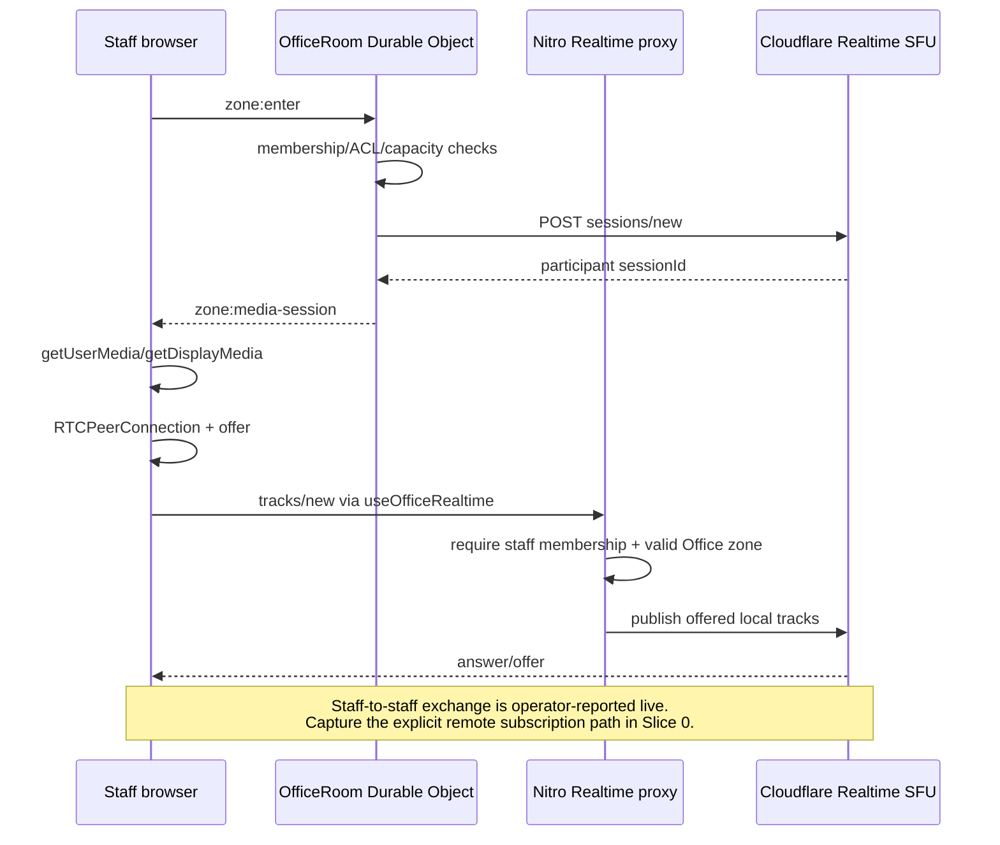
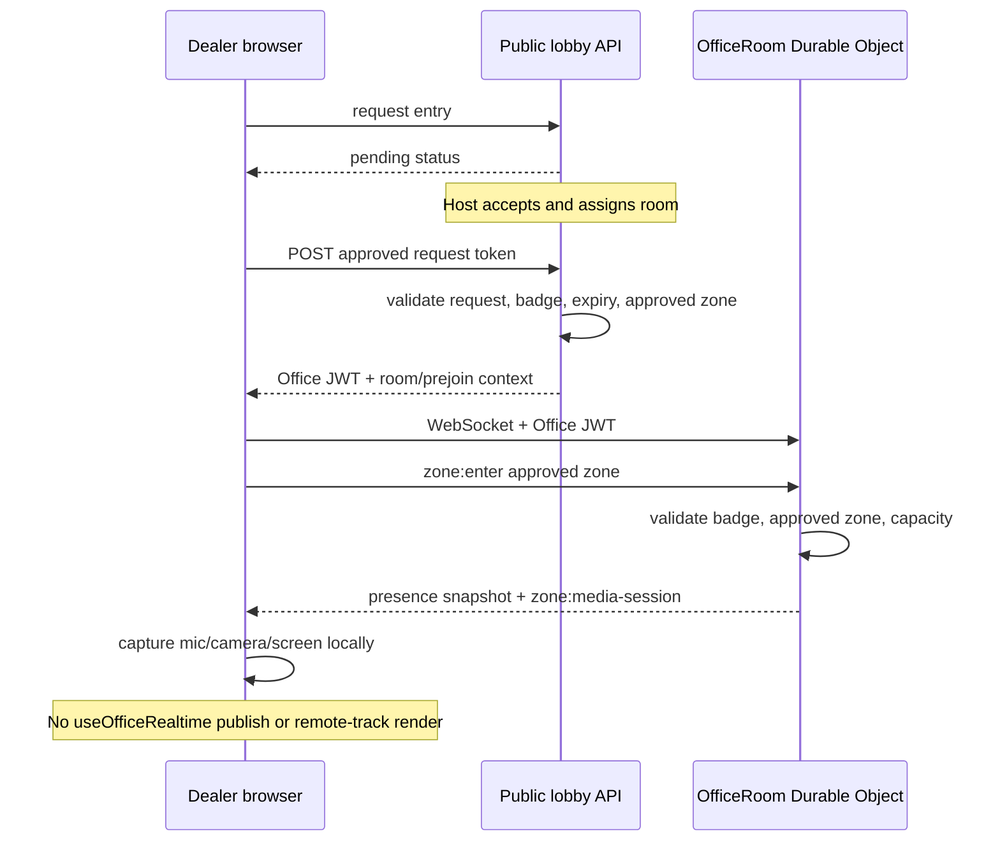
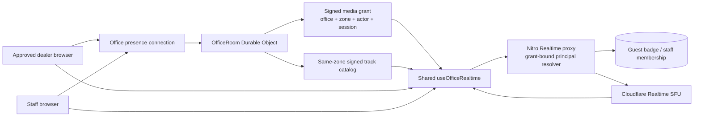

# Dealer guest video meetings — architecture discovery and rollout plan

**Date:** 2026-07-31
**Status:** Proposed rollout; dealer media is not yet production-verified
**Decision:** [ADR-006](../../decisions/ADR-006-dealer-guest-realtime-media-boundary.md)
**Scope:** Approved external dealer guests joining staff Office rooms

## Outcome

Ship dealer-facing audio, video, remote media, and screen sharing through the
existing XeroFlow Office and Cloudflare Realtime SFU architecture without
weakening room admission or exposing Cloudflare credentials.

Until the rollout gates are complete, use this product description:

> Staff-to-staff Office rooms support live realtime audio/video and screen
> sharing. Approved external dealer guests have prejoin readiness, temporary
> room access, local camera/microphone and screen controls, and live meeting
> presence. Publishing and receiving dealer media tracks is part of the
> XeroFlow rollout and is not yet production-verified.

Do not describe dealer-facing video meetings as generally available before the
final enablement gate.

## Discovery method

The repository's existing Graphify graph was queried for the Office room,
external guest, presence, and media path. The broad graph contained unrelated
dealer-feed nodes, so it was used only to locate candidate components. Every
finding below was then re-verified against the current `origin/main` source.

Current Cloudflare behavior was checked against the Realtime SFU Connection API
and limits documentation updated on 2026-07-30.

## Source-verified architecture and operator-reported capability

### Capability matrix

| Capability | Staff Office room | Approved dealer guest room | Evidence |
|---|---:|---:|---|
| Approved room admission | Office membership and zone policy | Lobby acceptance, active guest badge, approved zone | token endpoints, `OfficeRoom`, `evaluateZoneEntry` |
| Live room presence | Yes | Yes | `useOfficeConnection` and Office WebSocket |
| Camera/mic capture | Yes | Yes, local only | `OfficeMediaDock`, guest room `ensureLocalMedia` |
| Screen capture | Yes | Yes, local only | staff `toggleScreen`, guest `toggleScreenShare` |
| Realtime session reserved | Yes | Yes | `OfficeRoom.reserveZoneMediaSession` runs after admitted `zone:enter` |
| Local tracks published to SFU | Yes | No verified path | only staff UI invokes `useOfficeRealtime.publish()` |
| Remote media exchange | Reported live; baseline capture required | No | staff has `ontrack` and remote rendering, but no explicit cross-session pull registry was located; guest has neither |
| Realtime proxy authorization | Staff membership | Not supported | `requireOfficeRealtimeAccess` calls `requireAuth` and queries `office_members.user_id` |

### Staff media path



The implementation creates a Cloudflare Realtime session per participant. The
correlation ID includes office, zone, and actor. This differs from the old Phase
1b plan's "one session per zone" language.

The current composable sends only `location: 'local'` track payloads.
Cloudflare's current OpenAPI schema defines a remote pull with
`location: 'remote'`, the publisher `sessionId`, and `trackName`; it describes
`autoDiscover` as detecting new local tracks in the offered SDP. No same-zone
publisher catalog or explicit remote pull call was found in the source review.
The rollout must capture the operator-reported staff exchange in a live baseline
and add explicit room-scoped signaling if that evidence confirms the source gap.

### Dealer guest presence and local-preview path



The guest UI text accurately hints at this boundary: screen capture is active
locally, notes are staged until room audio is connected, and the host brings the
conversation into the live media layer.

## Gap statement

The missing work is not device readiness or room presence. It is the secure
bridge between the approved guest's captured `MediaStream`s and the existing
Cloudflare Realtime publish/subscribe state machine.

Two blockers must be resolved together:

1. **Client wiring:** the guest room does not pass its camera/microphone and
   screen streams to `useOfficeRealtime`, nor render `remoteStreams`.
2. **Authorization:** the Realtime proxy only accepts staff membership and does
   not cryptographically bind the supplied `sessionId` to the caller.

Adding guest UI wiring without the authorization redesign would either fail with
403 responses or create an unsafe public proxy.

## Target architecture



### Media grant contract

Add a signed, short-lived media grant issued by the Durable Object after a
successful room admission:

```ts
interface OfficeMediaGrantClaims {
  purpose: 'office-media'
  officeId: string
  zoneId: string
  handle: ActorHandle
  sessionId: string
  isGuest: boolean
  guestBadgeId?: string | null
  scopes: Array<'state' | 'publish' | 'pull' | 'renegotiate' | 'close'>
  exp: number
}

interface OfficeRemoteTrackGrantClaims {
  purpose: 'office-remote-track'
  officeId: string
  zoneId: string
  publisherHandle: ActorHandle
  publisherSessionId: string
  trackName: string
  kind: 'audio' | 'video'
  exp: number
}

interface OfficeMediaSession {
  provider: 'cloudflare-realtime'
  sessionId: string
  correlationId: string
  grant: string
  grantExpiresAt: number
  createdAt: number
}
```

The browser sends the grant in an Authorization header. It must not be placed in
the route, query string, client logs, audit metadata, or analytics.

### Same-zone track catalog

Use the authenticated Office WebSocket as the signaling plane:

1. The publisher sends the track names returned by Cloudflare after a successful
   local publish.
2. The Durable Object accepts the announcement only when the publisher's
   `sessionId` matches the session it reserved for that connected actor.
3. The Durable Object signs remote-track capabilities and broadcasts the catalog
   only to occupants of the same zone.
4. A subscriber pulls a remote track into its own session with
   `location: 'remote'`, the publisher `sessionId`, and `trackName`.
5. The proxy verifies both the subscriber media grant and the signed remote-track
   capability have the same office and zone before calling Cloudflare.
6. Leave, unpublish, revocation, eviction, and inactivity remove catalog entries
   and tell subscribers to close the corresponding remote tracks.

This makes the Office room—not knowledge of a raw Cloudflare session ID—the
subscription boundary.

### Unified proxy authorization

Replace `requireOfficeRealtimeAccess` with a media-specific resolver that:

- verifies `purpose`, signature, and expiry;
- compares signed and routed office/session IDs;
- compares signed and submitted zone IDs;
- revalidates active staff membership for staff grants;
- revalidates badge status, expiry, and allowed zone for guest grants;
- verifies the requested operation is in `scopes`;
- returns the Cloudflare credentials only after every check passes.

The existing Cloudflare app secret remains Pages-side only.

### Grant refresh and teardown

- Store the active Realtime `sessionId` in participant state in the Durable
  Object.
- Add a WebSocket media-grant refresh message that is accepted only while the
  actor is connected to the same zone. Guest badge validation already runs
  before every inbound message.
- Refresh before expiry without creating a second Cloudflare session.
- On `zone:leave`, guest badge revocation, host end, eviction, tab takeover, or
  access expiry:
  - stop local camera/microphone/screen tracks;
  - close published SFU tracks;
  - close the peer connection;
  - clear remote streams and the grant;
  - remove Office presence.
- Treat close calls as best-effort, because Cloudflare also garbage-collects
  inactive tracks. Client teardown remains required for immediate privacy.

### Guest media UI

Refactor the guest room to use the same composable as staff:

- `getStreams()` returns active local and screen streams.
- media toggles call `realtime.publish()` after adding, enabling, disabling, or
  removing tracks.
- `connection.mediaSession` supplies the session and grant.
- the same-zone catalog supplies signed remote track pulls.
- remote streams render with `OfficeRemoteMediaTile`.
- the status badge reflects peer-connection state (`joining`, `live`, `issue`),
  not only Office presence.
- current local-only copy remains when the feature flag is off.
- screen video is required for the first release; system audio remains
  browser-dependent and is not an acceptance gate.

## Rollout controls

Introduce fail-closed server/worker configuration:

- `OFFICE_GUEST_REALTIME_MEDIA_ENABLED=false` — global kill switch.
- `OFFICE_GUEST_REALTIME_PILOT_OFFICE_IDS=` — comma-separated Office UUID
  allowlist.

Both must allow a guest before the Durable Object issues a guest media grant.
Staff media behavior must remain unchanged when the guest flag is off.

No database migration is required for the first rollout. If product later needs
per-dealer controls, move the allowlist to an audited Office setting rather than
growing the environment variable indefinitely.

## Implementation slices

### Slice 0 — claim freeze and baseline evidence

- [ ] Keep dealer-facing media described as rollout work.
- [ ] Capture a successful staff-to-staff call in two real browsers.
- [ ] Record the current staff negotiation sequence and Cloudflare session state,
  including how each subscriber learns the publisher `sessionId` and
  `trackName`.
- [ ] If no explicit remote pull is present in runtime traffic, record the staff
  capability as local publication/readiness and make the signed track catalog a
  staff-and-guest prerequisite.
- [ ] Confirm production and preview have the required Realtime secrets without
  printing secret values.
- [ ] Confirm the global guest media flag defaults to off when absent.

**Exit gate:** staff media is proven on the current build and no public copy
claims dealer video is generally available.

### Slice 1 — session-bound authorization

- [ ] Define media-grant claims and mirrored signer/verifier tests.
- [ ] Store the participant's active Realtime session in the Durable Object.
- [ ] Add the same-zone published-track registry and signed remote-track
  capability.
- [ ] Issue and refresh the signed media grant only after successful zone
  admission.
- [ ] Implement the unified proxy principal resolver.
- [ ] Require exact office, zone, session, actor, scope, and expiry matches.
- [ ] Require a same-zone remote-track capability for every pull.
- [ ] Revalidate staff membership or guest badge on every proxy operation.
- [ ] Apply the resolver to state, publish, renegotiate, and close routes.
- [ ] Exclude grants, SDP, device labels, and tokens from logs.

**Exit gate:** attempts using another participant's session ID fail before any
Cloudflare request; all existing staff media tests remain green.

### Slice 2 — shared guest publish/subscribe client

- [ ] Add authorization injection and grant refresh to `useOfficeRealtime`.
- [ ] Reuse the composable from the guest room.
- [ ] Publish enabled microphone, camera, and screen tracks.
- [ ] Announce returned local track names through the authenticated Office
  WebSocket.
- [ ] Pull signed same-zone remote tracks explicitly into the subscriber session.
- [ ] Render remote staff and guest streams.
- [ ] Republish safely when devices, screen state, or room occupancy change.
- [ ] Actively tear down media on leave, access end, revocation, or component
  unmount.
- [ ] Preserve the current presence/local-preview experience when disabled.

**Exit gate:** a guest build with the flag off has no media regression; with the
flag on in test, valid grant-bearing calls reach the mocked SFU.

### Slice 3 — automated battle tests

Add tests for:

- [ ] valid staff grant;
- [ ] valid guest grant with active matching badge;
- [ ] missing, malformed, expired, and wrong-purpose grants;
- [ ] wrong office, zone, session, actor, or operation scope;
- [ ] missing, expired, cross-zone, and substituted remote-track capabilities;
- [ ] revoked, expired, missing, and wrong-zone guest badges;
- [ ] removed staff membership;
- [ ] guest media disabled globally;
- [ ] guest Office not in the pilot allowlist;
- [ ] media grant refresh in the same zone and denial after leaving;
- [ ] cleanup on host end, eviction, badge revocation, and unmount;
- [ ] mic-only, camera-only, camera+mic, and screen republish;
- [ ] remote-track arrival and ended-track removal;
- [ ] late join receives the current same-zone track catalog;
- [ ] duplicate publish and stale async-run race handling;
- [ ] no secrets, grants, or SDP in logs and error responses.

**Exit gate:** security and media lifecycle tests pass with no reduction in the
staff Office realtime suite.

### Slice 4 — real Cloudflare and browser UAT

Use a non-production Office and two independent browser identities.

- [ ] Chrome/Edge staff + guest exchange microphone audio.
- [ ] Staff sees guest camera and guest sees staff camera.
- [ ] Guest screen video reaches staff.
- [ ] Staff screen reaches guest.
- [ ] Cloudflare session state shows active guest local tracks.
- [ ] Runtime traffic shows explicit remote pulls with the expected publisher
  session and track names.
- [ ] Both browsers receive at least one remote track through `ontrack`.
- [ ] Mute, camera-off, stop-share, and re-enable do not duplicate tracks.
- [ ] Refresh and brief network loss recover or present a truthful reconnect
  state.
- [ ] Full-room denial never starts media.
- [ ] Host end and badge revocation stop guest media and deny renegotiation.
- [ ] Safari desktop completes camera/mic; iOS Safari limitations are recorded.

**Exit gate:** evidence includes browser timestamps, actor roles, correlation
IDs, track kinds/statuses, and pass/fail results. Do not capture SDP or tokens.

### Slice 5 — internal dogfood

- [ ] Enable the feature only for an internal Office.
- [ ] Run at least 10 mixed staff/guest sessions across five working days.
- [ ] Review negotiation errors, disconnects, cleanup, and support feedback daily.
- [ ] Exercise the kill switch once.
- [ ] Confirm recording/transcription remain off unless separately consented.

**Exit gate:** at least 95% of joins publish a track, at least 95% receive a
remote track within 10 seconds, no cross-room media, no unresolved P0/P1 issue,
and kill-switch rollback is verified.

### Slice 6 — single dealer pilot

- [ ] Select one consenting dealer and named staff owners.
- [ ] Add only its Office UUID to the pilot allowlist.
- [ ] Schedule supported meeting windows and a fallback meeting link.
- [ ] Run at least five real dealer meetings.
- [ ] Review media success, time-to-first-remote-track, disconnects, browser mix,
  and consent behavior after every meeting.
- [ ] Remove the Office from the allowlist immediately on a security, privacy, or
  repeated reliability failure.

**Exit gate:** no security/privacy incident, at least 95% publish and remote-track
success, median remote track under five seconds, and no more than one
media-blocking failure across the pilot.

### Slice 7 — controlled expansion

- [ ] Expand to a small dealer cohort.
- [ ] Hold the cohort for two weeks.
- [ ] Add dashboards and alerts before broadening further.
- [ ] Update support and incident runbooks.
- [ ] Update public feature copy only after the cohort gate passes.
- [ ] Move from allowlist to default-on only with an approved production review.

**Exit gate:** two weeks within SLO, rollback drill passed, support owns the
runbook, and ADR-006 is accepted or superseded.

## Observability

Emit structured events and metrics without media content:

| Signal | Purpose |
|---|---|
| `office_media_grant_issued` | prove authorized session creation by actor type |
| `office_media_publish_result` | count publish success/failure and error class |
| `office_media_remote_track` | measure first remote audio/video arrival |
| `office_media_connection_state` | track connect/disconnect/failure transitions |
| `office_media_teardown` | prove leave/revoke/host-end cleanup |
| `office_media_auth_denied` | detect wrong-session/zone/scope and expired grants |

Required dimensions: environment, office ID, zone ID, actor type, track kind,
browser family, result, and a non-secret correlation ID. Do not record guest
email, SDP, token/grant, device label, media content, or raw IP.

Alert on:

- any cross-session or cross-zone authorization denial burst;
- guest publish success below 95% over the pilot window;
- remote-track success below 95%;
- p95 time-to-first-remote-track above 10 seconds;
- repeated peer-connection failures for the same Office;
- teardown failures after revocation or host end.

## Rollback

1. Set `OFFICE_GUEST_REALTIME_MEDIA_ENABLED=false`.
2. Deploy through the guarded `pnpm deploy:production` path.
3. Confirm new guest handshakes no longer receive media grants.
4. Existing guest media clients must observe access-end/flag state and tear down;
   if not, revoke active guest badges or end affected sessions.
5. Keep staff Realtime enabled.
6. Preserve approved-entry, local readiness, room presence, meeting artifacts,
   and fallback meeting links.

The media grant and proxy hardening should remain even if guest media is rolled
back; they reduce risk for the staff path as well.

## Definition of done

Dealer-facing video meetings are complete only when:

- the signed media-grant boundary is implemented and reviewed;
- real guest tracks are active in Cloudflare session state;
- staff and guest browsers each receive the other's media;
- revocation and host end stop media;
- the automated security matrix and browser UAT pass;
- the single-dealer pilot meets the stated thresholds;
- monitoring, support, fallback, and kill-switch ownership are assigned;
- public wording is updated from rollout language to availability language.

## Source map

- `app/pages/lobby-room/[officeId]/[requestId].vue` — guest presence and local
  media controls
- `app/composables/useOfficeConnection.ts` — Office WebSocket lifecycle and
  `zone:media-session`
- `app/composables/useOfficeRealtime.ts` — staff local publish, `ontrack`
  handling, renegotiation, status, and teardown
- `app/components/office/OfficeMediaDock.client.vue` — staff media UI
- `workers/office-room/src/OfficeRoom.ts` — authoritative admission, badge
  validation, capacity, and Realtime session reservation
- `server/api/public/office-lobby/[officeId]/request/[requestId]/token.post.ts` —
  approved guest handshake
- `server/utils/officeRealtimeAccess.ts` — current staff-only proxy access
- `server/api/office/[officeId]/realtime/[sessionId]/` — current Realtime proxy
- [Cloudflare Realtime SFU Connection API](https://developers.cloudflare.com/realtime/sfu/https-api/)
- [Cloudflare Realtime SFU limits](https://developers.cloudflare.com/realtime/sfu/limits/)
