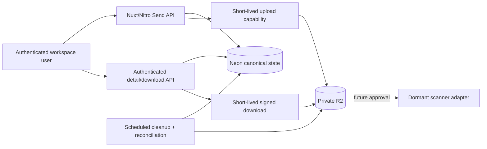

# PRD: XeroFlow Send

**Date:** 2026-07-20
**Status:** Approved — amended to private internal v1 on 2026-07-21
**Owner:** ADME / XeroFlow
**Living task plan:** `docs/superpowers/plans/2026-07-20-send-product-implementation.md`
**Goal-loop objective:** Incrementally deliver private, authenticated, workspace-scoped transfers for internal Dashboard users while keeping this PRD and its task plan current.

**Approval record:** The user approved the original PRD on 2026-07-20 and, on 2026-07-21, approved a private internal-only v1. [ADR-006](../../decisions/ADR-006-private-internal-dashboard-send-v1.md) supersedes every guest, external-recipient, public-sender, recipient-email, and scanner-launch requirement for v1. Those capabilities remain recorded as deferred product options and require a new approval before implementation or activation.

## 1. Executive summary

XeroFlow Send v1 is one private file-transfer surface inside Dashboard. Authenticated
internal users can upload large files, resume interrupted uploads, make a completed
transfer available to other authorised workspace users, download files, revoke access,
and retain an auditable history.

There is no anonymous or bearer-link access in v1. A file can be downloaded only by a
signed-in Dashboard user who passes the current workspace/transfer access check.

An optional later **Live Send** mode may provide croc-like browser-to-browser transfer using WebRTC and TURN. It is not part of the initial release because croc's native TCP/PAKE relay and WeTransfer-style asynchronous storage solve different user jobs.

The initial product stores files in private Cloudflare R2, uploads directly from the
browser, uses resumable multipart transfer for large files, and authorises every
download before issuing a short-lived signed URL. It reuses the existing Nuxt, Neon,
authentication, authorisation, and R2 foundations. Public verification, email delivery,
abuse infrastructure, and the dedicated scanner runtime are not part of this release.

## 2. Assumptions and proposed defaults

These approved assumptions define the private v1 boundary.

1. The product is browser-first within the existing Nuxt 4 application; no native app or CLI is required for v1.
2. V1 exposes only authenticated Workspace Send. Public-compatible domain fields may remain dormant, but no public route or entitlement is enabled.
3. R2 remains private. Transfer objects must never depend on `R2_PUBLIC_URL` or a permanently public bucket.
4. Workspace transfers require an authenticated staff user and an explicit tenant/client scope when client data is involved.
5. Every sender and downloader must be authenticated and pass the canonical workspace/transfer access policy; link possession is never sufficient.
6. Workspace limits and retention are configuration-driven. Until billing entitlements exist, administrators receive a conservative configurable default rather than an unlimited allowance.
7. V1 supports revocation, expiry, individual download, and an optional later archive download. It does not issue guest tokens, accept passwords, store recipients, or send recipient emails.
8. V1 validates server-owned object identity, expected size/type, canonical R2 metadata, and safe filename representation. Files are served as attachments, never inline from the application origin.
9. Dedicated malware scanning is deferred for private v1 to avoid fixed Container cost. The implemented scanner foundation remains disabled and is required for reconsideration before any external upload or unauthenticated download surface.
10. End-to-end/server-blind encryption and inline previews are excluded from v1.
11. Existing public-compatible schema and code are dormant compatibility work only and cannot be treated as launch authority.
12. Both private/server and public/UI feature flags remain false until the internal release gate is explicitly approved.

## 3. Objective

Build a dependable internal delivery experience for large workspace files that reduces
reliance on third-party transfer products while fitting naturally into XeroFlow's
client, project, deliverable, and audit workflows.

The product succeeds when:

- authorised staff can create, upload, publish, monitor, download, and revoke a transfer without leaving XeroFlow;
- another authorised Dashboard user can retrieve the intended files only within their current workspace scope;
- large interrupted uploads can resume without restarting the whole file;
- expired or revoked transfers cannot be downloaded;
- tenant isolation, object-contract validation, attachment-only delivery, and audit evidence are enforced server-side;
- operations can explain storage use, transfer state, expiry, revocation, and deletion without querying raw tables.

## 4. Problem

The application already stores media and documents in R2 and already exposes several specialised share-link flows, but it lacks one governed transfer product.

Current gaps include:

- file sharing is spread across task attachments, client files, deliverables, recordings, and generated assets;
- collection APIs generate `/gallery/{shareToken}` URLs, but no matching public gallery route exists;
- existing presigned uploads are single-request uploads and cannot resume;
- storage keys and long-lived file URLs are inconsistently represented in records;
- the generic upload confirmation route does not bind a key to a server-created upload intent, actor, tenant, or expected object metadata;
- the generic storage deletion route defaults to allowing deletion for unknown key categories;
- external and anonymous storage would introduce mail-bombing, malware, phishing, copyright, denial-of-wallet, and illegal-content risks, so those trust boundaries are deferred.

## 5. Users and jobs to be done

### 5.1 Internal sender

- Send large files to other authorised Dashboard users without leaving the workspace.
- Select existing XeroFlow assets and/or upload new files.
- Add a title, message, workspace scope, expiry, and download policy.
- Know whether the transfer was downloaded.
- Revoke or extend a transfer when circumstances change.

### 5.2 Internal recipient

- Sign in with an existing Dashboard account.
- See only transfers permitted by current workspace access.
- Understand who sent the transfer, what it contains, and when it expires.
- Download one file, and later an archive if approved, with clear expired/revoked/not-ready states.

### 5.3 Deferred external and public users

- Guest recipients, public senders, email verification, share links, password unlock,
  recipient notifications, and public management links are not v1 users or jobs.
- Reintroducing any of these jobs requires a PRD and threat-model amendment.

### 5.4 Operator

- Configure internal limits, retention, and availability.
- Block abuse actors and revoke transfers.
- Reconcile database records, incomplete uploads, and R2 objects.
- Observe upload, publication, download, expiry, and deletion health.

## 6. Product principles

1. **One authenticated entry point.** V1 has no anonymous or bearer-token access path.
2. **Private by construction.** R2 keys are never access grants; every access decision happens in application code.
3. **Server-authorised capabilities.** Clients receive narrow, expiring upload or download capabilities only after policy checks.
4. **Fail closed on identity and scope.** Missing authentication or workspace ownership evidence blocks metadata and download access.
5. **Recoverable transfers.** Uploads, publication, expiry, and deletion are idempotent and resumable.
6. **Audit without surveillance.** Record security and delivery events needed for support while minimising user PII.
7. **No misleading encryption claims.** TLS plus private storage is not marketed as end-to-end encryption.

## 7. Scope

### 7.1 Release 1 — Private internal Workspace Send

In scope:

- authenticated transfer creation;
- tenant/client/project association;
- upload from device and selection of eligible existing R2-backed assets;
- direct single-part and multipart/resumable R2 uploads;
- canonical metadata and object-contract validation;
- authenticated transfer detail and download-one experience;
- optional download-all only after the archive approach is approved;
- view/download audit events;
- expiry, revocation, and deletion;
- transfer list/detail UI and operational visibility;
- no route that permits access without a current Dashboard session and workspace authorisation.

### 7.2 Deferred — External delivery and Verified Public Send

Not approved or in scope for v1:

- unauthenticated transfer draft creation;
- Turnstile validation;
- sender email verification before upload authorization;
- conservative public quota and retention policies;
- sender management link for status and revocation;
- abuse reporting, operator review, and kill switch;
- public landing/create UI and transactional email;
- controlled-beta rollout and usage monitoring;
- guest/external recipient links and recipient notification email.

This section preserves the original direction only. None of these capabilities may be
implemented, provisioned, routed, or activated without a new product, security, and
cost approval.

### 7.3 Future — Live Send

Potential scope:

- code-phrase pairing;
- browser-to-browser WebRTC DataChannel transport;
- Cloudflare TURN fallback when direct connectivity fails;
- optional client-side content encryption;
- receiver-presence and reconnect semantics.

Live Send requires a separate technical spike and product decision. It must not delay the private release.

### 7.4 Explicitly out of scope for private v1

- native desktop or mobile applications;
- importing or embedding the croc Go binary;
- raw TCP relay infrastructure;
- permanent public file hosting;
- public or guest download links;
- recipient email delivery;
- anonymous upload without verified sender identity;
- dedicated malware-scanner deployment;
- payment plans, checkout, or overage billing;
- collaborative editing or comments on transfer files;
- server-blind encryption;
- arbitrary “import from URL” functionality;
- automatic public preview of active content such as HTML or SVG.

## 8. Functional requirements

### FR-1 Transfer creation

- A workspace sender can create a draft within an authorised tenant/client scope.
- Draft inputs include title, message, scope, expiry, and maximum-download option.
- Server validation uses strict Zod schemas and rejects unknown or oversized fields.
- The server owns transfer IDs, storage prefixes, status, and limits.
- V1 creation never accepts a public-sender identity, recipient list, password, or caller-selected access token.

### FR-2 Identity and access

- Workspace mutations require `requireAuth` plus transfer-level tenant/owner permission.
- Metadata and downloads require a current authenticated session plus transfer-level workspace permission.
- An owner cannot broaden access beyond the canonical tenant/client/project scope.
- Existing dormant share, management, password, and public-sender fields do not grant access and are not populated by v1 routes.

### FR-3 Upload intents

- Every file begins as a server-created upload intent containing transfer ID, generated R2 key, expected size, declared MIME type, original filename, uploader identity, expiry, and upload method.
- The client cannot choose or substitute the R2 key.
- Upload capabilities expire quickly and authorise only the intended object or multipart upload.
- Object metadata is verified against the intent before a file can become publication-eligible.
- Abandoned upload intents and multipart uploads are cleaned automatically.

### FR-4 Large and resumable upload

- Small files may use a presigned single `PUT`.
- A single-part presigned `PUT` remains reusable until its signature expires; API completion does not revoke it. Such files remain unavailable until the write capability has expired and canonical metadata is re-read, unless a future integrity-bound upload contract proves equivalent immutability.
- Files at or above the configured threshold use multipart upload.
- Multipart state records the R2 upload ID, completed parts, checksums/ETags, and expiry.
- Retrying create, part-complete, final-complete, or abort operations is idempotent.
- The UI shows per-file and total progress, retry, pause/resume where supported, and actionable failure states.

### FR-5 Validation and safe internal delivery

- Declared extension and MIME type are treated as hints, not proof.
- The system validates size, permitted type, canonical object metadata, checksum/integrity where available, and safe filename representation.
- Under the private-v1 policy, a stable, complete internal upload may become publication-eligible with `scan_status = 'not_required'`; `clean` must never be presented as a malware-free claim in this mode.
- The dormant scanner path, if later enabled, remains fail-closed on scanner error or timeout.
- Rejected or incomplete files are inaccessible and deleted according to retention policy.
- Active content downloads use safe content disposition and cannot execute under the application origin.

### FR-6 Internal publication

- A transfer can publish only when every included file is complete, immutable with respect to any outstanding upload capability, and eligible under the current internal validation policy.
- Publishing atomically fixes the file set, records the policy decision, and moves the transfer to `ready`.
- Publication does not create a public token or notification job and does not send email.

### FR-7 Authenticated recipient experience

- No transfer metadata is exposed before authentication and workspace authorisation.
- Expired, revoked, deleted, unavailable, exhausted, and unauthorised requests return user-safe states without revealing transfers outside the caller's scope.
- An authorised recipient may download one file or request an archive where supported.
- Each download revalidates transfer and file state, then returns or redirects to a short-lived signed capability.
- Responses carrying sensitive capabilities use `Cache-Control: no-store` and a restrictive referrer policy.

### FR-8 Sender management

- Workspace senders can list and filter their authorised transfers.
- Senders can view status, aggregate downloads, expiry, revocation, and validation state.
- Senders can revoke a transfer immediately.
- Retention extension is allowed only within entitlement and policy limits.

### FR-9 Expiry and deletion

- Application state rejects access immediately at `expires_at`, independent of physical object deletion timing.
- Scheduled cleanup deletes expired transfer objects and records deletion evidence.
- R2 lifecycle rules provide a prefix-based backstop for incomplete-upload data.
- Reconciliation detects orphan objects, missing objects, stale multipart uploads, and database/object drift.
- Deletion is idempotent and deny-by-default.

### FR-10 Internal controls

- Creation and upload enforce authenticated user, workspace entitlement, byte, file-count, concurrency, and retention limits before expensive storage work.
- Operators can disable new internal drafts independently of currently authorised downloads.
- Operators can revoke a transfer immediately.
- Logs and responses do not expose cross-workspace identity, policy internals, or object credentials.

### FR-11 Audit and analytics

- Append-only v1 events cover draft creation, upload intent, upload completion or abort, internal validation decision, publication, view, download, revocation, expiry, deletion, and operator action.
- Audit events include actor class, transfer, timestamp, safe request correlation, and redacted metadata.
- Product metrics describe private workspace traffic; dormant public traffic must remain zero.
- Raw tokens, signed URLs, object credentials, and full IP addresses are never logged.

## 9. Transfer state model

### 9.1 Transfer states

```text
draft
  -> uploading                   authorised workspace sender
  -> scanning                    legacy name: internal validation or optional future scan
  -> ready                       all selected files policy-eligible; publication committed
  -> revoked                     sender/operator action
  -> expired                     access deadline passed
  -> deletion_pending            retention cleanup claimed work
  -> deleted                     objects removed or confirmed absent

Any pre-ready state -> failed    terminal policy or unrecoverable processing failure
```

`ready`, `revoked`, `expired`, and `deleted` are access-significant. No route may infer access from the presence of an R2 object alone.

### 9.2 File states

```text
pending -> uploading -> uploaded -> quarantined -> clean
                    \-> aborted
uploaded/quarantined -> rejected
any non-terminal state -> failed
clean/rejected/failed -> deleted
```

For private v1, `clean` means eligible under the recorded publication policy, not a
malware-free assertion. `scan_status = 'not_required'` distinguishes an authenticated
internal validation decision from a scanner verdict. Renaming this legacy state is
deferred to avoid an unnecessary migration before launch.

## 10. Data model

The exact SQL is an implementation detail, but the canonical model requires:

### `send_transfers`

- `id`, nullable `tenant_id`, nullable `client_id`, nullable `project_id`;
- sender class and authenticated owner; public-sender references remain null in v1;
- title/message and lifecycle status;
- dormant nullable hashed share/management tokens and password fields, which remain null in v1;
- authenticated access mode and maximum-download policy;
- configured and actual byte/file totals;
- `expires_at`, `published_at`, `revoked_at`, `deleted_at`;
- immutable policy snapshot and timestamps.

### `send_files`

- transfer, server-generated R2 key, original/display filename;
- expected and actual size/type;
- checksum and object ETag where applicable;
- upload method and multipart state reference;
- validation/scan status and optional provider/version/evidence;
- file lifecycle state and timestamps.

### `send_recipients`

- Dormant compatibility table; v1 routes do not create recipient rows.

### `send_upload_intents`

- transfer/file, uploader scope, expected object contract;
- upload method, R2 multipart upload ID where needed;
- expiry, completion, abort, and idempotency evidence.

### `send_events`

- append-only transfer event ledger with actor class, event type, safe metadata, request correlation, and timestamp.

### `send_public_senders`

- Dormant compatibility table; v1 routes do not create or resolve public-sender rows.

## 11. Architecture



### Architecture decisions

1. **Neon is canonical state.** R2 object existence cannot substitute for transfer policy, ownership, or lifecycle state.
2. **R2 is private object storage.** Store keys in the database and mint signed URLs at the access boundary; do not persist signed URLs as file identity.
3. **Direct browser uploads avoid Pages request-body limits.** The application authorises uploads; R2 receives bytes.
4. **Multipart is the large-file path.** It provides resumability and parallelism and avoids restarting multi-gigabyte transfers.
5. **Private publication records its validation policy.** Dedicated scan and notification queues remain dormant and are not launch dependencies.
6. **Scheduled cleanup is authoritative; R2 lifecycle is a backstop.** Application expiry is immediate even if physical deletion is eventually completed.
7. **No public route is part of v1.** Dormant public-compatible fields and services do not create authority.
8. **Live Send is a distinct transport adapter.** If approved later, it reuses transfer metadata and UI concepts without weakening stored-transfer semantics.

## 12. Security and privacy threat model

### Trust boundaries

- browser to Nitro APIs;
- Nitro to R2 capability signing;
- browser directly to R2;
- authenticated detail/download API to short-lived R2 capability signing;
- scheduled cleanup to database and R2;
- operator actions over internal uploaded content.

### STRIDE summary

| Threat | Example | Required mitigation |
|---|---|---|
| Spoofing | Caller claims another workspace identity | Existing authenticated session plus server-derived actor identity |
| Tampering | Replace an intended object/key or multipart part | Server-generated key, scoped upload intent, checksums/ETags, completion validation |
| Repudiation | Sender denies publishing or revoking | Append-only actor-attributed event ledger |
| Information disclosure | Cross-tenant key or signed capability leaks | Transfer-level authorisation, private bucket, short signed URLs, safe errors |
| Denial of service/wallet | Compromised account creates large uploads or repeated downloads | Workspace byte/file/concurrency quotas, expiry, kill switch, monitoring |
| Elevation of privilege | Authenticated user confirms/deletes another user's object | Deny-by-default ownership checks bound to transfer and tenant |

### Abuse cases that must have tests

- unauthenticated metadata or download request;
- valid user attempting another tenant's transfer or R2 key;
- upload completion with mismatched size/type/key/ETag;
- replayed completion, publication, download-count, revocation, and deletion calls;
- misleading extension, active HTML/SVG, executable content, and oversized file;
- authenticated user creating many drafts or multipart uploads without completing them;
- deletion request for an unknown prefix or unowned transfer;
- R2, database, and cleanup outage;
- signed URL reuse after transfer revocation, bounded by the deliberately short signed-URL lifetime.

## 13. Non-functional requirements

### Reliability

- Every mutating operation accepts or derives an idempotency key.
- Upload completion, publication, download accounting, and cleanup retry are safe.
- Publication is atomic with respect to the canonical ready state and immutable file set.
- Orphan and drift reconciliation is runnable on demand and on schedule.

### Performance

- File bytes do not proxy through the Nuxt application during normal upload/download.
- Transfer metadata pages target a p95 API response under 500 ms excluding archive creation and R2 byte transfer.
- Large upload progress remains responsive and supports retrying failed parts independently.

### Accessibility and UX

- All forms use Nuxt UI v4, `UFormField`, accessible labels, keyboard operation, focus management, and visible error summaries.
- Upload progress is conveyed with text as well as colour.
- Internal pages support mobile widths and dark mode.
- Expired, revoked, unavailable, and failed states explain the next available action.

### Privacy and retention

- Minimise stored actor evidence and do not duplicate identity data into recipient rows.
- Display retention terms in the internal transfer form and detail page.
- Delete expired content and record deletion evidence without retaining filenames or messages longer than policy requires.
- Support operator legal hold only through an explicit, audited future policy; no silent indefinite retention.

## 14. Existing code to reuse or harden

### Reuse

- `server/utils/storage.ts`: R2 client, native binding, signed URLs, object metadata, and local fallback.
- Existing `requireAuth` and client/workspace access helpers: authenticated identity and scoped authorisation.
- `server/database/schema-client-portal.sql`: client files, deliverables, collections, share expiry, and download counters.
- Nuxt UI agency-page conventions.

### Harden before reuse

1. `server/api/storage/presigned-upload.post.ts` must create an upload intent bound to actor, tenant, transfer, key, type, and size rather than accepting a free-form entity reference.
2. `server/api/storage/confirm-upload.post.ts` must confirm only the caller's unexpired intent and must compare actual object metadata with the intent.
3. `server/api/storage/[key].delete.ts` must remove the default-allow branch and authorise by canonical transfer/file ownership.
4. New Send records must store R2 keys, not expiring presigned URLs.
5. Transfer downloads must ignore `R2_PUBLIC_URL` and always perform application policy checks.

## 15. Commands

Use the repository's existing commands:

```bash
# Development
pnpm dev

# Focused tests during a task
pnpm test:run -- <test-file-1> <test-file-2>

# Full unit/integration suite when risk warrants it
pnpm test:run

# Type check (known repository-wide legacy errors must be distinguished from new errors)
pnpm typecheck

# Lint changed files first, then repository lint at checkpoints
pnpm exec eslint <changed-files>
pnpm lint

# Production build
pnpm build

# Deployment guard and production deployment — only at an approved launch gate
pnpm deploy:check
pnpm deploy:production
```

## 16. Project structure

Expected locations; exact filenames may be refined in the implementation plan before each slice.

```text
app/pages/agency/send/           authenticated sender pages
app/components/send/             internal transfer/upload/detail components
app/composables/                 resumable upload client orchestration
app/types/                       runtime Send types
shared/                          cross-runtime contracts where Worker reuse is required
server/api/agency/send/          workspace transfer endpoints
server/api/internal/send/        cleanup callbacks protected as internal APIs
server/utils/send/               policy, repository, storage, token, and event services
server/database/migrations/      additive Send schema migrations
workers/send-scanner/            dormant future scanner adapter; not deployed for v1
test/send/                       domain and orchestration unit tests
test/server/api/send/            API boundary and abuse-case tests
test/app/send/                   component/page contract tests
docs/runbooks/                   operations, abuse, retention, and rollback runbooks
```

## 17. Code style

Use strict boundary validation, server-owned identifiers, parameterized SQL, double-tilde server imports, and typed result objects.

```ts
const Body = z.object({
  transferId: z.string().uuid(),
  fileName: z.string().trim().min(1).max(255),
  fileSize: z.number().int().positive().max(policy.maxFileBytes),
  contentType: z.string().trim().min(1).max(200)
}).strict()

const input = Body.parse(await readBody(event))
const user = await requireAuth(event)
const intent = await createUploadIntent({ actorId: user.id, ...input })

return { intent: toPublicUploadIntent(intent) }
```

Conventions:

- route handlers validate, authenticate, call a service, and serialize; business policy lives in `server/utils/send/`;
- database queries are parameterized and tenant predicates are explicit;
- response mappers allowlist fields rather than spreading database rows;
- state changes go through named transition functions;
- no endpoint accepts a caller-selected storage key;
- UI uses Nuxt UI v4 components and semantic colour tokens;
- tests name the abuse case or business outcome, not the implementation function alone.

## 18. Testing strategy

### Unit and contract tests

- transfer and file state transitions;
- policy limits and entitlement resolution;
- R2 key generation and safe filename handling;
- upload intent validation and multipart idempotency;
- internal validation policy and dormant scan-result normalization;
- expiry, revocation, and download-count rules;
- event redaction.

### API integration tests

- workspace auth, tenant/client scope, and ownership;
- create/upload/complete/validate/publish/download/revoke lifecycle;
- cross-tenant, key substitution, replay, and unknown-prefix deletion failures;
- signed download minted only after current policy checks;
- R2 and database failure behavior.

### UI/component tests

- draft form validation;
- upload queue progress/retry/resume;
- sender management and revocation confirmation;
- authenticated detail/download and accessible status messaging.

### Browser tests

- workspace happy path;
- authenticated recipient download;
- interrupted multipart resume;
- expired/revoked transfer behavior;
- mobile and keyboard navigation.

### Operational verification

- apply migration to the target database and read back constraints/indexes;
- confirm R2 CORS allows only approved application origins and required methods/headers;
- confirm lifecycle rules for incomplete prefixes;
- inspect logs to confirm no signed URL or credential leakage;
- run cross-workspace, rollback, R2-outage, and orphan-cleanup drills.

## 19. Boundaries

### Always do

- Update this PRD before changing approved scope or security semantics.
- Validate all external input and enforce transfer-level authorisation.
- Keep the R2 bucket private and store object keys rather than access URLs.
- Add an authorisation or misuse-case test with each new access capability.
- Run focused tests and changed-file lint for every task.
- Apply and verify additive database migrations as part of their implementation task.
- Keep both Send flags disabled until the private internal launch gate is approved.
- Re-read all changed files and perform a security-focused review before commits.

### Ask first

- Changing internal size, retention, or quota defaults after approval.
- Provisioning, deploying, or activating the malware scanner.
- Adding guest, external-recipient, public-sender, password, or recipient-email capability.
- Adding payment/billing, legal-hold, or new PII retention.
- Enabling server-blind encryption or Live Send.
- Changing R2 CORS, lifecycle, public-bucket, or custom-domain configuration.
- Deploying, applying production migrations, or enabling Send.
- Sending real external recipient emails during testing.

### Never do

- Commit secrets or expose R2 credentials to the browser.
- Treat a dormant share/management token or password field as internal-v1 authority.
- Trust a client-selected storage key, MIME type, size, tenant, or ownership claim.
- Default-allow an unknown file category, object prefix, or actor.
- Describe an internal `not_required` validation decision as a malware-free scan result.
- Put passwords or signed URLs in query strings, logs, analytics, or emails.
- Serve untrusted active content inline from the application origin.
- Mark the product end-to-end encrypted unless the server is cryptographically unable to decrypt file content.

## 20. Success metrics

Product and operational targets for the private internal release:

- at least 95% of initiated policy-eligible transfers that begin uploading reach `ready` or a clear user-actionable failure state;
- at least 99% of successful publication requests produce exactly one ready transfer;
- zero confirmed cross-tenant or unauthorised file disclosures;
- zero unauthenticated or cross-workspace metadata/file disclosures;
- 100% of expired/revoked transfers rejected by application access checks immediately;
- at least 99% of expired objects physically deleted within 24 hours of cleanup eligibility;
- p95 metadata API response under 500 ms excluding R2 byte transfer and async work;
- no secrets, raw tokens, object credentials, or signed URLs found in production logs;
- operator can trace every transfer from draft through deletion using redacted events.

Metric thresholds may be refined before beta but must remain explicit and testable.

## 21. Rollout

1. Implement and verify storage-authorisation hardening with Send disabled.
2. Complete internal publication, authenticated download, revocation, and cleanup while both Send flags remain false.
3. Apply approved migrations in a selected non-production environment and run internal interruption, authorisation, active-content, revocation, and expiry tests.
4. Enable only an allowlisted administrator/internal cohort behind the feature flag.
5. Complete cost, security, support, and retention review after an agreed soak window.
6. Broaden, pause, or roll back the internal cohort based on evidence.

Rollback order:

- disable new internal creation;
- disable new publication while preserving currently authorised downloads if safe;
- revoke affected transfers;
- stop cleanup consumers only after preserving recoverable state;
- leave additive schema in place and retain audit evidence;
- use reconciliation to finish or remove orphaned storage work.

## 22. Open decisions for product review

Defaults may be resolved task-by-task before launch without broadening the private boundary.

1. **Workspace limits:** use one administrator default first, or define plan entitlements now?
2. **Retention options:** fixed internal retention or administrator-selectable up to 30 days?
3. **Archive download:** omit “download all” initially, stream on demand, or build asynchronously?
4. **Internal discovery:** owner-only list plus direct authorised detail, or a shared workspace inbox?
5. **Geography:** are Australian data-location or residency controls required before internal enablement?
6. **Future scanning:** what usage, external-sharing request, or policy threshold justifies activating the dormant adapter?

## 23. Source notes

- Croc provides relay-based transfer, PAKE end-to-end encryption, resumability, and native cross-platform clients: https://github.com/schollz/croc
- R2 recommends single `PUT` for smaller files and multipart upload for large/resumable/parallel transfers: https://developers.cloudflare.com/r2/objects/upload-objects/
- R2 presigned URLs are bearer capabilities and should be short lived and tightly scoped: https://developers.cloudflare.com/r2/api/s3/presigned-urls/
- Browser use of presigned URLs requires an origin-restricted R2 CORS policy: https://developers.cloudflare.com/r2/buckets/cors/
- R2 lifecycle rules can expire objects by policy/prefix and provide a deletion backstop: https://developers.cloudflare.com/r2/buckets/object-lifecycles/
- Cloudflare TURN can relay WebRTC traffic when direct browser communication is blocked: https://developers.cloudflare.com/realtime/turn/

## 24. Approval and release status

The private internal v1 amendment was approved on 2026-07-21. The product owner also
approved the production migrations, deployment, and private feature-flag enablement.
Those approvals were consumed by the release recorded below.

Any external recipient, guest link, public sender, recipient email, or scanner
deployment remains a separate explicit approval gate. The private release does not
authorize those capabilities.

## 25. Private production release evidence

Released on 2026-07-21 for authenticated internal Dashboard users:

- migrations `268_send_foundation.sql` through `271_send_private_internal.sql` were
  applied to the production Neon database;
- both server and public UI Send flags were enabled in the production configuration;
- the Cloudflare Pages application and cleanup scheduler were deployed;
- Send is available from the agency sidebar at `/agency/send`;
- an authenticated browser smoke created a draft, uploaded a 48-byte attachment
  directly to private R2, waited through the single-PUT sealing window, published,
  downloaded, and revoked the transfer;
- the Workers multipart control plane was hardened to use a workerd-compatible SigV4
  adapter, bounded and progress-checked R2 part pagination, canonical server-side part
  listing, and capped XML response parsing;
- deployment `43c5a646` was served successfully from both its immutable Cloudflare Pages
  URL and `https://app.xeroflow.io/agency/send`;
- a second authenticated production smoke uploaded a 105,906,176-byte (101 MiB)
  multipart attachment, published it, downloaded it once, and revoked it;
- production records confirmed `upload_method = 'multipart'`, a completed upload
  intent, a clean file with scanning correctly marked `not_required`, one download,
  and exactly one event for draft creation, upload intent creation, upload completion,
  publication, download, and revocation; the final transfer state was `revoked`;
- follow-up deployment `8a2a6ada` added policy-bounded expiry extension for owners and
  workspace management roles. A live authenticated smoke extended a zero-file draft
  from 7 to 14 days, confirmed the new date and secret-free operator audit event in the
  production database, then revoked the transfer;
- both the immutable `8a2a6ada` route and `https://app.xeroflow.io/agency/send` returned
  200 after the follow-up release;
- deployment `09703d23` added bounded, report-only R2/database reconciliation after the
  scheduled cleanup phase. The immutable and custom Send routes returned 200 and the
  protected cron route returned 401 without its scheduler secret;
- a separate read-only production reconciliation scanned three Send objects and two
  expected file rows with zero orphan, malformed, missing, metadata-failure,
  stale-multipart, retryable-deletion, truncation, or batch-limit findings. One expired
  single-part intent belongs to an already-revoked transfer and is inaccessible pending
  normal cleanup;
- live lifecycle read-back confirmed the enabled default `agency-files` rule aborts
  incomplete multipart uploads after seven days;
- a disposable PostgreSQL 14 expiry drill proved concurrent single-claim cleanup,
  recovery from an injected partial object-delete failure after the retry window,
  terminal `deleted` state, exactly-once claim/deletion events, zero remaining objects,
  and zero reconciliation issues;
- final source review added regression coverage for transient R2 metadata failures,
  traversal-like key normalization, multipart abort recovery during an R2 outage, and
  automatic publication refresh after single-upload sealing; the reviewed source is
  recorded in commits `b00ef135`, `51332e4d`, and `fd348e5c`;
- the reviewed focused release matrix passed 210 tests across 37 files, focused ESLint
  passed, and both the root and isolated production builds completed successfully.

These smokes prove both the single-part and large-file multipart private lifecycles in
production. Public sharing, external recipients, email, and the dormant scanner remain
out of scope.
