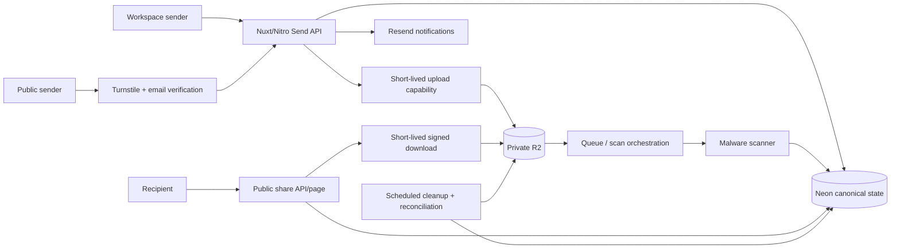

# PRD: XeroFlow Send

**Date:** 2026-07-20
**Status:** Approved — implementation authorised 2026-07-20
**Owner:** ADME / XeroFlow
**Living task plan:** `docs/superpowers/plans/2026-07-20-send-product-implementation.md`
**Goal-loop objective:** Define, plan, and incrementally deliver authenticated workspace transfers, secure expiring guest links, and a verified public WeTransfer-style service while keeping this PRD and its task plan current.

**Approval record:** The user approved this PRD as written on 2026-07-20. Proposed defaults in section 2 are the implementation baseline; later changes still follow the named Ask-first boundaries.

## 1. Executive summary

XeroFlow Send is a secure file-delivery product with two launch surfaces backed by one transfer platform:

1. **Workspace Send** lets authenticated agency staff send files to clients or collaborators, track delivery, revoke access, and retain an auditable history.
2. **Public Send** lets a verified sender without a XeroFlow account upload files and create a short-lived WeTransfer-style link under conservative abuse and storage limits.

An optional later **Live Send** mode may provide croc-like browser-to-browser transfer using WebRTC and TURN. It is not part of the initial release because croc's native TCP/PAKE relay and WeTransfer-style asynchronous storage solve different user jobs.

The initial product will store files in a private Cloudflare R2 bucket, upload directly from the browser, use resumable multipart transfer for large files, and authorize every download before issuing a short-lived signed URL. It will reuse the application's existing Nuxt, Neon, R2, Resend, Turnstile, and Durable Object rate-limiting foundations.

## 2. Assumptions and proposed defaults

These assumptions make the PRD implementable. They remain reviewable until this document is approved.

1. The product is browser-first within the existing Nuxt 4 application; no native app or CLI is required for v1.
2. Workspace Send and Public Send share one domain model, storage layout, recipient page, and event ledger.
3. R2 remains private. Transfer objects must never depend on `R2_PUBLIC_URL` or a permanently public bucket.
4. Workspace transfers require an authenticated staff user and an explicit tenant/client scope when client data is involved.
5. Public senders must pass Turnstile and verify their email before upload credentials are issued.
6. Public Send starts with a proposed limit of **2 GB per transfer, 20 files, and seven-day retention**. These are configuration values, not hard-coded product constants.
7. Workspace limits are entitlement-driven. Until billing entitlements exist, administrators receive a configurable default rather than an unlimited allowance.
8. Transfers support an unguessable link, optional password, optional recipient emails, revocation, expiry, and configurable maximum downloads.
9. Uploaded content remains quarantined until type, size, integrity, and malware checks pass. Public publication fails closed if scanning is unavailable.
10. End-to-end/server-blind encryption is excluded from v1 because it prevents server-side malware scanning and previews. A later encrypted mode may explicitly trade those capabilities away.
11. Public Send is unlisted, not publicly indexed: share pages use `noindex`, tokens are high entropy, and only holders of the link can discover a transfer.
12. Public Send will launch as a controlled beta with monitoring and an operator kill switch before broad promotion.

## 3. Objective

Build a dependable delivery experience for large client files that removes reliance on third-party transfer products while fitting naturally into XeroFlow's client, project, deliverable, notification, and audit workflows.

The product succeeds when:

- staff can create, upload, publish, monitor, and revoke a transfer without leaving XeroFlow;
- a recipient without a XeroFlow account can securely retrieve the intended files;
- a verified public sender can create an expiring transfer without gaining application access;
- large interrupted uploads can resume without restarting the whole file;
- expired or revoked transfers cannot be downloaded;
- tenant isolation, abuse controls, quarantine, and audit evidence are enforced server-side;
- operations can explain storage use, delivery state, scan state, and abuse state without querying raw tables.

## 4. Problem

The application already stores media and documents in R2 and already exposes several specialised share-link flows, but it lacks one governed transfer product.

Current gaps include:

- file sharing is spread across task attachments, client files, deliverables, recordings, and generated assets;
- collection APIs generate `/gallery/{shareToken}` URLs, but no matching public gallery route exists;
- existing presigned uploads are single-request uploads and cannot resume;
- storage keys and long-lived file URLs are inconsistently represented in records;
- the generic upload confirmation route does not bind a key to a server-created upload intent, actor, tenant, or expected object metadata;
- the generic storage deletion route defaults to allowing deletion for unknown key categories;
- public anonymous storage introduces mail-bombing, malware, phishing, copyright, denial-of-wallet, and illegal-content risks that internal uploads do not fully address.

## 5. Users and jobs to be done

### 5.1 Agency staff sender

- Send large deliverables to a client without leaving the workspace.
- Select existing XeroFlow assets and/or upload new files.
- Add a title, message, recipients, password, expiry, and download policy.
- Know whether recipients viewed or downloaded the transfer.
- Revoke or extend a transfer when circumstances change.

### 5.2 Client or external recipient

- Open a link without creating an account.
- Understand who sent the transfer, what it contains, and when it expires.
- Unlock a password-protected transfer without exposing the password in a URL.
- Download one file or all files and receive clear expired/revoked/not-ready states.

### 5.3 Public sender

- Create a simple transfer without becoming a XeroFlow customer.
- Verify ownership of the sender email before consuming storage.
- Resume a large interrupted upload.
- Receive the transfer link and expiry details by email.
- Revoke the transfer using a secure management link.

### 5.4 Operator

- Configure public limits, retention, scanning, and availability.
- Review quarantined or reported transfers without opening unsafe content inline.
- Block abuse actors and revoke transfers.
- Reconcile database records, incomplete uploads, and R2 objects.
- Observe upload, scan, publish, delivery, expiry, and deletion health.

## 6. Product principles

1. **One transfer model, multiple entry points.** Workspace and public flows differ in identity and entitlement, not storage semantics.
2. **Private by construction.** R2 keys are never access grants; every access decision happens in application code.
3. **Server-authorised capabilities.** Clients receive narrow, expiring upload or download capabilities only after policy checks.
4. **Fail closed at public trust boundaries.** Missing verification, scanner, quota, or ownership evidence blocks publication.
5. **Recoverable transfers.** Uploads, publication, notifications, expiry, and deletion are idempotent and resumable.
6. **Audit without surveillance.** Record security and delivery events needed for support while minimizing recipient PII.
7. **No misleading encryption claims.** TLS plus private storage is not marketed as end-to-end encryption.

## 7. Scope

### 7.1 Release 1 — Workspace Send and secure guest delivery

In scope:

- authenticated transfer creation;
- tenant/client/project association;
- upload from device and selection of eligible existing R2-backed assets;
- direct single-part and multipart/resumable R2 uploads;
- quarantine, integrity validation, and malware scan state;
- recipient email delivery;
- high-entropy guest link and optional password;
- download-one and download-all experiences;
- view/download audit events;
- expiry, revocation, and deletion;
- transfer list/detail UI and operational visibility;
- public recipient page that requires no account.

### 7.2 Release 2 — Verified Public Send beta

In scope:

- unauthenticated transfer draft creation;
- Turnstile validation;
- sender email verification before upload authorization;
- conservative public quota and retention policies;
- sender management link for status and revocation;
- abuse reporting, operator review, and kill switch;
- public landing/create UI and transactional email;
- controlled-beta rollout and usage monitoring.

### 7.3 Future — Live Send

Potential scope:

- code-phrase pairing;
- browser-to-browser WebRTC DataChannel transport;
- Cloudflare TURN fallback when direct connectivity fails;
- optional client-side content encryption;
- receiver-presence and reconnect semantics.

Live Send requires a separate technical spike and product decision. It must not delay Releases 1–2.

### 7.4 Explicitly out of scope for Releases 1–2

- native desktop or mobile applications;
- importing or embedding the croc Go binary;
- raw TCP relay infrastructure;
- permanent public file hosting;
- anonymous upload without verified sender identity;
- payment plans, checkout, or overage billing;
- collaborative editing or comments on transfer files;
- server-blind encryption;
- arbitrary “import from URL” functionality;
- automatic public preview of active content such as HTML or SVG.

## 8. Functional requirements

### FR-1 Transfer creation

- A workspace sender can create a draft within an authorised tenant/client scope.
- A public sender can create a pre-verification draft only after Turnstile succeeds.
- Draft inputs include title, message, expiry, password option, recipient list, and maximum-download option.
- Server validation uses strict Zod schemas and rejects unknown or oversized fields.
- The server owns transfer IDs, public tokens, storage prefixes, status, and limits.

### FR-2 Identity and access

- Workspace mutations require `requireAuth` plus transfer-level tenant/owner permission.
- Public upload credentials require a verified-sender session scoped to one transfer.
- Share and management tokens use at least 256 bits of randomness and are stored as hashes.
- Passwords are hashed with the existing password helper and never appear in URLs, logs, analytics, or database plaintext.
- A successful password unlock creates a short-lived, secure, HttpOnly, SameSite access session scoped to the transfer.

### FR-3 Upload intents

- Every file begins as a server-created upload intent containing transfer ID, generated R2 key, expected size, declared MIME type, original filename, uploader identity, expiry, and upload method.
- The client cannot choose or substitute the R2 key.
- Upload capabilities expire quickly and authorise only the intended object or multipart upload.
- Object metadata is verified against the intent before a file can leave `uploading` or `quarantined` state.
- Abandoned upload intents and multipart uploads are cleaned automatically.

### FR-4 Large and resumable upload

- Small files may use a presigned single `PUT`.
- Files at or above the configured threshold use multipart upload.
- Multipart state records the R2 upload ID, completed parts, checksums/ETags, and expiry.
- Retrying create, part-complete, final-complete, or abort operations is idempotent.
- The UI shows per-file and total progress, retry, pause/resume where supported, and actionable failure states.

### FR-5 Validation and quarantine

- Declared extension and MIME type are treated as hints, not proof.
- The system validates size, permitted type, magic bytes where supported, checksum/integrity, and safe filename representation.
- Public files remain unavailable until malware scanning returns clean.
- Scanner error or timeout produces a visible retryable quarantine state and never silently publishes the file.
- Rejected files are inaccessible and deleted according to the quarantine retention policy.
- Active content downloads use safe content disposition and cannot execute under the application origin.

### FR-6 Publication and recipient notification

- A transfer can publish only when every included file is clean and complete.
- Publishing atomically fixes the file set, creates access policy, moves the transfer to `ready`, and emits notification work.
- Recipient emails contain the application share page, sender identity, expiry, and file summary; they never contain signed R2 URLs.
- Notification retries are idempotent and visible to the sender/operator.

### FR-7 Recipient experience

- The share page exposes only safe transfer metadata before access is granted.
- Expired, revoked, deleted, quarantined, exhausted, and invalid tokens return distinct user-safe states without revealing whether unrelated tokens exist.
- An authorised recipient may download one file or request an archive where supported.
- Each download revalidates transfer and file state, then returns or redirects to a short-lived signed capability.
- Responses carrying sensitive capabilities use `Cache-Control: no-store` and a restrictive referrer policy.

### FR-8 Sender management

- Workspace senders can list and filter their authorised transfers.
- Senders can view status, recipients, aggregate views/downloads, expiry, and scan state.
- Senders can revoke a transfer immediately.
- Retention extension is allowed only within entitlement and policy limits.
- Public senders use a separate high-entropy management token delivered through the verified email flow.

### FR-9 Expiry and deletion

- Application state rejects access immediately at `expires_at`, independent of physical object deletion timing.
- Scheduled cleanup deletes expired transfer objects and records deletion evidence.
- R2 lifecycle rules provide a prefix-based backstop for public and incomplete-upload data.
- Reconciliation detects orphan objects, missing objects, stale multipart uploads, and database/object drift.
- Deletion is idempotent and deny-by-default.

### FR-10 Abuse controls

- Public creation and upload endpoints enforce Turnstile, verified email, rate limits, concurrent-transfer limits, byte quotas, file-count limits, and retention limits.
- Rate keys combine privacy-preserving IP evidence, verified email, and transfer identity rather than trusting one signal.
- Operators can disable new public drafts without disabling existing valid downloads.
- Reported transfers can be quarantined or revoked immediately.
- User-facing responses do not expose internal abuse scores or make email enumeration possible.

### FR-11 Audit and analytics

- Append-only events cover draft creation, verification, upload intent, upload completion, scan result, publication, notification, unlock, view, download, revocation, expiry, deletion, report, and operator action.
- Audit events include actor class, transfer, timestamp, safe request correlation, and redacted metadata.
- Product metrics separate workspace and public traffic.
- Raw share tokens, passwords, signed URLs, object credentials, and full IP addresses are never logged.

## 9. Transfer state model

### 9.1 Transfer states

```text
draft
  -> awaiting_verification       public sender only
  -> uploading                   verified public or authorised workspace sender
  -> scanning                    all upload intents complete
  -> ready                       all selected files clean; publication committed
  -> revoked                     sender/operator action
  -> expired                     access deadline passed
  -> deletion_pending            retention cleanup claimed work
  -> deleted                     objects removed or confirmed absent

Any pre-ready state -> failed    terminal policy or unrecoverable processing failure
```

`ready`, `revoked`, `expired`, and `deleted` are access-significant. No route may infer access from the presence of an R2 object alone.

### 9.2 File states

```text
pending -> uploading -> uploaded -> quarantined -> clean
                    \-> aborted
uploaded/quarantined -> rejected
any non-terminal state -> failed
clean/rejected/failed -> deleted
```

## 10. Data model

The exact SQL is an implementation detail, but the canonical model requires:

### `send_transfers`

- `id`, nullable `tenant_id`, nullable `client_id`, nullable `project_id`;
- sender class and authenticated owner or verified sender reference;
- title/message and lifecycle status;
- hashed share token and hashed management token;
- access mode, optional password hash, maximum-download policy;
- configured and actual byte/file totals;
- `expires_at`, `published_at`, `revoked_at`, `deleted_at`;
- immutable policy snapshot and timestamps.

### `send_files`

- transfer, server-generated R2 key, original/display filename;
- expected and actual size/type;
- checksum and object ETag where applicable;
- upload method and multipart state reference;
- scan status/provider/version/evidence;
- file lifecycle state and timestamps.

### `send_recipients`

- transfer, normalized recipient email, delivery state;
- sent/viewed/downloaded timestamps;
- no recipient authentication secret in plaintext.

### `send_upload_intents`

- transfer/file, uploader scope, expected object contract;
- upload method, R2 multipart upload ID where needed;
- expiry, completion, abort, and idempotency evidence.

### `send_events`

- append-only transfer event ledger with actor class, event type, safe metadata, request correlation, and timestamp.

### `send_public_senders`

- normalized verified email identity, verification status, abuse/limit state, and timestamps;
- verification secrets stored only as hashes or signed short-lived tokens.

## 11. Architecture



### Architecture decisions

1. **Neon is canonical state.** R2 object existence cannot substitute for transfer policy, ownership, or lifecycle state.
2. **R2 is private object storage.** Store keys in the database and mint signed URLs at the access boundary; do not persist signed URLs as file identity.
3. **Direct browser uploads avoid Pages request-body limits.** The application authorises uploads; R2 receives bytes.
4. **Multipart is the large-file path.** It provides resumability and parallelism and avoids restarting multi-gigabyte transfers.
5. **Async scan and notification work is queue-backed.** Publication waits for clean results; email delivery does not hold the user request open.
6. **Scheduled cleanup is authoritative; R2 lifecycle is a backstop.** Application expiry is immediate even if physical deletion is eventually completed.
7. **Public and workspace traffic use the same services behind different identity policies.** This prevents two security models from drifting.
8. **Live Send is a distinct transport adapter.** If approved later, it reuses transfer metadata and UI concepts without weakening stored-transfer semantics.

## 12. Security and privacy threat model

### Trust boundaries

- browser to Nitro APIs;
- Nitro to R2 capability signing;
- browser directly to R2;
- R2 event/queue to scanner;
- public share page to download authorisation;
- application to Resend;
- scheduled cleanup to database and R2;
- operator actions over untrusted uploaded content.

### STRIDE summary

| Threat | Example | Required mitigation |
|---|---|---|
| Spoofing | Attacker claims another sender email | Turnstile plus email verification; authenticated workspace identity |
| Tampering | Replace an intended object/key or multipart part | Server-generated key, scoped upload intent, checksums/ETags, completion validation |
| Repudiation | Sender denies publishing or revoking | Append-only actor-attributed event ledger |
| Information disclosure | Cross-tenant key or token leaks | Transfer-level authorisation, hashed tokens, private bucket, short signed URLs, safe errors |
| Denial of service/wallet | Automated large uploads or repeated downloads | Verification, byte/file/concurrency quotas, rate limits, expiry, kill switch, monitoring |
| Elevation of privilege | Authenticated user confirms/deletes another user's object | Deny-by-default ownership checks bound to transfer and tenant |

### Abuse cases that must have tests

- guessed, malformed, expired, revoked, or exhausted share token;
- valid user attempting another tenant's transfer or R2 key;
- upload completion with mismatched size/type/key/ETag;
- replayed verification, completion, publication, notification, and deletion calls;
- zip bomb, misleading extension, active HTML/SVG, malware, and oversized file;
- public sender creating many drafts or multipart uploads without completing them;
- password submitted in query string or leaked through logs/referrers;
- recipient email mail-bombing and enumeration;
- deletion request for an unknown prefix or unowned transfer;
- scanner outage and cleanup outage;
- signed URL reuse after transfer revocation, bounded by the deliberately short signed-URL lifetime.

## 13. Non-functional requirements

### Reliability

- Every mutating operation accepts or derives an idempotency key.
- Queue redelivery, notification retry, scan retry, and cleanup retry are safe.
- Publication is atomic with respect to the canonical ready state and immutable file set.
- Orphan and drift reconciliation is runnable on demand and on schedule.

### Performance

- File bytes do not proxy through the Nuxt application during normal upload/download.
- Transfer metadata pages target a p95 API response under 500 ms excluding email, scanning, archive creation, and R2 byte transfer.
- Large upload progress remains responsive and supports retrying failed parts independently.

### Accessibility and UX

- All forms use Nuxt UI v4, `UFormField`, accessible labels, keyboard operation, focus management, and visible error summaries.
- Upload progress is conveyed with text as well as colour.
- Public pages support mobile widths and dark mode.
- Expired, revoked, locked, quarantined, and failed states explain the next available action.

### Privacy and retention

- Minimise stored recipient identity and hash IP evidence used for rate limiting.
- Publish retention terms on the public form and share page.
- Delete expired content and record deletion evidence without retaining filenames or messages longer than policy requires.
- Support operator legal hold only through an explicit, audited future policy; no silent indefinite retention.

## 14. Existing code to reuse or harden

### Reuse

- `server/utils/storage.ts`: R2 client, native binding, signed URLs, object metadata, and local fallback.
- `server/utils/turnstile.ts`: fail-closed server validation.
- `server/utils/tracking/rate-limit.ts` and `workers/rate-limiter`: layered Durable Object rate limiting.
- `server/api/public/office-recordings/[token]/index.get.ts`: public token/password pattern and dynamic asset URL resolution.
- `server/database/schema-client-portal.sql`: client files, deliverables, collections, share expiry, and download counters.
- Resend/email helpers and existing double-opt-in patterns.
- Nuxt UI portal and public-page conventions.

### Harden before reuse

1. `server/api/storage/presigned-upload.post.ts` must create an upload intent bound to actor, tenant, transfer, key, type, and size rather than accepting a free-form entity reference.
2. `server/api/storage/confirm-upload.post.ts` must confirm only the caller's unexpired intent and must compare actual object metadata with the intent.
3. `server/api/storage/[key].delete.ts` must remove the default-allow branch and authorise by canonical transfer/file ownership.
4. New Send records must store R2 keys, not expiring presigned URLs.
5. Transfer downloads must ignore `R2_PUBLIC_URL` and always perform application policy checks.

## 15. Commands

Use the repository's existing commands:

```bash
# Development
pnpm dev

# Focused tests during a task
pnpm test:run -- <test-file-1> <test-file-2>

# Full unit/integration suite when risk warrants it
pnpm test:run

# Type check (known repository-wide legacy errors must be distinguished from new errors)
pnpm typecheck

# Lint changed files first, then repository lint at checkpoints
pnpm exec eslint <changed-files>
pnpm lint

# Production build
pnpm build

# Deployment guard and production deployment — only at an approved launch gate
pnpm deploy:check
pnpm deploy:production
```

## 16. Project structure

Expected locations; exact filenames may be refined in the implementation plan before each slice.

```text
app/pages/agency/send/           authenticated sender pages
app/pages/send/                  public sender and recipient pages
app/components/send/             shared transfer/upload/recipient components
app/composables/                 resumable upload client orchestration
app/types/                       public/runtime Send types
shared/                          cross-runtime contracts where Worker reuse is required
server/api/agency/send/          workspace transfer endpoints
server/api/public/send/          public creation, verification, share, and download endpoints
server/api/internal/send/        scanner/cleanup callbacks protected as internal APIs
server/utils/send/               policy, repository, storage, token, and event services
server/database/migrations/      additive Send schema migrations
workers/                         scanner/queue worker only if separated from existing workers
test/send/                       domain and orchestration unit tests
test/server/api/send/            API boundary and abuse-case tests
test/app/send/                   component/page contract tests
docs/runbooks/                   operations, abuse, retention, and rollback runbooks
```

## 17. Code style

Use strict boundary validation, server-owned identifiers, parameterized SQL, double-tilde server imports, and typed result objects.

```ts
const Body = z.object({
  transferId: z.string().uuid(),
  fileName: z.string().trim().min(1).max(255),
  fileSize: z.number().int().positive().max(policy.maxFileBytes),
  contentType: z.string().trim().min(1).max(200)
}).strict()

const input = Body.parse(await readBody(event))
const user = await requireAuth(event)
const intent = await createUploadIntent({ actorId: user.id, ...input })

return { intent: toPublicUploadIntent(intent) }
```

Conventions:

- route handlers validate, authenticate, call a service, and serialize; business policy lives in `server/utils/send/`;
- database queries are parameterized and tenant predicates are explicit;
- public response mappers allowlist fields rather than spreading database rows;
- state changes go through named transition functions;
- no endpoint accepts a caller-selected storage key;
- UI uses Nuxt UI v4 components and semantic colour tokens;
- tests name the abuse case or business outcome, not the implementation function alone.

## 18. Testing strategy

### Unit and contract tests

- transfer and file state transitions;
- token generation/hash/lookup and password sessions;
- policy limits and entitlement resolution;
- R2 key generation and safe filename handling;
- upload intent validation and multipart idempotency;
- scan result normalization;
- expiry, revocation, and download-count rules;
- event redaction.

### API integration tests

- workspace auth, tenant/client scope, and ownership;
- public verification, Turnstile, quota, and enumeration-safe errors;
- create/upload/complete/scan/publish/download/revoke lifecycle;
- cross-tenant, key substitution, replay, and unknown-prefix deletion failures;
- signed download minted only after current policy checks;
- scanner and R2 failure behavior.

### UI/component tests

- draft form validation;
- upload queue progress/retry/resume;
- password unlock and error states;
- sender management and revocation confirmation;
- public verification and accessible status messaging.

### Browser tests

- workspace happy path;
- recipient password-protected download;
- interrupted multipart resume;
- verified public sender flow;
- expired/revoked transfer behavior;
- mobile and keyboard navigation.

### Operational verification

- apply migration to the target database and read back constraints/indexes;
- confirm R2 CORS allows only approved application origins and required methods/headers;
- confirm lifecycle rules for incomplete and public prefixes;
- prove Turnstile Siteverify is called server-side;
- inspect logs to confirm no token/password/signed URL leakage;
- run abuse, rollback, scanner-outage, queue-redelivery, and orphan-cleanup drills.

## 19. Boundaries

### Always do

- Update this PRD before changing approved scope or security semantics.
- Validate all external input and enforce transfer-level authorisation.
- Keep the R2 bucket private and store object keys rather than access URLs.
- Add an abuse-case test with each new public capability.
- Run focused tests and changed-file lint for every task.
- Apply and verify additive database migrations as part of their implementation task.
- Use feature flags/kill switches for public creation and publication.
- Re-read all changed files and perform a security-focused review before commits.

### Ask first

- Changing public size, retention, or quota defaults after approval.
- Selecting or adding the malware-scanning provider/dependency.
- Adding payment/billing, legal-hold, or new PII retention.
- Enabling server-blind encryption or Live Send.
- Changing R2 CORS, lifecycle, public-bucket, or custom-domain configuration.
- Deploying, applying production migrations, or broadly enabling Public Send.
- Sending real external recipient emails during testing.

### Never do

- Commit secrets or expose R2 credentials to the browser.
- Persist plaintext share/management/verification tokens or passwords.
- Trust a client-selected storage key, MIME type, size, tenant, or ownership claim.
- Default-allow an unknown file category, object prefix, or actor.
- Publish unscanned public content when scanning is required or unavailable.
- Put passwords or signed URLs in query strings, logs, analytics, or emails.
- Serve untrusted active content inline from the application origin.
- Mark the product end-to-end encrypted unless the server is cryptographically unable to decrypt file content.

## 20. Success metrics

Product and operational targets for the controlled beta:

- at least 95% of initiated clean-file transfers that begin uploading reach `ready` or a clear user-actionable failure state;
- at least 99% of successful publication requests produce exactly one ready transfer and no duplicate recipient deliveries;
- zero confirmed cross-tenant or unauthorised file disclosures;
- zero public files released before required clean scan state;
- 100% of expired/revoked transfers rejected by application access checks immediately;
- at least 99% of expired objects physically deleted within 24 hours of cleanup eligibility;
- p95 metadata/share API response under 500 ms excluding R2 byte transfer and async work;
- no secrets, passwords, raw share tokens, or signed URLs found in production logs;
- operator can trace every transfer from draft through deletion using redacted events.

Metric thresholds may be refined before beta but must remain explicit and testable.

## 21. Rollout

1. Implement and verify storage-authorisation hardening with Send disabled.
2. Release Workspace Send to administrators behind a feature flag.
3. Run internal transfers, interruption tests, scan tests, revocation tests, and expiry cleanup.
4. Enable selected workspace users and client recipients.
5. Deploy Public Send UI with creation disabled; verify public recipient traffic separately.
6. Enable verified public creation for an allowlisted beta cohort with conservative quotas.
7. Complete abuse, cost, support, and retention review after an agreed soak window.
8. Broaden or pause the beta based on evidence.

Rollback order:

- disable new public creation;
- disable new publication while preserving authorised existing downloads if safe;
- revoke affected transfers;
- stop queue consumers only after preserving recoverable state;
- leave additive schema in place and retain audit evidence;
- use reconciliation to finish or remove orphaned storage work.

## 22. Open decisions for product review

Proposed defaults are shown so review can approve or replace them.

1. **Public limits:** approve 2 GB, 20 files, seven days?
2. **Workspace limits:** use one administrator default first, or define plan entitlements now?
3. **Retention options:** public fixed at seven days; workspace selectable up to 30 days?
4. **Malware scanning:** which provider/runtime meets file-size, privacy, regional, latency, and cost requirements?
5. **Archive download:** create ZIP on demand, pre-build it after scanning, or omit “download all” from the first slice?
6. **Recipient identity:** is anonymous link possession sufficient by default, with password/email OTP optional?
7. **Branding/domain:** launch under the current application `/send` path or a dedicated send subdomain?
8. **Public sender management:** email-delivered management link only, or optional account conversion?
9. **Geography:** are Australian data-location or residency controls required before beta?
10. **Commercial model:** remain free/controlled beta initially, with billing explicitly deferred?

## 23. Source notes

- Croc provides relay-based transfer, PAKE end-to-end encryption, resumability, and native cross-platform clients: https://github.com/schollz/croc
- R2 recommends single `PUT` for smaller files and multipart upload for large/resumable/parallel transfers: https://developers.cloudflare.com/r2/objects/upload-objects/
- R2 presigned URLs are bearer capabilities and should be short lived and tightly scoped: https://developers.cloudflare.com/r2/api/s3/presigned-urls/
- Browser use of presigned URLs requires an origin-restricted R2 CORS policy: https://developers.cloudflare.com/r2/buckets/cors/
- R2 lifecycle rules can expire objects by policy/prefix and provide a deletion backstop: https://developers.cloudflare.com/r2/buckets/object-lifecycles/
- Turnstile requires server-side Siteverify; tokens are short lived and single use: https://developers.cloudflare.com/turnstile/get-started/server-side-validation/
- Cloudflare TURN can relay WebRTC traffic when direct browser communication is blocked: https://developers.cloudflare.com/realtime/turn/

## 24. Approval gate

Implementation beyond document and read-only discovery work begins only after a human reviews this PRD and records one of:

- **Approved as written**;
- **Approved with named changes**, which are applied to this document first; or
- **Not approved**, with the goal loop remaining active but implementation blocked on revised product direction.
