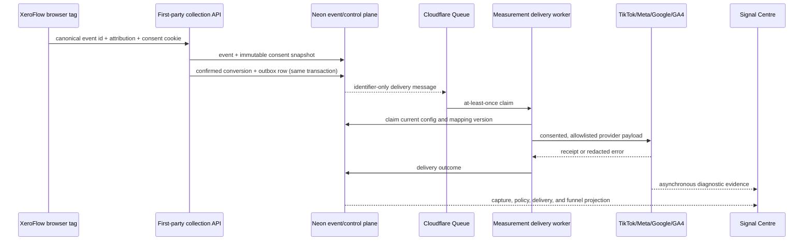

# Enterprise Measurement Signal Centre design

**Date:** 4 September 2026

**Status:** Approved for implementation

**PRD:** [`2026-09-04-enterprise-measurement-signal-centre-prd.md`](../../prd/2026-09-04-enterprise-measurement-signal-centre-prd.md)

**Research:** [`2026-09-04-xeroflow-enterprise-server-side-measurement-rd.md`](../../research/2026-09-04-xeroflow-enterprise-server-side-measurement-rd.md)

**Extends:** [`ADR-004`](../../decisions/ADR-004-measurement-signal-hub-canonical-control-plane.md)

## Decision summary

Extend the existing Measurement Signal Hub. Do not create a TikTok-specific
parallel pipeline and do not restore server-side GTM as the canonical runtime.
Neon remains configuration and event truth; the transactional outbox and
Cloudflare Queue remain the asynchronous delivery spine. TikTok becomes a native
adapter alongside Meta and Google Data Manager.

## System flow



## Browser collection contract

`window.xf` gains a stable consent method while preserving existing APIs:

```ts
interface XeroFlowConsentChoice {
  tracking: boolean
  analytics: boolean
  marketing: boolean
}

window.xf.setConsent(choice: XeroFlowConsentChoice): XeroFlowConsentSnapshot
```

The method writes `_xf_consent` with a generated ISO `updatedAt` and emits:

```ts
window.dataLayer.push({
  event: 'xeroflow_consent_update',
  xeroflow_consent: {
    tracking: 'granted',
    analytics: 'granted',
    marketing: 'denied'
  }
})
```

Malformed values fail closed and do not replace the last valid choice. The
server's region-aware `snapshotConsent()` remains authoritative.

Attribution adds bounded `ttp` alongside `ttclid`. The browser reads `_ttp` but
does not manufacture a provider identifier. Both values are stored only when
present and reported as aggregate coverage in UI.

## Confirmed conversion contract

Form attempts stay `form_submit`. A confirmed browser success uses
`generate_lead` or a more specific canonical booking event. The attempt and the
confirmed conversion have distinct ids because they are distinct events. Browser
and server copies of the confirmed conversion reuse the conversion id. External
form/provider integrations may call:

```ts
const submissionEventId = window.xf.track('form_submit', {
  form_id: 'vehicle-enquiry'
})
providerForm.onSuccess(() => {
  const conversionEventId = window.xf.createEventId()
  window.xf.confirmLead(
    { form_id: 'vehicle-enquiry', submission_event_id: submissionEventId },
    { eventId: conversionEventId }
  )
})
```

Authoritative server webhooks use the confirmed conversion id where the provider
can return it, or correlate through the separately recorded submission id.
Deduplication remains source system plus source event id. Only the confirmed event
is promotable to the measurement outbox.

## Canonical attribution envelope

The canonical conversion allowlist becomes:

```ts
interface MeasurementAttribution {
  browserEventId: string | null
  metaLeadId: string | null
  gclid: string | null
  gbraid: string | null
  wbraid: string | null
  fbc: string | null
  fbp: string | null
  ttclid: string | null
  ttp: string | null
  eventSourceUrl: string | null
  clientUserAgent: string | null
}
```

Values are identifiers/context only. Raw email, phone, names, free text, and raw
IP remain prohibited. Provider-compatible hashed identity is resolved from an
authorised lead/CRM source only at the delivery boundary and is discarded after
request construction.

## Provider policy

Policy evaluation happens before outbox creation where possible and again when a
worker claims delivery. This protects against configuration changes between
capture and dispatch.

A delivery is eligible only when:

- the profile and destination are enabled;
- the environment is not paused;
- the mapping is active for the canonical event;
- marketing consent was granted at event time for advertising destinations;
- the event is confirmed where the mapping represents a conversion;
- required match/context inputs are available; and
- the config version still matches the claimed projection.

Policy skips are terminal, auditable outcomes. Transport and provider failures
follow the existing retry taxonomy.

## TikTok Events API adapter

The adapter posts Events API 2.0 payloads to TikTok's Business API gateway. It
receives a provider-neutral delivery object and constructs a TikTok payload using
only the approved mapping and properties.

```ts
interface TikTokDeliveryInput {
  delivery: MeasurementProviderDelivery
  accessToken: string
  environment: 'test' | 'live'
  testEventCode?: string
  fetch: FetchLike
}
```

Validation rules:

- Pixel/Data Source id and access token binding are required.
- Web events require `browserEventId` and at least one TikTok match input.
- Test markers are forbidden for live delivery.
- Timestamps must parse and fall inside provider-supported windows.
- Provider body content is never logged or persisted.
- `408`, `429`, and `5xx` are retryable; other non-success responses are
  permanent unless TikTok's documented code says otherwise.
- Provider request/log ids are bounded to 255 characters before persistence.

## Storage changes

Additive migrations will:

1. add `ttp` to first-party tracking events;
2. expand canonical attribution constraints for TikTok/browser context;
3. allow `tiktok` platform and `tiktok_pixel`/`tiktok_events_api` capabilities in
   measurement configuration and provider-test tables; and
4. add aggregate/diagnostic indexes only after query evidence demonstrates need.

Every migration uses explicit constraint replacement, `IF EXISTS`/`IF NOT EXISTS`
guards where valid, and is applied to the configured database immediately.

## Signal Centre read model

Read APIs return aggregates and redacted lineage, never raw identifiers:

```ts
interface MeasurementSignalSummary {
  captured: number
  confirmed: number
  consentGranted: number
  policySkipped: number
  delivered: number
  retrying: number
  failed: number
  identifierCoverage: Record<string, number>
  freshnessAt: string | null
}
```

Agency users may drill into event ids, timestamps, mapping versions, provider
receipt ids, and stable redacted reason codes. Portal users receive counts,
status, and plain-language next actions only.

## UI design

The agency Signal Centre has four sections:

1. **Overview:** collection freshness, confirmed funnel, consent readiness, and
   destination health.
2. **Events:** filters for canonical event, state, destination, date, and test
   status; redacted lineage slideover.
3. **Destinations:** platform capabilities, match coverage, test, diagnostics,
   and mapping configuration.
4. **Changes:** configuration versions, approvals, validation evidence, and
   replay audit.

All forms use Nuxt UI v4 `UFormField` and controls. Client portal content uses the
existing measurement health page and exposes no mutation controls.

## Failure handling

- Invalid browser payload: return the existing bounded validation error and store
  nothing.
- Missing/denied consent: retain permitted first-party analytics; record a
  policy skip for attempted advertising delivery.
- Missing browser context likely to arrive later: retry only within the existing
  bounded freshness window.
- Invalid credential or mapping: permanent failure and destination degradation.
- Queue exhaustion: dead-letter and raise an operational alert.
- Provider 2xx with warning/async rejection: reconcile diagnostic evidence and
  degrade health without rewriting canonical event truth.
- Cache publication failure: Neon commit remains successful and cache health is
  marked stale, matching ADR-004.

## Verification

- Unit tests cover consent fail-closed behaviour, `_ttp`, policy, mappings,
  payloads, retries, redaction, and summaries.
- Integration tests cover tenant scope, version conflict, migrations, outbox,
  worker claims/results, and provider test evidence.
- happy-dom tests execute the real public tag.
- TikTok Test Events validates payload acceptance and browser/server
  deduplication before live activation.
- Werribee browser verification confirms consent choices, TikTok identifiers,
  form success, network payloads, and no console errors.
- Full tests, typecheck, production build, and deployment guard run before
  release.

## Rollback

The feature is additive and dormant by default. Rollback order is:

1. pause/disable the TikTok destination;
2. stop the measurement-delivery worker binding if necessary;
3. hide Signal Centre routes behind their feature gate;
4. revert application code while leaving additive nullable columns and expanded
   constraints in place; and
5. never delete canonical events or delivery history as part of operational
   rollback.
